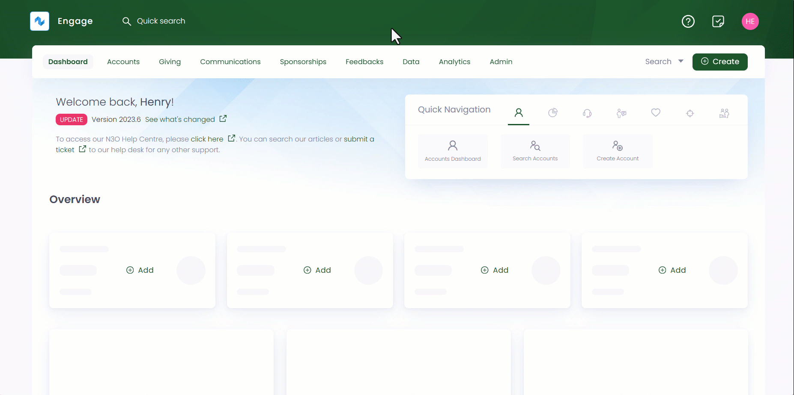
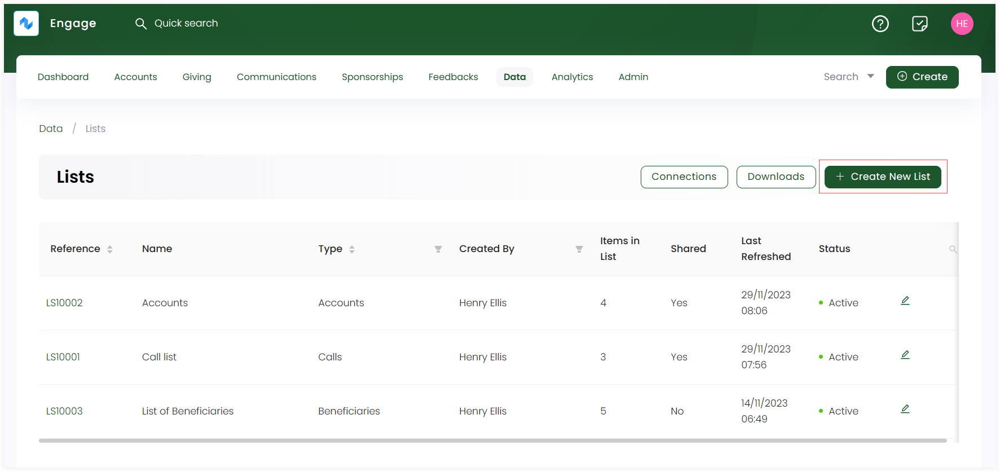
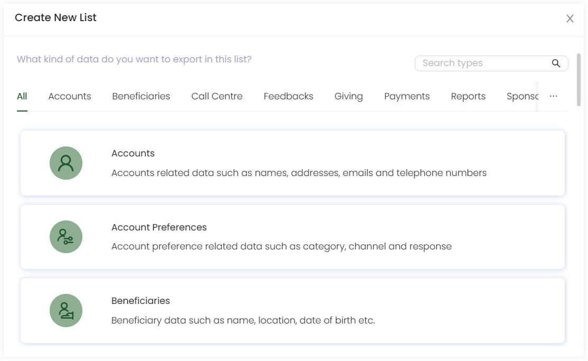
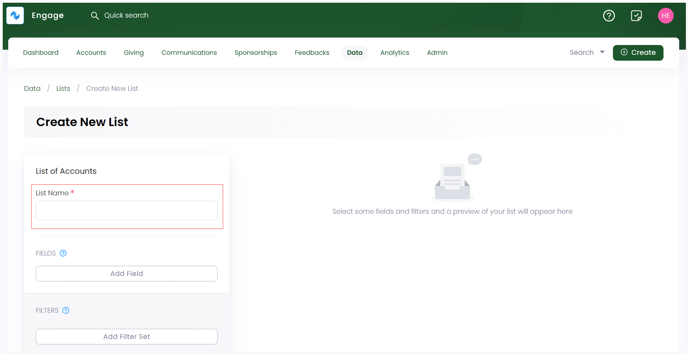

Engage allows you to create a new list of any type to access and export information from within the system. Follow the steps defined below to create a new list.

**1.** Click *Data* in the top menu bar and then *Lists* in the quick navigation section to view the lists screen.

**2.** On the *Lists* screen, click *+ Create New List* option to select the type the list you want to create.

**3.** In the *Create New List* popup screen, select the type of data you want to export in a particular list. Each department in Engage can export its relevant data in a list that includes *accounts*, *beneficiaries* or *call center* etc.  

**4.** Selecting the list type redirects you to that particular lists *Create New List* screen. First, input the *List Name*.

**5.** Click *Add Field* to add different fields to the list which represents the actual data you wish to see on the list. For e.g. in an accounts list, you need to add the major important fields that are *reference*, *display name*, *primary telephone number* and *current preference*. Some fields require additional data to be added e.g. current preference requires adding *field title*, choosing the *field channel + category* and giving the consent whether to contact the account as *yes*, *no* or *any*.      

:::info
- Each field set has a number of other parameters which can be displayed as per necessary e.g. *address* or *postal code*. You may need not add and display each of them separately in a list.
- Fields once added can be removed from the field set via the *"x"* icon.
- While adding fields, results start appearing on the right automatically for each field set. 
:::

**6.** Click *Add Filter Set* and then *Add Filter* to add filters to the selected fields of the list, hence narrowing down the results appearing on the right. For example, in an accounts list, you can add a filter on *current preference* and select the *filter criteria* as *opt-in*. Accounts who have opted in for the choosen preference will be displayed only. 

:::note
It is not necessary to add filters for a field. You can always create a list without a filter set.
:::

**7.** Click **+ Create New List** and a list of the data type chosen with fields and filter set will appear on the right.
