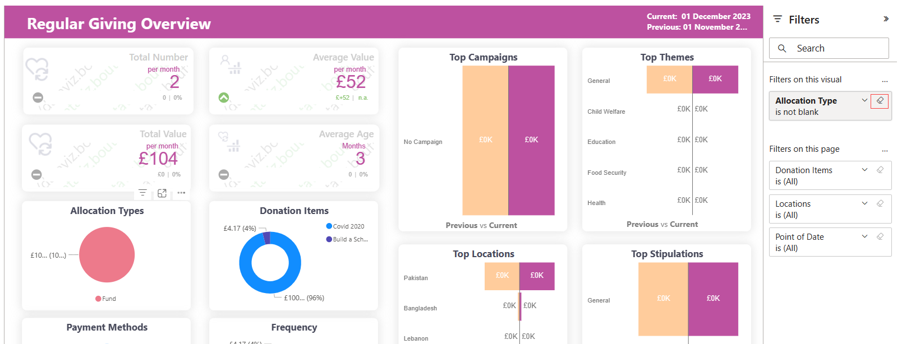

The *Filters* panel on the right-hand side shows all the filters applied to the report. This is an area where you can view information about each filter, interact with them and change these filters to see the impact on your visuals and report. 

It displays and manages several types of report filters including: 

- A whole single report
- Different report pages
- Visuals 

## Display Filter Details

:::note
Anyone who has permissions to the report can interact with the filters section.
:::

Whenever a report is viewed in Engage, some default filters are displayed for each report under the *Filters* panel e.g. income overview report has filters: *Reporting Period*, *Donation Item* and *Stipulation*. Simply expand the panel for each report and view the filters already added.

To completely understand a filter in detail, expand the filter card with the *arrow* next to the filter name and view at all the available values and their counts. Some filters have *(All)* beside them meaning all values under the filter have been selected to display. 

## Search a Filter

Sometimes there might be more filters for a single report or a filters can have a long list of values within itself. To cater this purpose, use the search bar under the *Filters* heading or the search box within any filter to search and find any value you want.

## View Filter Applied to a Visual

You can get a closer look at the filters affecting a specific visual by hovering over the visual to reveal the *filter icon*. Select that filter icon to see a pop-up window with all the filters and slicers affecting that visual. The filters in the pop-up window are the same filters displayed on the *Filters panel*, and you can view them as explained in the [Display Filter Details](#display-filter-details).

## Change Filter Selections

Another way to search for data insights within a report is to interact with the filters. You can change filter selections by using the drop-down arrow next to the filter name. Depending on the filter and type of data that you are filtering, your options range from simple selections from a list, to identifying ranges of dates or numbers.

## Clear a Filter

To reset or clear a filter, you can clear all values by selecting the *eraser icon* next to the *filter name*. 

