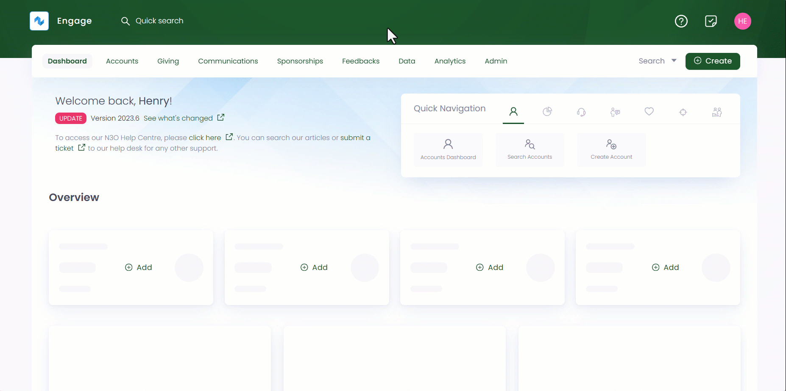
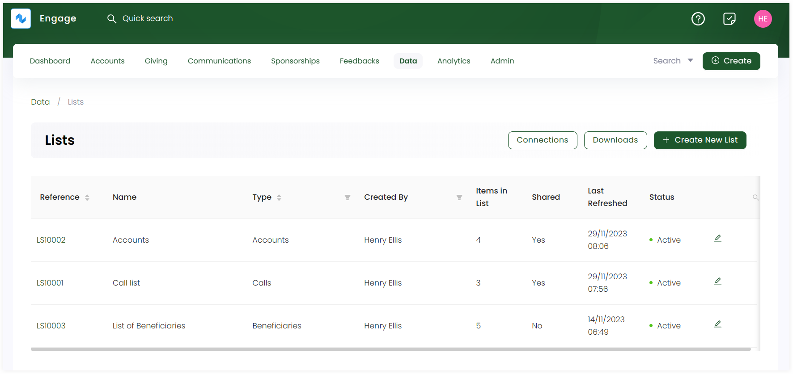

In Engage, lists is a function which allows the user to access and export data from within the system for a variety of functions. The information can be used to identify trends, create reports, send bespoke communications to donors etc. 

**1.** To land onto the lists dashboard, click *Data* in the top menu bar and then *Lists* in the quick navigation section. 

**2.** The *Lists* dashboard consists of a record of all new or existing lists created with different parameters defined.

:::note
- The *Lists dashboard* includes a connections and downloads option to view all connections and downloaded lists separately.
- You can also use filters on parameters, *Type* and *Created by*, to view a list of a certain type and created by a specific user. 

:::

| Lists Parameters | Description |
| ---------------- | ----------- |
| Reference | Reference number of the list created. |
| Name | Name of the list. |
| Type | Type of list created e.g. *accounts*, *beneficiaries* or *payments* list. |
| Created by | Name of the user who created the list. |
| Items in List | Number of records in a single list. |
| Shared | Status if a list is shared or connected as *yes* or *no*. |
| Last Refreshed | The date and time when a list was last shared. |
| Status | Status of a list as *active* or *not active*.  |

