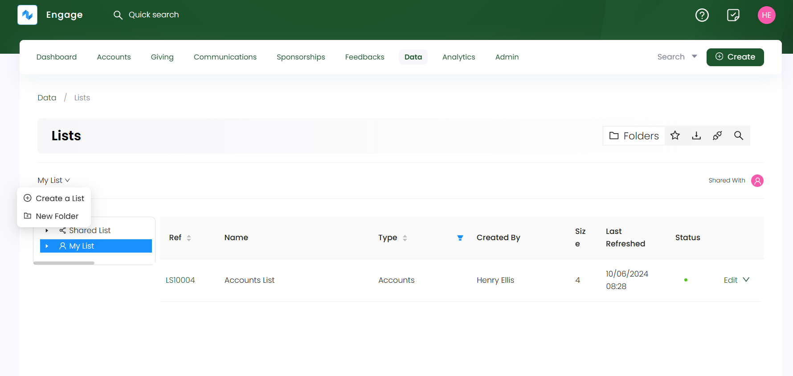
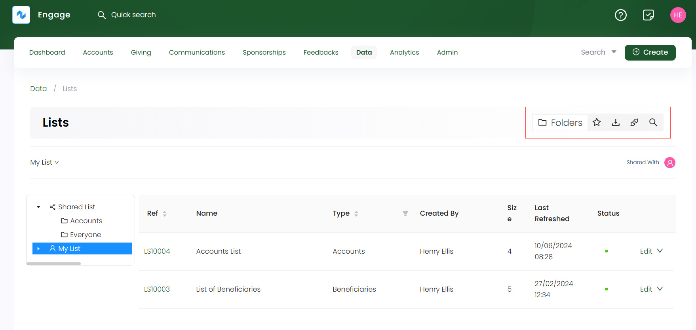

To land onto the **lists dashboard**, click **Data** in the top menu bar and then **Lists** in the quick navigation section. It consists of a record of all new lists created or any existing ones in their respective folders. 

## Folder Structure for Lists

Lists in Engage, are now created and placed within a **folder structure** on the dashboard. A folder structure reduces clutter and provides an opportunity to display different resources in one place. The lists dashboard shows two types of predefined folders for each user:

1. **My list folder:** Contains all those lists that are for the user only.
2. **Shared list folder:** Contains all those lists that are shared within the organization or everyone.

Each list created under these folders can be seen in the form of a table with the following parameters.

| Lists Parameters | Description |
| ---------------- | ----------- |
| **Reference** | Reference number of the list created. |
| **Name** | Name of the list. |
| **Type** | Type of list created e.g. *accounts*, *beneficiaries* or *payments* list. |
| **Created by** | Name of the user who created the list. |
| **Size** | Number of records in a single list. |
| **Last Refreshed** | The date and time when a list was last refreshed. |
| **Status** | Status of a list as *active* or *not active*.  |

:::info
You can also use filters on parameters, like *Type*, to view a list of a certain type. 

:::

### Creating SubFolders under a Folder

You can create subfolders under a single folder to differentiate lists from one another. For example, **My List folder** may include an accounts, sponsorships or payments folder to place their unique lists within. 

**1.** Click on the folder in the folder section and hover over its name written on the top left. 

**2.** Select **New Folder**, input the **folder name**, and click **OK**. The folders description can also be viewed separately. 

    

## Perform Quick Functions for a List

Multiple quick functions can be performed for each list created on the dashboard. For example, bookmarking or deleting a list.

**1.** Select any list and click the **down arrow** at the end of that list.

**2.** You will find the following options:

- **Download:** Download the list in `CSV` or `Excel` format.
- **Set Connection:** Set up a connection for the list. This option appears only when the list is not connected before. 
- **Move to:** Move the list from one existing subfolders to another within **My List** and **Shared List** folders respectively. 
-  **Bookmark:** Bookmark a list for quick access.
- **Deactivate:** Deactivate a list if no longer in use.
- **Delete:** Delete a list if no longer needed.

## Provide Access for Shared Lists

Shared lists can provide access to other team members within the organization for combined collaboration and work. This access can be for a few people or everyone instead. 

**1.** Select a folder within the **Shared List**, click the **down arrow** next to it and choose **Share Access**.

**2.** In the **Share Access** side panel, choose to **share with specific people** or **everyone**. 

**3.** Search for the **users** and click **Add** to add them. Either give them access to **Export & View only** or **Can Modify** (can view and edit the list). When all specified users are added, click **Save**.

## Quick Access to Multiple Pages from Dashboard

The lists dashboard provides a quick access sidebar to view different pages on one click. Click on any icon and navigate to the respective page. Icons include:

1. **Folders:** takes you to the lists dashboard.
2. **Bookmarks:** takes you to view the bookmarked lists. These bookmarked lists are personal to you and allow quick access to a specific list instead of searching it all over again. To bookmark a list, click the **down arrow** at the end of a list and select **Bookmark**.
3. **Downloads:** takes you to view the downloaded lists.
4. **Connections:** takes you to the connections page.
5. **Search:** takes you to search for a specific list.

### Discussing the List Search Option

**1.** Click on the **Search icon** in the quick access sidebar to view the search screen.

**2.** The list search screen is made up of a **Filters** panel on the left which you can collapse, and a **results** panel on the right.

**3.** In the **Filters** panel, you can modify the search by specifying input parameters accordingly. For example, click the **+ icon** next to **List**. You will see a list of parameters including:

- **Reference and Name:** Input the reference and name of the list.
- **Type:** Choose the type of list.
- **Status:** Select the status of the list.

:::info
For the **Created/Updated** search option, you can specify only the **From Date** or the **To Date** and do not need to specify both.
:::

**4.** Click the **Search button** and the results are loaded "one page" at a time on the right. To get further results, use a **Load More** button at the bottom of the result list. If you wish to remove the search input for all parameters and start all over again, use the **Reset All** option.
