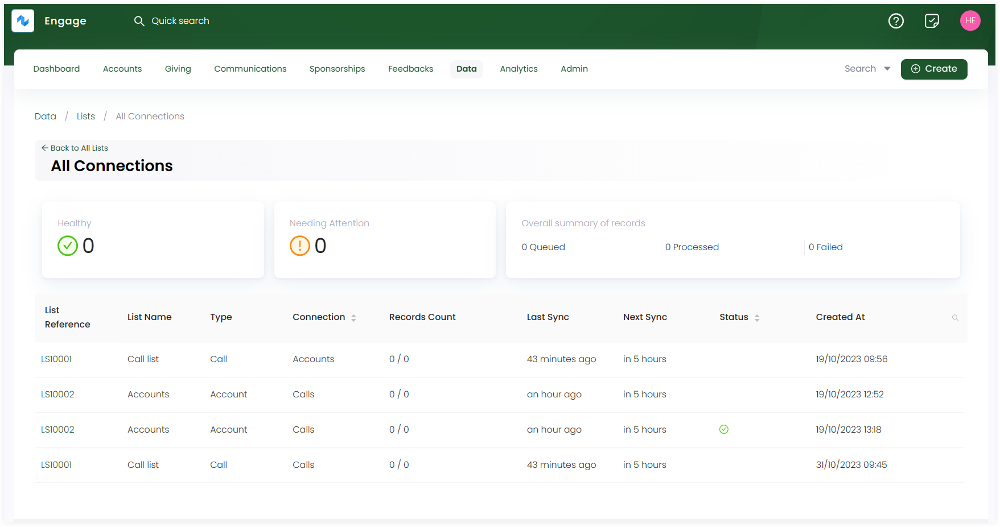

Engage allows you to connect any predefined or a newly created list with internal or enternal entities like call center campaigns, tasks or Mailchimp. Examples of connecting a list might include:

- To call donors within Engage via the call center, an existing accounts list is connected with any active campaign.
- To send a bespoke thankyou email to donors who paid an extra amount in donations, an existing donors list is connected with Mailchimp.

In order to connect any list with any entity within Engage, follow the steps defined.

**1.** Click *Data* in the top menu bar and then *Lists* in the quick navigation section to view the lists screen.

**2.** On the *Lists* screen, either create a new list or select any existing list and click *Connect*.

**3.** On the *New Connection* screen under *Step 1*, choose whether to connect the list within Engage or externally. 

**4.** If you choose Engage, then select the entity type to connect the list with and click *Next*. For example, an accounts list with an account reference field can be connected with *calls*, *accounts* or *tasks* etc.

**5.** Under *Step 2*, input the details for the choosen entity. For example, when connecting an accounts list with *Calls* entity, details would include selecting an existing active campaign etc. 

:::note
- Any connection type choosen creates and performs a separate action for each entry in the list.
- Connection types are only available if *reference field* for any list created is selected in the *Fields* section.
- You can leave *priority field* and *order* in the *step 2: details* section blank as well. 
- You can also remove a connection type from the list via *Remove Connection* option.
:::

## List of all Connections

You can also view a record of all active connections created with existing lists. Click *Connections* on the lists dashboard and an *All Connections* screen appears with all active connections and their defined parameters. 

| Lists Parameters | Description |
| ---------------- | ----------- |
| List Reference | Reference number of the list. |
| List Name | Name of the list. |
| Type | Type of list. |
| Connection | Connection type connected with the list. |
| Last Sync | Last time when the list was synced, updated or refreshed. |
| Next Sync | Next time a list will be synced. |
| Status | Status of connection as *healthy* or *needs attention*. |
| Created At | Date and time when the connection was created. |

