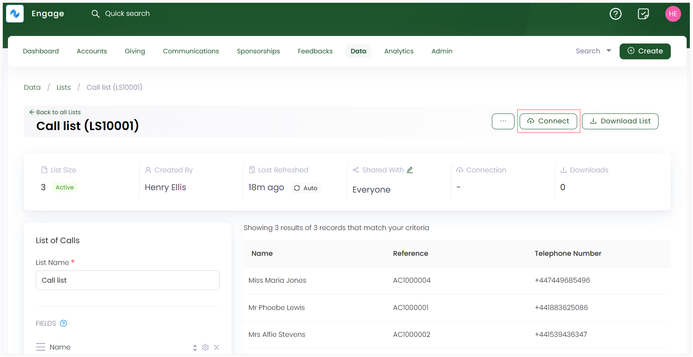
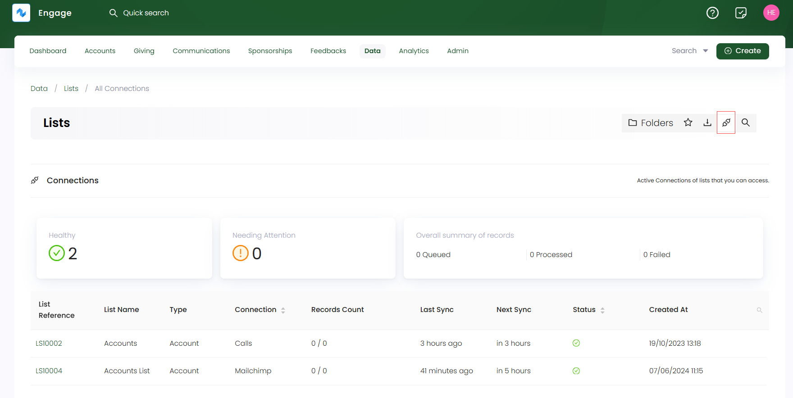

Engage allows you to connect an existing or a newly created list with internal entities like call center campaigns or tasks. An example might be an existing accounts list connected with any active campaign, to call donors via the call center for raising donations.

To connect any list within Engage, follow the steps defined.

**1.** On the **lists dashboard**, either <K2Link route="docs/engage/data/lists/creating-lists/" text="create a new list" isInternal/> or select any existing list and click *Connect*.

**2.** On the **New Connection** screen, click the **Engage** tab. 

**3.** Select the entity type to connect the list with and click **Next**. For e.g. an **accounts list** with an **account reference field** can be connected with **Calls**.

**4.** Under **Step 2**, input the details regarding the entity type e.g. when connecting an accounts list with **Calls** entity would include selecting an **existing active campaign**, etc. 

:::note
- Any connection type choosen creates and performs a specified action for each entry in the list.
- Connection types are only available if **reference fields** for any list created is selected in the **Fields** section.
- You can leave **priority field** and **order** in the **step 2: details** section **blank** as well. 
- You can also remove a connection type from the list via **Remove Connection** option.
:::

## List of all Connections

You can also view a record of all active connections created with existing lists. Click the **connections icon** in the quick access bar on the lists dashboard to view a **Connections** screen with all active connections.

| Lists Parameters | Description |
| ---------------- | ----------- |
| **List Reference** | Reference number of the list. |
| **List Name** | Name of the list. |
| **Type** | Type of list. |
| **Connection** | Connection type connected with the list. |
| **Records Count** | Number of records. |
| **Last Sync** | Last time when the list was synced, updated or refreshed. |
| **Next Sync** | Next time a list will be synced. |
| **Status** | Status of connection as *healthy* or *needs attention*. |
| **Created At** | Date and time when the connection was created. |

