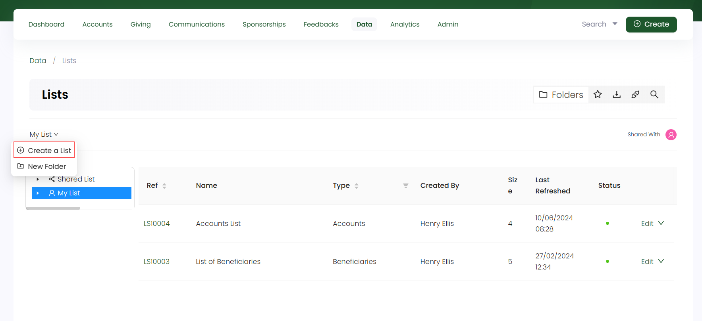
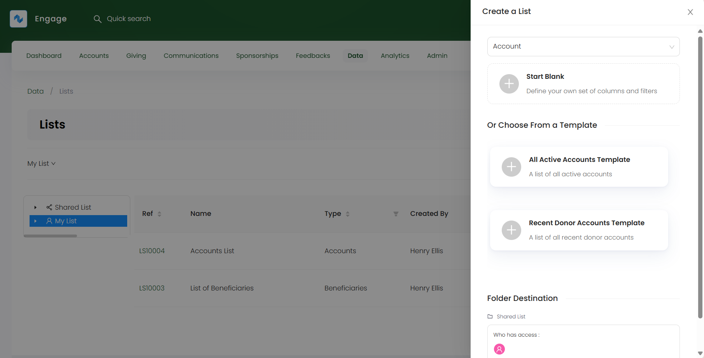
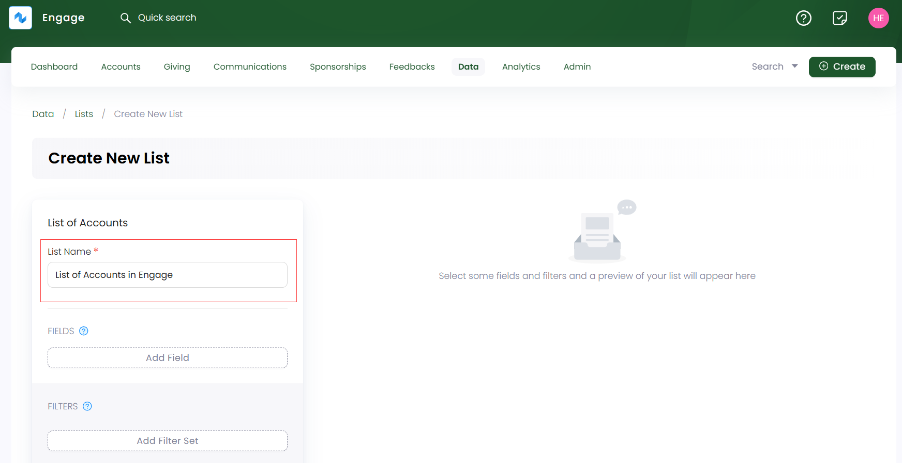

Every list type in Engage is created within a folder. Follow the steps defined below to create a new list.

**1.** On the **lists dashboard**, choose whether to create a shared list or for your personal use. 

**2.** For personal use, click on **My List** and select **Create a List**. You can also add a subfolder and create a list within it. For shared purpose, click **Shared List**, select a folder and click **Create a List**.

**3.** In the **Create a List** popup side panel, select the type of data you want to export in a particular list such as **accounts**. Choose whether to:

- Start **blank** by defining your own set of columns and filters.
- Start from a **template** predefined by N3O according to the data selected. 

**4.** Selecting the list type redirects you to that particular lists **Create New List** screen. In the **List of Data type** section, input the **List Name**.

5. Click **Add Field** to add different fields to the list which represents the actual data you wish to see on the list. For e.g. in an **accounts** list, you need to add some major fields; **reference**, **display name**, **primary telephone number** and **current preference**. Some fields require additional data to be added e.g. current preference requires choosing the **field channel + category** and giving the **consent** whether to contact the account as *yes*, *no* or *any*.      

:::info
- Each field set has a number of other parameters which can be displayed as per necessary e.g. **address** or **postal code**. You may need not add and display each of them separately in a list.
- Each field can be edited again via the **settings icon**.
- Fields once added can be removed from the field set via the **"x"** icon.
- While adding fields, **results** start appearing on the right automatically for each field set. 
:::

6. Click **Add Filter Set** and then **Add Filter** to add filters to the selected fields of the list, narrowing down the results appearing on the right. E.g. in an accounts list, you can add a filter on **current preference** and select the **filter criteria** as **opt-in**. Accounts who have opted in for the choosen preference will be displayed only. 

:::note
It is not necessary to add filters for a field. You can always create a list **without** a filter set.
:::

7. Click **+ Create New List** and a list of the data type chosen with fields and filter set will appear on the right.
