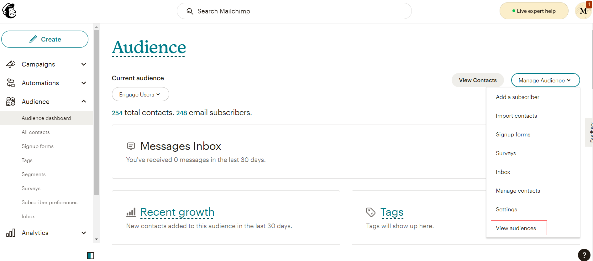
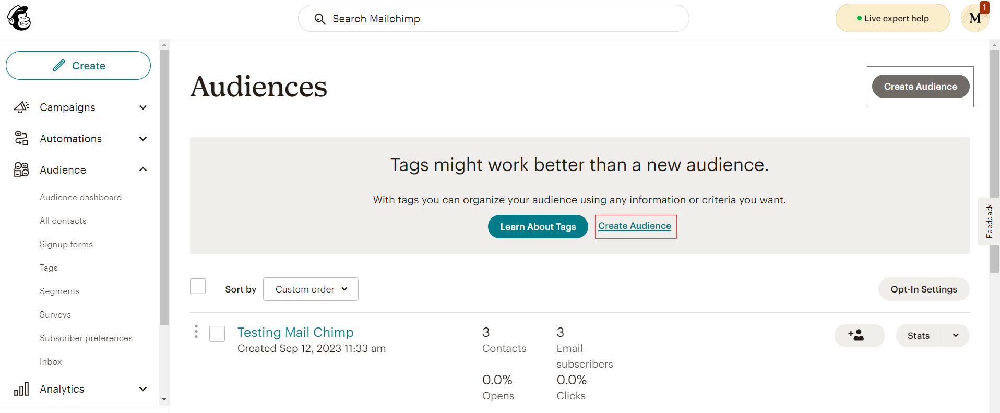
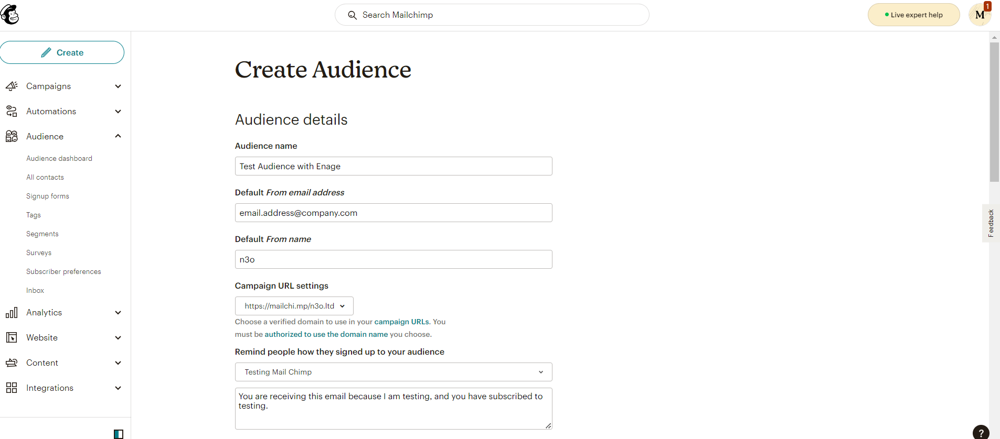
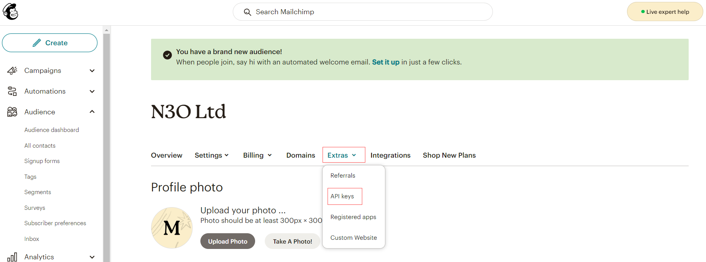
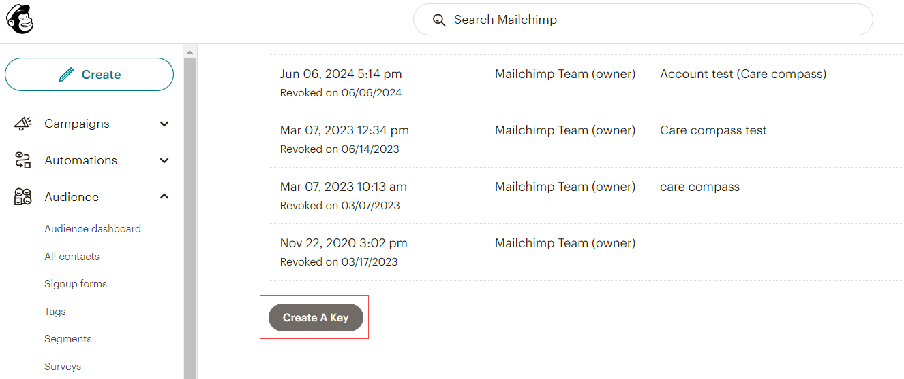
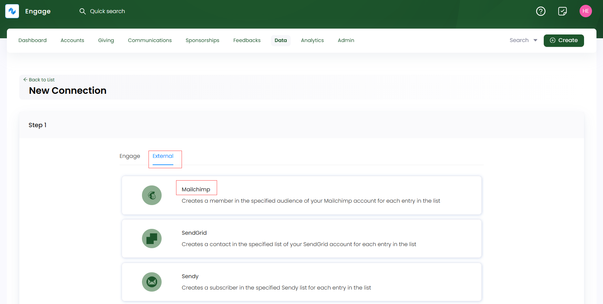
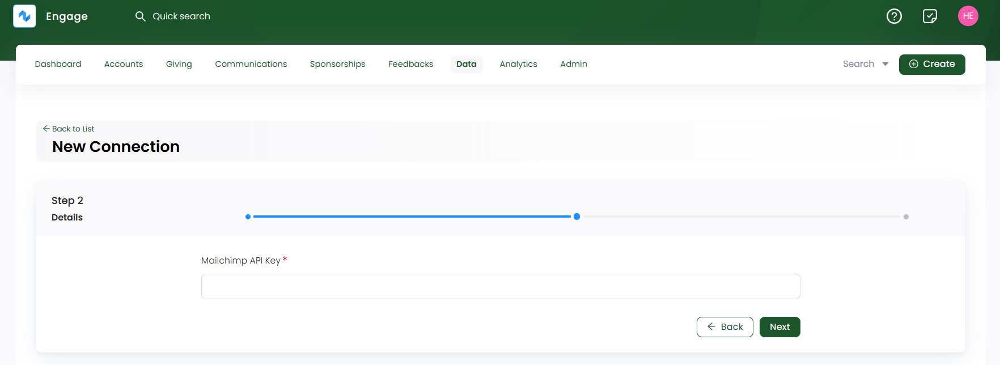
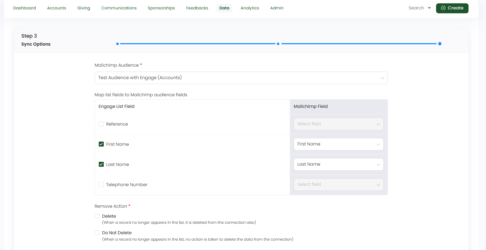
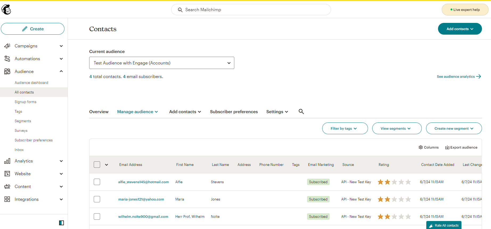

A list created in Engage can be connected with multiple external email marketing platforms. This can be handy for sending bespoke thankyou or other emails to donors for their donations or extra efforts. In this guide, you will learn how to connect your list with **Mailchimp**.

## Create an Audience and API Key in Mailchimp

Login to your Mailchimp account and first set up an **audience**. Your audience is where you will store and manage all your contacts/donors data. If you have existing one, you can also use that but for now let's create a new one. 

**1.** Click **Audience**, then click **Audience dashboard** in the sidebar menu.

**2.** Click the **Manage Audience** drop-down and choose **View audiences**. 

**3.** Click **Create Audience**. In the confirmation box, click **Create Audience**, next to **Learn About Tags**.

**4.** Enter the details in the fields provided like **audience name**, **default name**, **email address** and **campaign URL settings** according to your organization.

**5.** Review the **Contact information** for this audience, and edit if needed. This will be prepopulated according to your organization details that you added while creating an account.

**6.** In the **Form Settings** section, choose the **opt-in** method for your audience. As an Engage user, donot tickmark the **Enable double opt-in** option, rather prefer the other one.

**7.** In the **Notifications** section, review the email address that you'd like to receive notifications about your audience, and edit if needed. Click **Save**. As soon as your audience gets created, you will be able to import contacts within it from Engage. 

Now, generate an API key for your audience in order to connect Mailchimp with Engage.

:::info
You will only be able to see the full API key immediately after you generate it. After that, you will only see the name given to it and its first 4 digits.
:::

**1.** Click your profile icon and choose **Profile**.

**2.** Click the **Extras** drop-down then choose **API keys**.

**3.** In the **Your API Keys** section, click **Create A Key**.

**4.** **Name** your key. Be descriptive, so you know what app uses that key and click **Generate Key**.

**5.** Once we generate your key, click **Copy Key to Clipboard**. Save your key someplace secure as you won't be able to see or copy it again. If you lose this key, you’ll need to generate a new key and update any integration that uses it. Click **Done**.

## Create a List in Engage and Connect it with Mailchimp

Navigate to **Engage** and login to your account. Navigate to the **Lists** section under **Data**, and <K2Link route="docs/engage/data/lists/creating-lists/" text="Create a new list" isInternal/> or select any existing one. In this guide, we will be using an **accounts list** with fields:

1. First and last name
2. Email address
3. Status
4. Phone Number

:::info
Remember, **phone number** of all the contacts must be **valid**, and **email address** **MUST** be added as a field otherwise you will not be able to connect the list to the specified Mailchimp audience. 
:::

**1.** On the lists detail screen, click **Connect**.

**2.** Under the **New Connection** screen, click the **External** tab, choose **Mailchimp** and click **Next**.

**3.** Paste the **Mailchimp API Key** generated before and click **Next**.

**4.** As a last step, choose the **Mailchimp audience** you created before from the drop-down. Tickmark the **Engage list fields** and select the relevant **Mailchimp audience fields** to map them onto one another.

**5.** Choose the required **Remove action** and click **Save Connection**. 

**6.** All the accounts in the list will be synced and imported within Mailchimp and appear under the choosen audience. Click **Audience**, then **All Contacts** to see list of all those accounts. 

