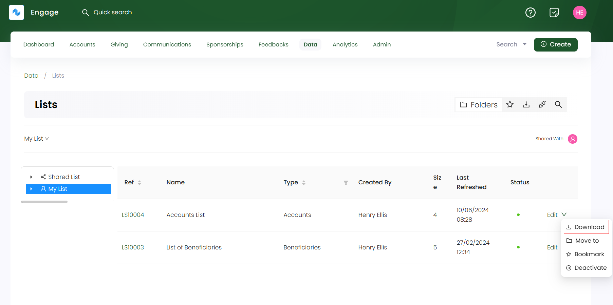
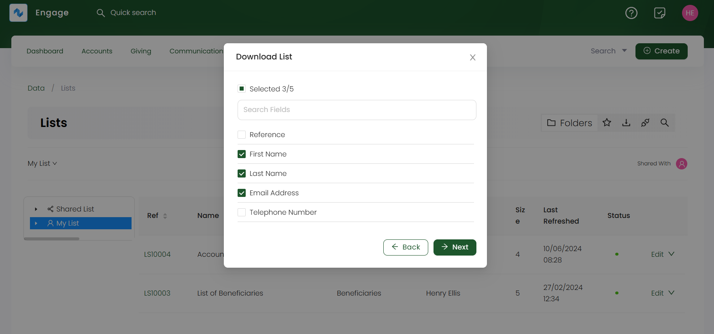
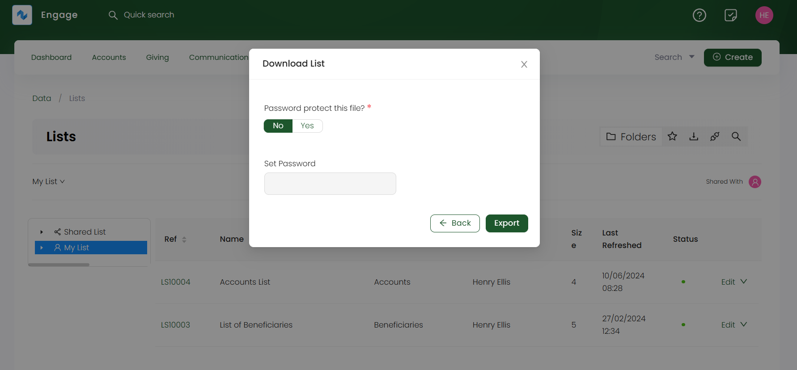
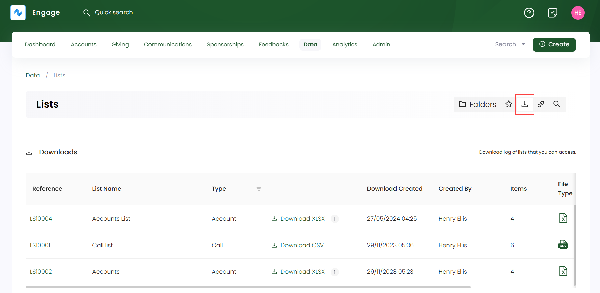
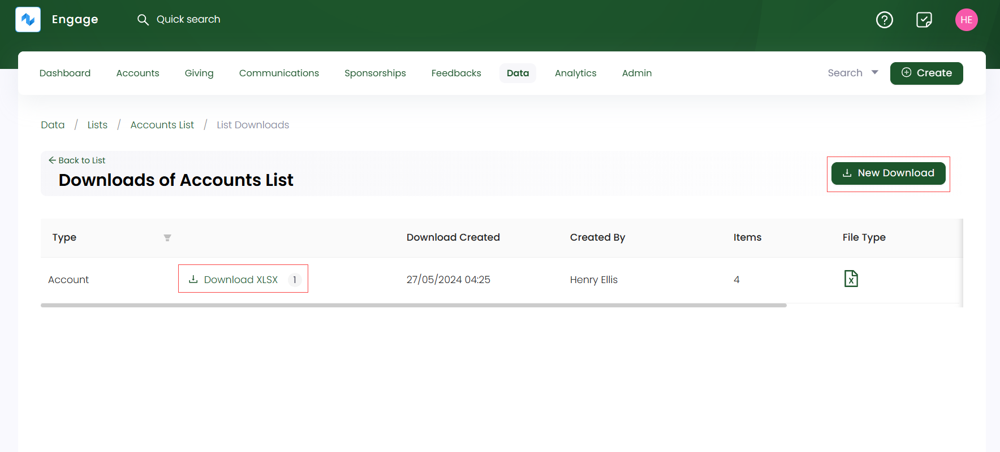

You can download any existing or newly created lists in the form of *CSV* or *Excel* files.

**1.** On the **lists dashboard**, click the **down arrow** at the end of a list row under any folder and click **Download**. 

**2.** Select whether to download as **CSV** or **Excel** and click **Next**.

**3.** Choose the fields that you export in your downloaded file or tickmark **Select All** and select **Next**.

**4.** Lastly, choose whether you want the downloaded file to have password protection as **yes** or **no**. If yes, then set the password and click **Export**. This option is only available for downloading **Excel** files.

## View All Downloaded Files

As soon as a list is downloaded, you can view it in the **Downloads** section. On the **lists dashboard**, click the **downloads icon** in the quick access bar to view all the downloads in the form of a table. 

:::tip
You can also download again from **Downloads** screen, click the **Download XLSX** or **Download CSV** for any list.  
:::

| Lists Parameters | Description |
| ---------------- | ----------- |
| **Reference** | Reference number of the downloaded file. |
| **List Name** | Name of the list downloaded. |
| **Type** | Type of the list downloaded. |
| **Downloaded Created** | Date and time the list was dowloaded. |
| **Created by** | Name of user who downloaded the file. |
| **Items** | Number of records in a downloaded file. |
| **File Type** | Type of file downloaded. |
| **Downloaded by** | Logo of user who downloaded the file. |

## View Downloaded Files for a Particular List

You can also see a list of downloads done for a particular list. On the **lists dashboard**, click the **list reference** or **Edit** option and select **All List Downloads**. You will see a table of downloaded files including:

1. List Type
2. Date and time of download
3. List created by
4. Number of items in the list
5. Download file type

To make a new download for the list again, click **New Download** and follow the same process explained above.

