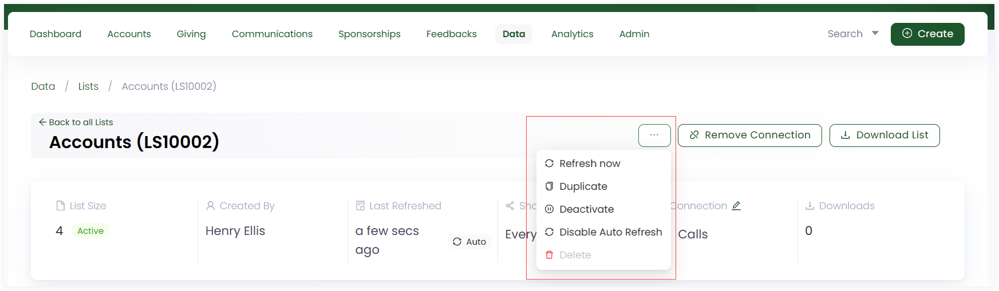

Similar to creating lists, you can view and update any existing list within Engage. 

**1.** On the **lists dashboard**, click any **list reference** or the **Edit** option to view a detailed version of any existing list in a folder.

**2.** You can view all the **records** present in the list in the form of a table and selected **fields** plus **filter sets** on the left-hand side along with:

- **List Size:** The total number of records within the list.
- **Created By:** User who created the list.
- **Last Refreshed:** The last time when a particular list was refreshed. 
- **Shared With:** The users with whom the list is shared with. You can click the *pen icon* to set the list with *private*, *available to all* or *only selected users* sharing option.
- **Connections:** The connection type with which the list is connected. 
- **Downloads:** The number of downloads for the list.

3. You can edit any field or filter set with the **settings icon** and click **Update List**.

4. To explore more options regarding the list, click the **three dots (...)** and you can perform the below functions.

    - Refresh a list anytime with the **Refresh Now** option.
    - Create a duplicate of a list via **Duplicate**.
    - Deactivate the list by clicking **Deactivate**.
    - Enable and set a list to auto refresh with **Enable Auto Refresh** option when a list is created. If done, then this option will appear as **Disable Auto Refresh**.

 