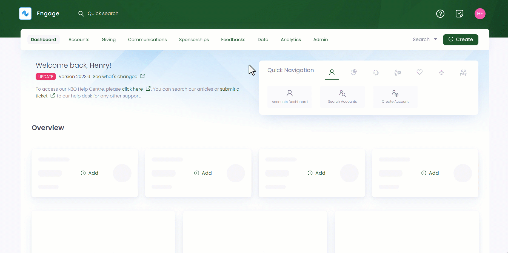
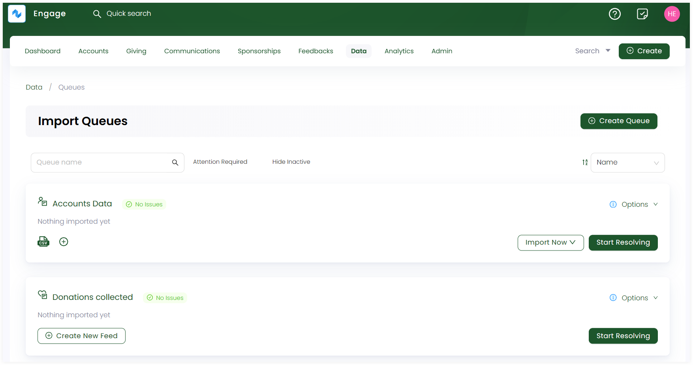

Queues are important in terms of importing, managing and organising data into the system from different data sources.  
 
To land onto the **Queues dashboard**, click **Data** in the top menu bar and then **Imports** in the quick navigation section. The **Import Queues** screen contains records of all new or previously created queues.

:::tip
You can also search for a queue in the search bar located on the top.
:::

Each queue displayed has:

- A **name** dedicated to the queue.
- Number of records showing an **import status** like **error**, **unmatchable records**, **no issues** or **warnings**, if the queue has an import issue. If not, then **no issues** status is shown.
- **Date** on which the last data was imported. If nothing is imported, then **Nothing imported yet** is displayed.
- Number of **CSV** or **JSON** feeds created. 
- An **Import Now** option to import data into the existing feed (template). If a **CSV feed** is not created, then this option will not appear.
- A **Start Resolving** option to automatically get the next available record which requires your attention and start resolving issues.

