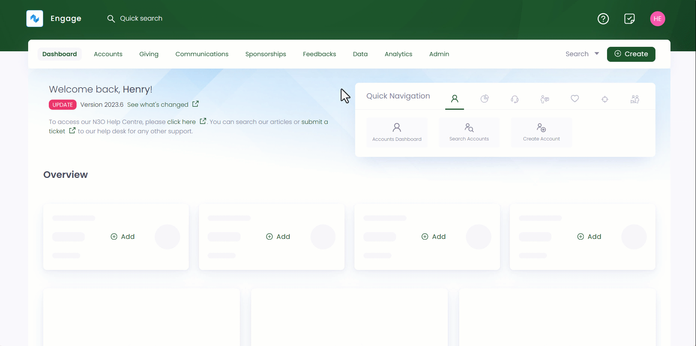

The first step in importing data is to create an import queue. An import queue is a collection of data feeds used to manage and organise data imports into the CRM. You can import multiple types of data into Engage related to accounts, calls, customer correspondence, and more. For each of these entities, a separate queue is created. 

Follow the steps defined to create a new queue.

**1.** Click **Data** in the top menu bar and then **Imports** in the quick navigation section to view the **Import Queues** screen.

**2.** Click **+ Create Queue** option to select the type of queue you want to create.

**3.** On the **Add New Queue** popup screen, select the type of data you want to import.  

**4.** Next, input the **Queue Name** and add any extra notes. Tickmark **Accessible to everyone** if you want the queue to be accessed by everyone. But, if you do not, then choose the role of a user from **Restrict to Roles** drop-down and click **Save**.   

