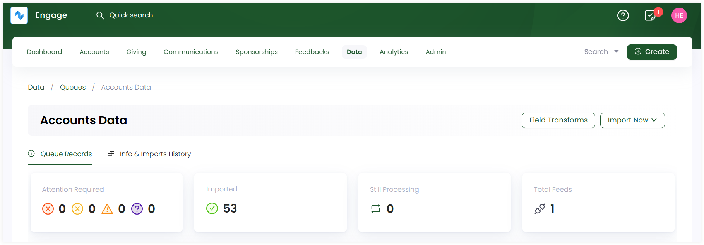
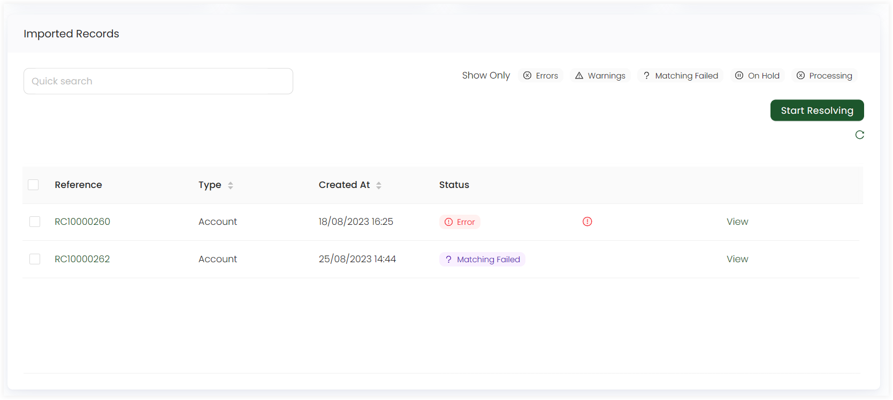
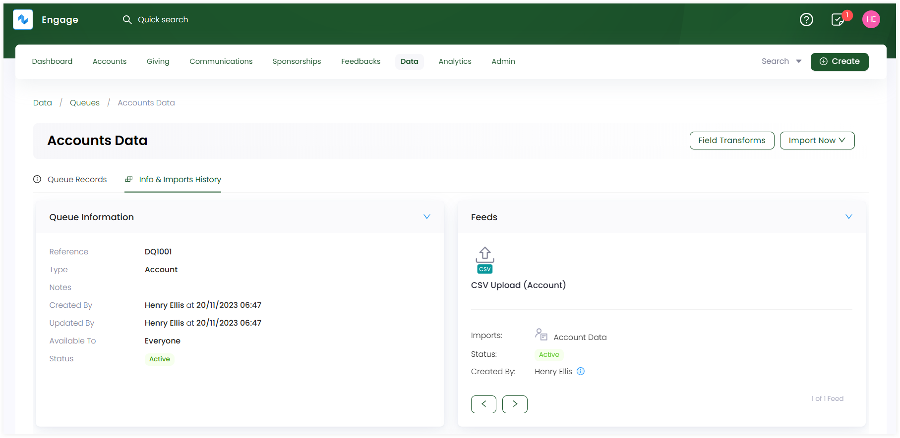
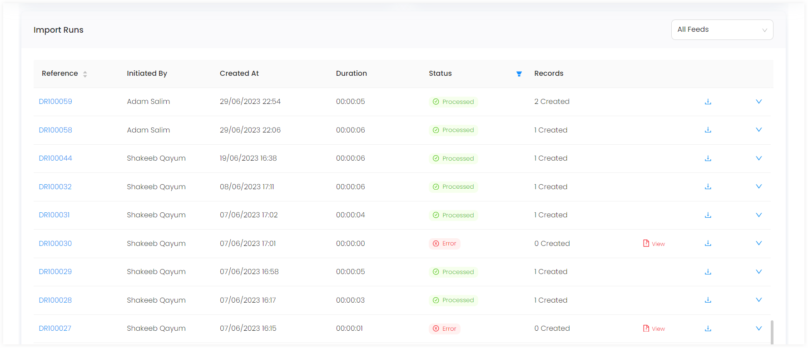

As soon as you create a queue, you can look at its complete information immediately within Engage. 

**1.** Click **Data** in the top menu bar and then **Imports** in the quick navigation section to view the **Import Queues** screen.

**2.** Select the queue you created previously and it will redirect towards the detailed queue section. 

**3.** The queue information is split into two parts, **Queue Records** and **Info & Imports History**. 

- **Queue Records** explain about the imported records, their status, and the total number of data feeds created.
- **Info & Imports History** includes a minimal queue summary, information about the data feeds, and the import records that have been run and tested within Engage. 

### Queue Records

Starting with the **Queue Records** tab; it shows different boxes stating:

- Number of imported records that require attention with status as **error**, **warning** or **matching failed**.
- Number of records imported successfully within Engage.
- Number of records still processing while being imported.
- Total number of feeds created for the queue.

:::tip
- If a data feed has been created for a queue, then an **Import Now** option appears to import data into the queue.
- Data fields can be transformed into meaningful fields via **Field Transforms** option. 
:::

The **Imported Records** table shows a list of all the imported records within the queue. Click **Start Resolving** and the system automatically starts resolving issues for each imported record. This function also corrects a record which goes into an error state maybe due to mandatory data missing or duplicates. You can also view a record in detail by clicking the **View** button or the **record reference**.

| List Parameters | Description |
| ---------------- | ----------- |
| **Reference** | Unique reference number of an imported record. | 
| **Type** | Type of queue the record is imported into. |
| **Created At** | Date and time the record was imported at. |
| **Status** | Status of the imported record. |

An **import status** is always available for each imported record. You can click on any status and find records for that status in the imported records table.

- **Imported:** The record is successfully imported into the system.
- **Validation Error:** The imported record has failed to meet one or more predefined criteria or rules set by the system.
- **Validation Warning:** The imported record has been accepted into the system, but there are certain issues or inconsistencies that the system has flagged as potential problems.
- **Matching Failed:** The system has attempted to match the imported record with existing records in the database but was unable to find a suitable match.
- **On Hold:** The record has been temporarily paused in its processing or integration into the system.
- **Processing:** The record is currently undergoing a series of operations or checks as part of its integration into the system.
- **Processing Errors:** The record encountered issues during the processing phase that prevented it from being fully or correctly integrated into the system.

### Info & Imports History

Under the **Info & Imports History** tab; on the top, you will see:

**1.** Summary of the queue created containing:
- Queue **reference**
- **Type** of queue
- **Name** of user who **created** and **updated** the queue
- **Availability** and **status** of the queue

**2.** Each created feed summary including:
- **Name** and **type** of feed
- **Type** of data imported via the feed
- **Status** and **creator** of the feed

You can switch to view other feeds information by clicking the **greater than** button.

Next, is the **Import Runs** table that shows a list of all the attempted imported data records via a feed. Each imported run is either imported into system successfully or goes into an error state. You can click the **import run reference** to see how the record is imported:

- If record is imported, then this means the information sent is correct and no further work is required.
- If it gave an error, then click on the record, and you will be directed to a screen covering information of the error. In most cases, this is due to missing information or a mis-configuration.

| List Parameters | Description |
| --------------- | ----------- |
| **Reference** | Unique reference number of an imported record. | 
| **Initiated by** | Name of the user who started to import the record. |
| **Created At** | Date and time the record was imported at. |
| **Duration** | Time period the record took to import. |
| **Status** | Status of the imported record as **processed**, **error**, **paused**, **cancel**, **processing** or **scheduled**. |
| **Records** | Number of records that match with the number of rows within the previously uploaded data file. |

