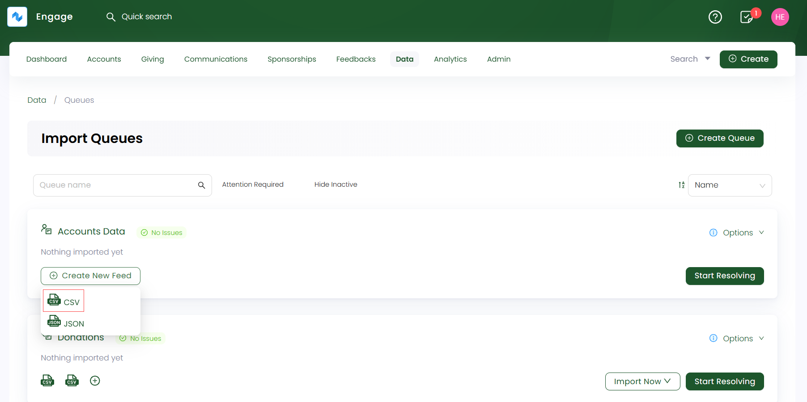
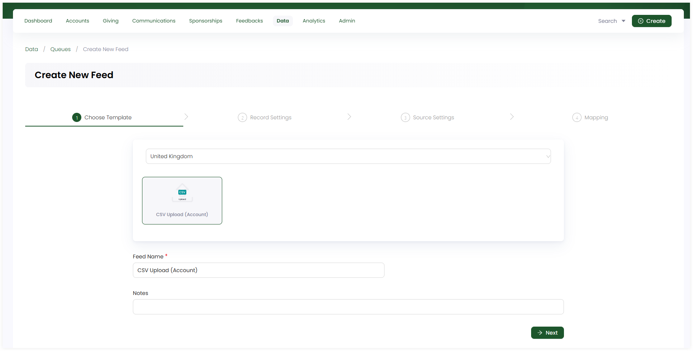
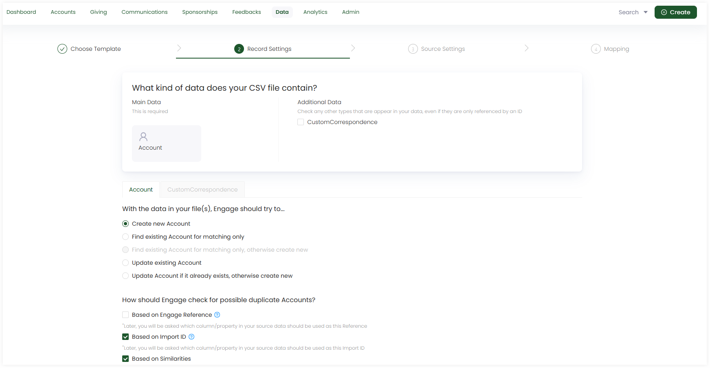
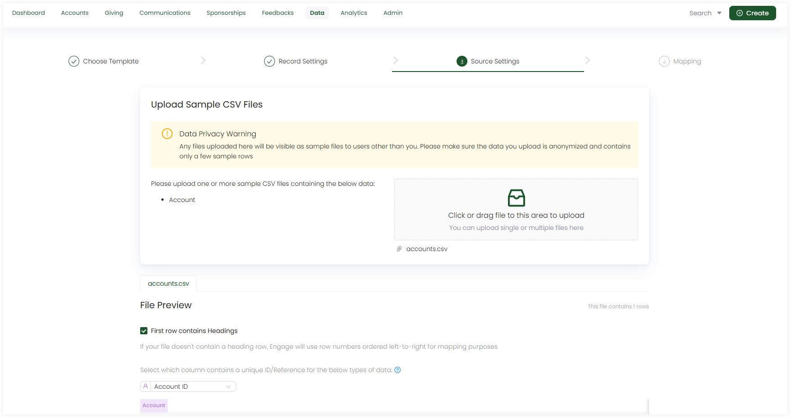
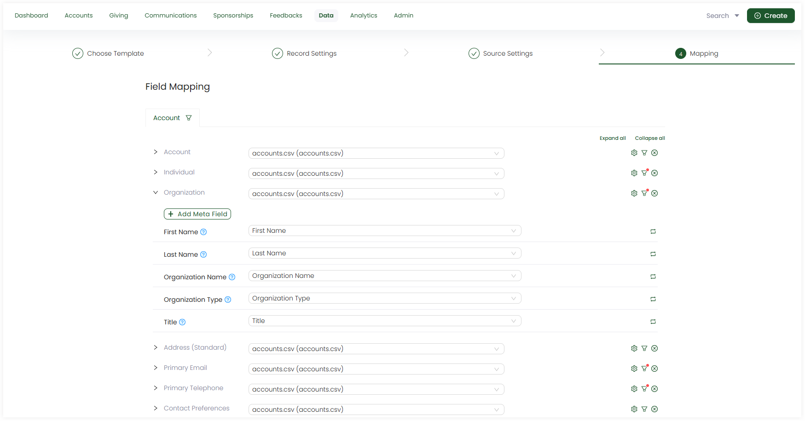
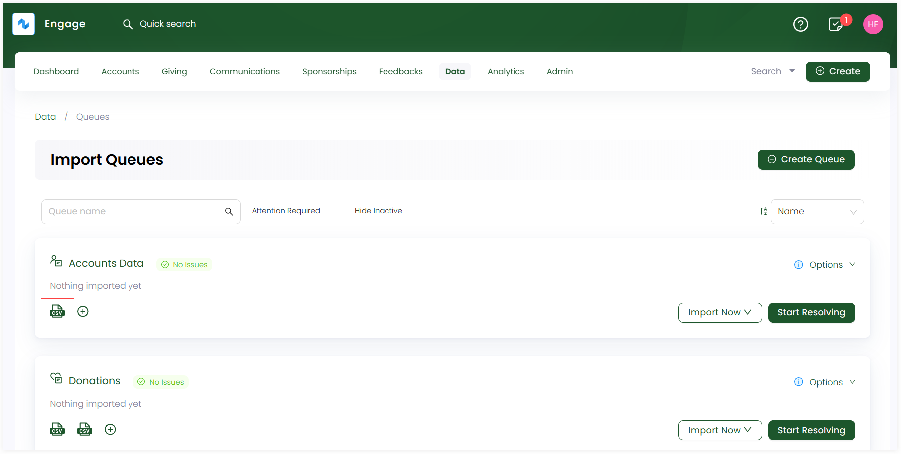
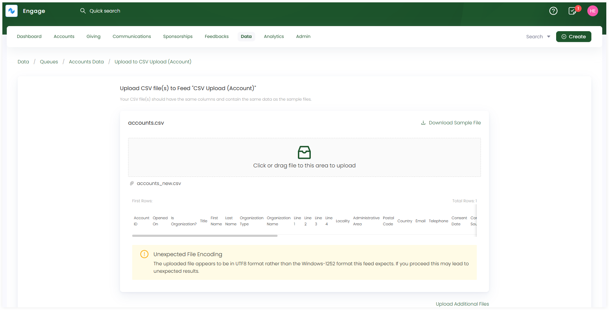

Once a queue is created in Engage, the next step is to import data within the queue. To perform this import process, first queues are populated with **data feeds**. A feed is classified as a template or a configuration setting with which you can import data into the CRM. Engage allows you to bulk import data into mulitple data feeds within queues and then group them together as required.

In Engage, there are two types of data feeds:

1. **CSV Feed**
2. **JSON Feed**

The first type of **data feed** and the mostly used one is a **CSV feed**. In this guide, let us look at how to create a CSV feed and then import data into it.

## Create a CSV Feed Within a Queue

**1.** On the **Import Queues** screen, click **+ Create New Feed** and select **CSV** as the feed format for your newly created queue.

**2.** Complete the configuration settings for the CSV feed defined below and click **Create Feed**. 

:::tip
For a more technical approach, contact `N3O` at `support@n3o.ltd` to set up these feed configurations for you as per your requirements. 
:::

### Basic Settings (Choose Template)

:::tip
Each feed created under a queue type has different templates (third-party platforms) to choose from. *For example, a CSV feed under a donations queue will have templates: "CSV upload(Donation)", "JustGiving Donations Report" and "LaunchGood Donations Import"*.
:::

- Choose the **CSV template** provided.
- The **feed name** prepopulates by default, but you can change it, if required.
- Add any extra notes, if required.

### Record Settings

- Observe the kind of data present in the CSV file including **Main Data** and **Additional Data**. Main data is added by default, but tickmark if you want additional data to be added.
- Answer the questions related to both main and additional data under their respective tabs. By default, each question is tickmarked but you can change if you want.

### Source Settings

- Upload one or more CSV files that will be used to input data. By default, a sample file is already uploaded, e.g. `accounts.csv`.
- Preview the CSV file and observe its **filename**, **filters** and **formatting options**. By default, these have been defined but you change them as necessary. Also, each file uploaded can be previewed under its respective tab.

### Mapping

- Map the data in the uploaded file with the data references in the CRM. By default, mapping is performed by populating fields but you can change and do it yourself.
- Apply **filters** to specify conditions on the fields in the source data for more clarification via **filter icon**. 
- Any field can be populated by the **Field Transform** function if you require.

**3.** The created feed appears as a **CSV file icon** under the queue on the dashboard.

## Import Data into the Created CSV Feed

As soon as a feed is created, you are ready to import data via the feed within a queue. 

**1.** Click the **Import Now** option for a queue on the **Import Queues** screen or alternatively on the detailed queues screen and choose the created feed. 

**2.** On the **Upload CSV file to Feed** screen, download the sample file, fill it up with your data and then upload it again. Make sure your CSV file has the same format as the sample file and click **Upload**.

**3.** Each imported data via a feed is shown as a record in the **Import Runs** section under **Info & Imports History**. Number of records are created and tested on the basis of the number of rows within the uploaded data file. Imported records with a **Processed** status can be downloaded or reprocessed, if needed. 

