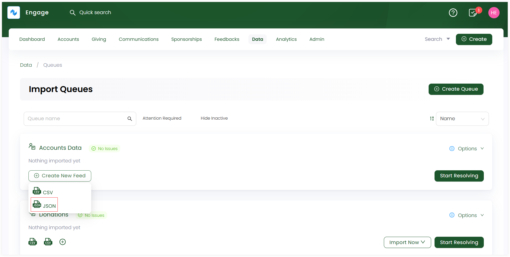
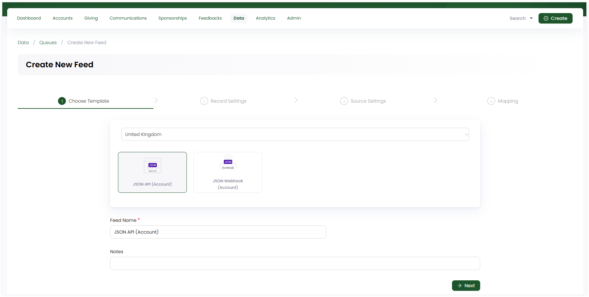
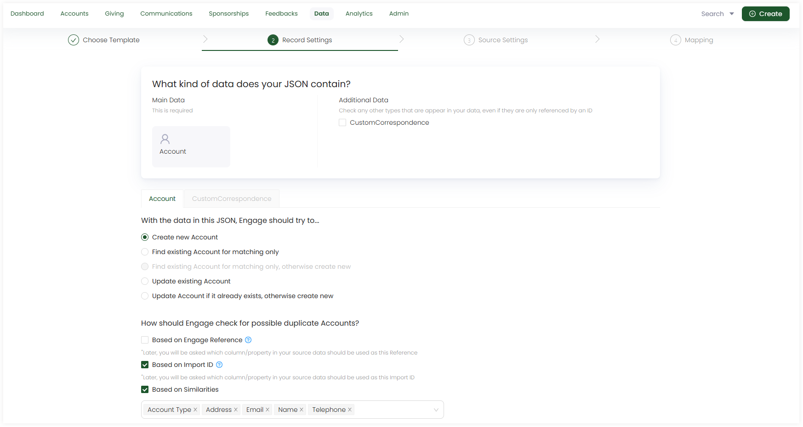
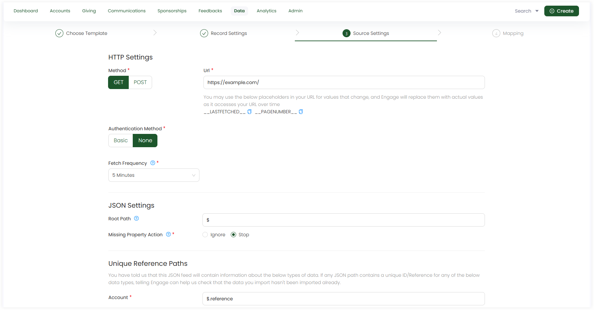
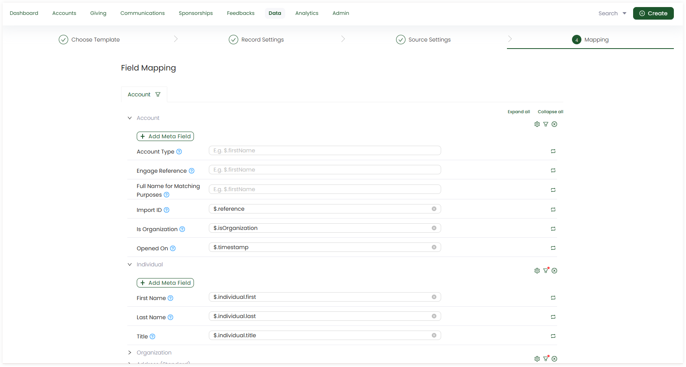

The second type of **data feed** is a **JSON Feed**. In Engage, you can create two different types of JSON feeds:

1. **JSON API Feed**
2. **JSON Webhook Feed**

In this guide, let us look at how to create a JSON API feed and then import data into it via APIs.

**1.** On the **Import Queues** screen, click **+ Create New Feed** and select **JSON** as the feed format for your newly created queue.

**2.** Complete the configuration settings for the JSON feed and click **Create Feed**. 

:::tip
For a more technical approach, contact `N3O` at `support@n3o.ltd` to set up these feed configurations for you as per your requirements. 
:::

### Basic Settings (Choose Template)

- Choose the **JSON API template** provided.
- The **feed name** prepopulates by default, but you can change it, if required.
- Add any extra notes, if required.

### Record Settings

- Observe the kind of data present in the CSV file including **Main Data** and **Additional Data**. Main data is added by default, but tickmark if you want additional data to be added.
- Answer the questions related to both main and additional data under their respective tabs. By default, each question is tickmarked but you can change if you want.

### Source Settings

- Fill up the required **HTTP** and **JSON settings**. They are defined by default but you can change as necessary.
    - HTTP settings include the **method type (GET or POST)**, **URL** to fetch data, **authentication method (basic or none)** and **fetch frequency** in minutes. 
    - JSON settings include **root path** to be defined along with the **missing property action** checkbox.
- Define the **unique reference paths**, **filters** if needed and **formatting options**.

### Mapping

- Map the data in the JSON file with the data references in the CRM. By default, mapping is performed by populating fields but you can change and do it yourself.
- Apply **filters** to specify conditions on the fields in the source data for more clarification via **filter icon**. 
- Any field can be populated by the **Field Transform** function if you require.

**3.** The created feed appears as a **JSON file icon** under the queue on the dashboard.