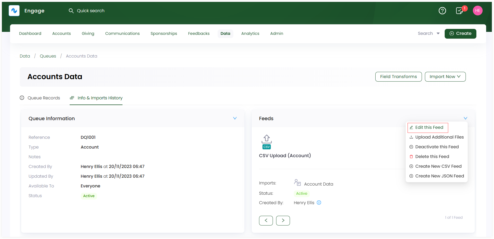
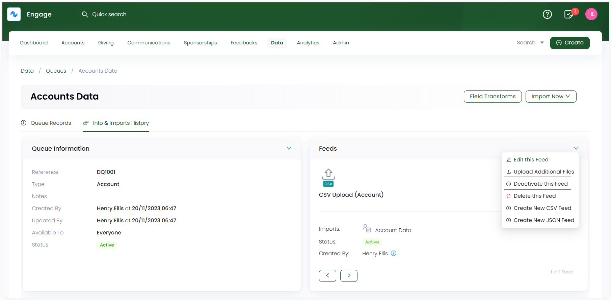
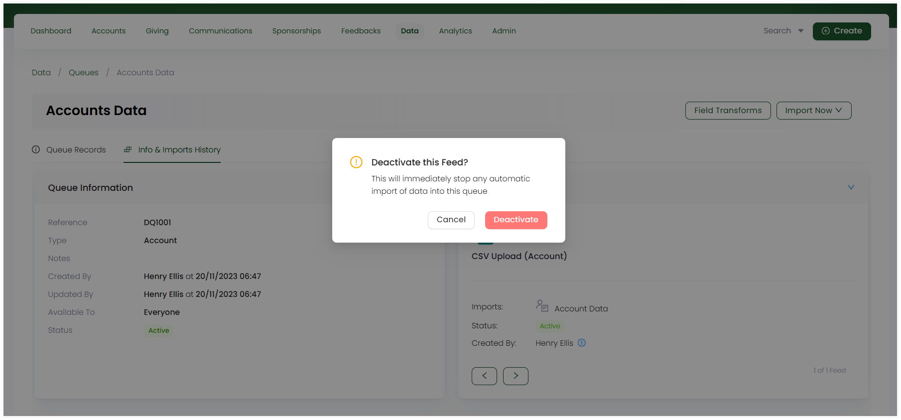
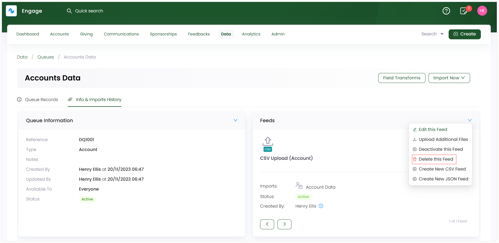
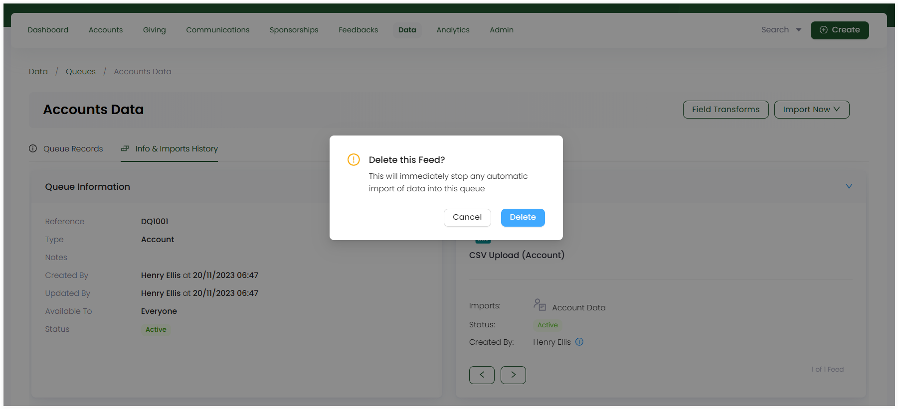

Other than creating feeds under queues, you can perform many more functions with a single feed including:

1. [Editing a Feed](#editing-a-feed) (Updating any part of a feed)
2. [Deactivating a Feed](#deactivating-a-feed) (Making the feed become inactive for a certain period of time)
3. [Deleting a Feed](#deleting-a-feed) (Removing a feed altogether)

## Editing a Feed

To edit a feed:

**1.** Select a queue and navigate to the **Info & Imports History** tab. Click the **down arrow** on the **Feeds** section and select **Edit this Feed**. 

**2.** On the **Update Feed** screen, change any step of the feed you wish to update and click **Save Feed** at the end.

## Deactivating a Feed

To deactivate a feed:

**1.** Select a queue and navigate to the **Info & Imports History** tab. Click the **down arrow** on the **Feeds** section and select **Deactivate this Feed**.

**2.** Read the deactivation message on the popup and click **Deactivate**.

## Deleting a Feed

To delete a feed:

**1.** Select a queue and navigate to the **Info & Imports History** tab. Click the **down arrow** on the **Feeds** section and select **Delete this Feed**.

**2.** Read the deletion message on the popup and click **Delete**.

