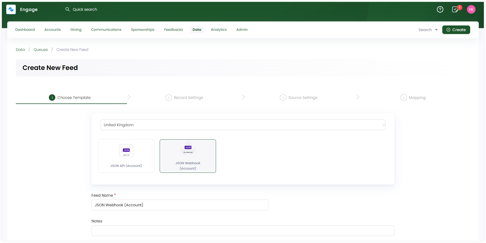
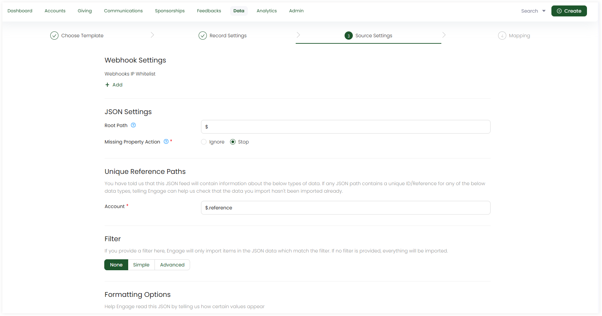

In Engage, webhooks are used as **JSON webhook feeds** created within a queue. These feeds contain a URL to which you post data from the external application. In this guide, let us look at how to create a JSON Webhook feed and then test it accordingly.

## Create a JSON Webhook Feed

**1.** On the **Import Queues** screen, click **+ Create New Feed** and select **JSON** as the feed format for your newly created queue.

**2.** Complete the configuration settings for the JSON feed and click **Create Feed**. 

:::tip
For a more technical approach, contact `N3O` at `support@n3o.ltd` to set up these feed configurations for you as per your requirements. 
:::

### Basic Settings (Choose Template)

- Choose the **JSON Webhook template** provided.
- The **feed name** prepopulates by default, but you can change it, if required.
- Add any extra notes, if required.

### Record Settings

- Observe the kind of data present in the CSV file including **Main Data** and **Additional Data**. Main data is added by default, but tickmark if you want additional data to be added.
- Answer the questions related to both main and additional data under their respective tabs. By default, each question is tickmarked but you can change if you want.

### Source Settings

- Fill up the required **Webhook** and **JSON settings**. They are defined by default but you can change as necessary.
    - Webhook settings include a webhook IP whitelist where you can add IP addresses from where the data will come. 
    - JSON settings include **root path** to be defined along with the **missing property action** checkbox.
- Define the **unique reference paths**, **filters** if needed and **formatting options**.

### Mapping

- Map the data in the JSON file with the data references in the CRM. By default, mapping is performed by populating fields but you can change and do it yourself.
- Apply **filters** to specify conditions on the fields in the source data for more clarification via **filter icon**. 
- Any field can be populated by the **Field Transform** function if you require.

**3.** The created feed appears as a **JSON file icon** under the queue on the dashboard.

## Set up and Test JSON Webhooks

Webhooks are generally used to send data from one application to another, with a three-step process.

1. Get the **webhook URL** from the application you want to send data to.
2. Use that **URL** in the webhook section of the application you want to receive data from.
3. Choose the type of **events** you want the application to notify you about.

**Engage** follows the same general webhook process. To try out a webhook yourself:

- First, create a JSON Webhook in Engage's imports section.
- Then, test the data coming from the sending application within Engage. To read more on how to test the webhook process, go to the <K2Link route="docs/integration-guides/website-integration/testing-webhook-data/" text="Testing Webhook Data Documentation" isInternal/>.

:::tip
To read how data should be posted to a webhook, read the <K2Link route="docs/integration-guides/website-integration/" text="Website Integration Documentation" isInternal/>
:::