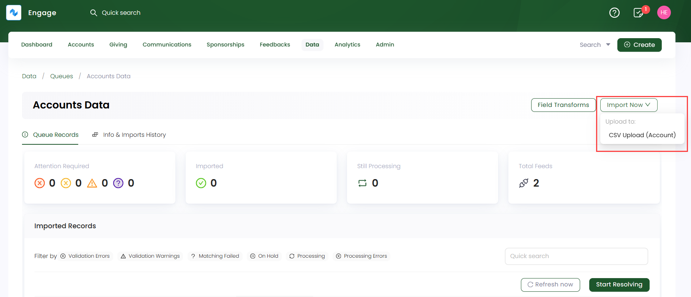
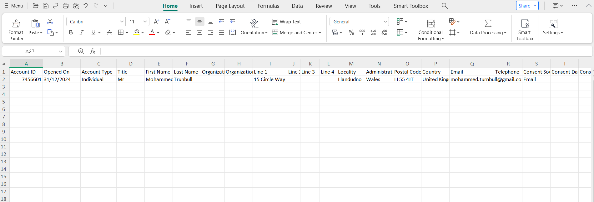
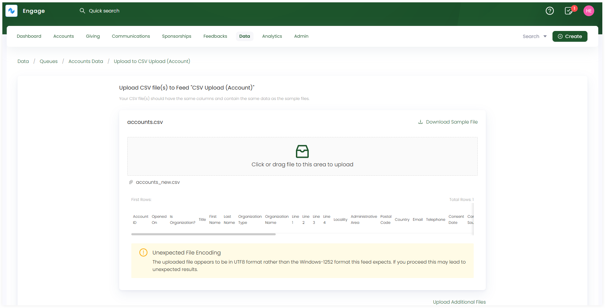
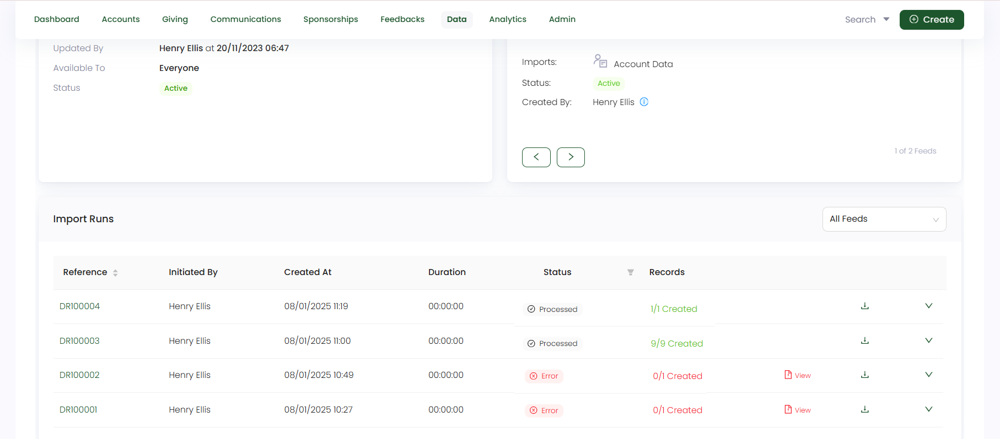

In this guide, let us look at how to import account data into its respective queue.

## Import Account Data via Account Feed

**1.** On an **account queue's** detailed screen, click the **Import Now** option and choose the feed to upload the account data into. Remember to choose a basic feed created for accounts upload. 

**2.** On the **Upload CSV file to Feed** screen, download the sample file and fill it up with all the new accounts that needs to be imported into Engage. In the sample file, there are both **mandatory** and **optional** fields that need to be filled in. Let us have a look at each field and its description for clarity.

:::tip
- These fields also depend on the **field mapping** setup in the CSV Account Feed. You can also check whether the options (selected options, filters) under the fields are correctly configured and your added details are in sync with the mapping.
- If you do not specify any field in the uploaded CSV file, Engage will use the field details from the **Field Mapping** section of the feed.
:::

| Field | Description |
| ----- | ----------- |
| **Account ID** | Unique ID (reference number) dedicated to the account to be created and a **mandatory** field. |
| **Opened On** | Date on which the account is created and a **mandatory** field. |
| **Account Type** | Type of account being created, i.e. **individual** or **organization** and a **mandatory** field. *Title, first & last name, locality, administrative area and postal code depends on the account type entered by the donor.* |
| **Title, First Name & Last Name** | Title, first and last name of the individual and **optional** fields. |
| **Organization Type & Name** | Name and type of the organization and **optional** fields. |
| **Address as Line 1, 2**  | Address of the individual and a **mandatory** field. |
| **Locality & Administrative Area**  | A general place (locality) and a legally defined region (administrative area) and **optional** fields. |
| **Postal Code & Country**  | Unique identification of a region (postal code) and name of the country where the region is and **optional** fields.  |
| **Email & Telephone**  | Email address and telephone number of the individual and either of the two are required as **mandatory** fields. |
| **Consent Source & Date**  | Date of when the consent is given by the donor and name of the source and **optional** fields. The consent date field is usually added the same as **"Opened on"** date by the system if not given by the donor. |
| **Contact Preferences**  | Ways to communicate with the donor via channels for different purposes and **optional** field. But if the donor specifies to add it, then it must be filled up. |
| **Tax Relief Information**  | Information regarding the **tax relief eligibility as yes or no** and the **tax declared date** and are **mandatory** fields. The tax declaration date field is usually added the same as **"Opened on"** date by the system if not given by the donor. |

Upload the CSV file, make sure your CSV file has the same format as the sample file, and click **Upload**.

**3.** Each imported data via a feed is shown as a record in the **Import Runs** section under **Info & Imports History**. Number of records are created and tested on the basis of the number of rows within the uploaded data file. Imported records with a **Processed** status can be downloaded or reprocessed, if needed.

:::tip
Each account imported can be searched and viewed via the different search functions available in Engage.
:::
