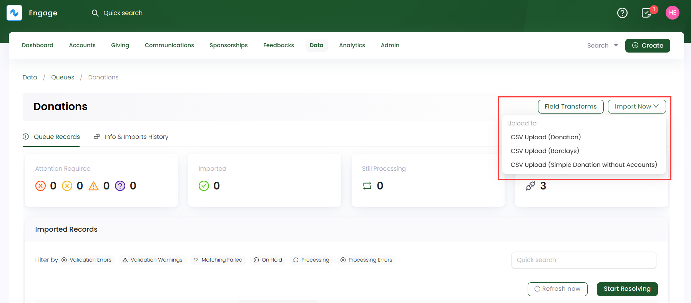
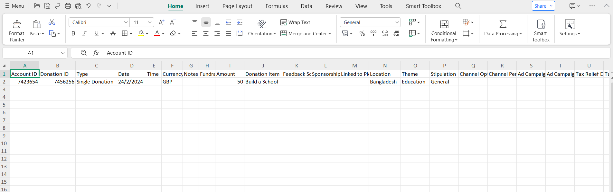
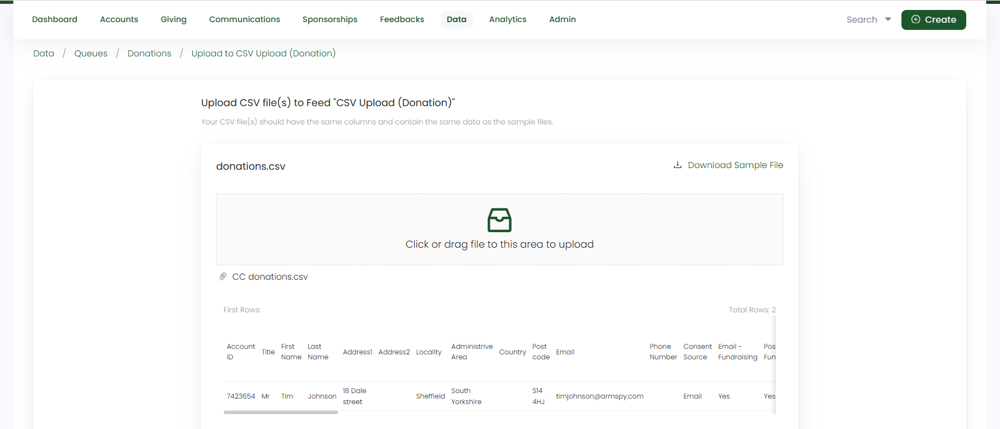
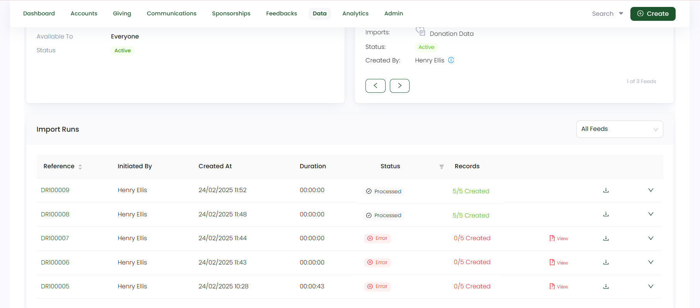

In this guide, let us look at how to import simple donation data in Engage.

## Import Donation Data via Donation Feed

:::tip
When importing donations, you can import a donation along with other data types (accounts, sponsorships, feedbacks, pledges), but in this guide we will talk about simple donations only.
:::

**1.** On a **donation queue's** detailed screen, click the **Import Now** option and choose the feed to upload the donation data into. Remember to choose a basic feed created for simple donations upload. 

**2.** On the **Upload CSV file to Feed** screen, download the sample file and fill it up with all the new donations that need to be imported into Engage. In the sample file, there are both **mandatory** and **optional** fields that need to be filled in. Let us have a look at each field and its description for clarity.

:::tip
- These fields also depend on the **field mapping** setup in the CSV Account Feed. You can also check whether the options (selected options, filters) under the fields are correctly configured and your added details are in sync with the mapping.
- If you do not specify any field in the uploaded CSV file, Engage will use the field details from the **Field Mapping** section of the feed.
:::

| Field | Description |
| ----- | ----------- |
| **Account ID** | Unique ID (reference number) dedicated to the account bringing in the donation and a **mandatory** field. |
| **Donation ID** | Unique ID (reference number) dedicated to a donation and a **mandatory** field. If accounts are included, then both donation and account ID can be the same.  |
| **Date** | Date of when the donation was done and a **mandatory** field. |
| **Type** | Type of donation being imported, i.e. **single donation** or **regular giving** and a **mandatory** field. |
| **Currency** | Currency in which the donation's payment will be done and a **mandatory** field. |
| **Amount** | Amount dedicated to the donation and a **mandatory** field. |
| **Allocation Type** | Type of allocation (fund, sponsorship, feedback or pledge) related to the donation and a **mandatory** field. |
| **Donation Item** | Donation item related to the **allocation type (fund)** and a **mandatory** field in case a fund is selected for a donation, otherwise **optional**. |
| **Fund Dimensions** | Dimensions related to the **allocation type (fund)** which are **location, theme and stipulation** and a **mandatory** field in case a fund is selected for a donation, otherwise optional. |
| **Channel Option and Percentage** | Channel's name to which the donation will be attributed towards and percentage number (of how much percent the donation is attributed) and an **optional** field. |
| **Payment Method** | Type of payment method used for the donation and a **mandatory** field. |
| **Tax Relief Donation Information** | Information such the **tax relief donation amount, currency, claim submitted on**, etc. and are optional fields. |

Upload the CSV file, make sure your CSV file has the same format as the sample file, and click **Upload**.

**3.** Each imported data via a feed is shown as a record in the **Import Runs** section under **Info & Imports History**. Number of records are created and tested on the basis of the number of rows within the uploaded data file. Imported records with a **Processed** status can be downloaded or reprocessed, if needed.

:::tip
Each donation imported can be searched and viewed via the different search functions available in Engage.
:::