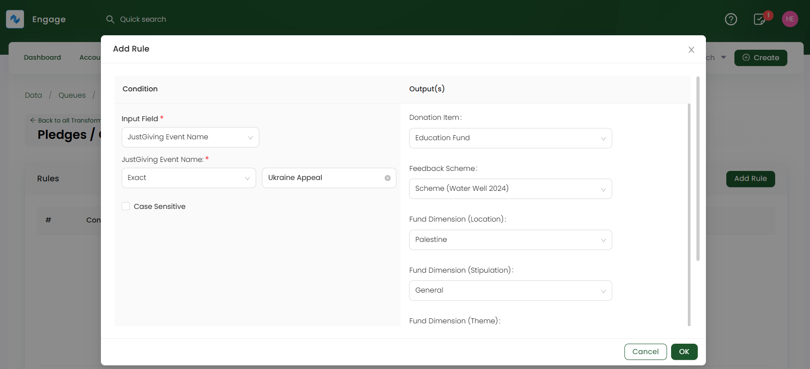
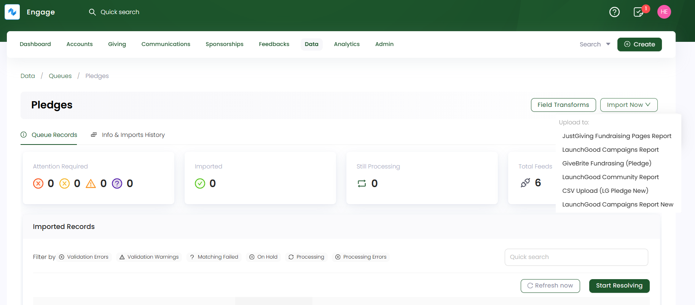
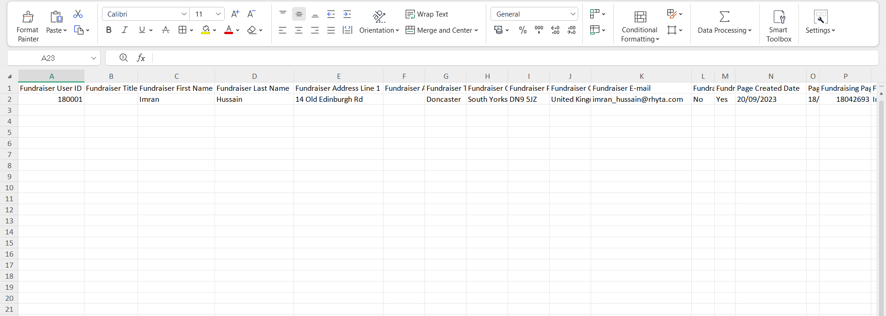
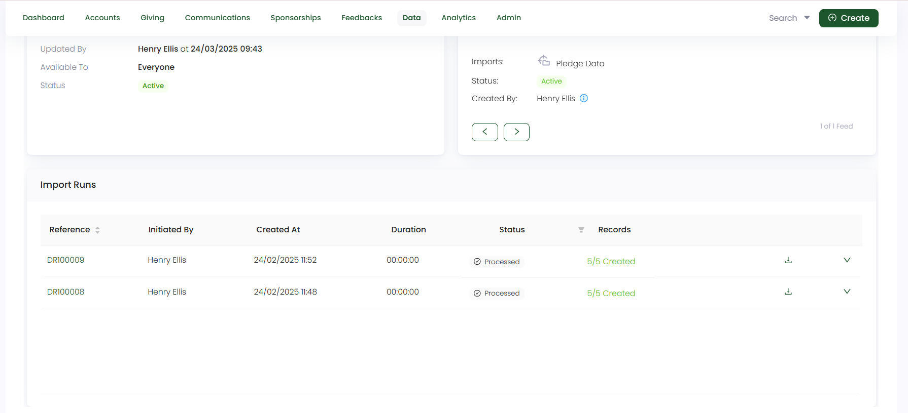
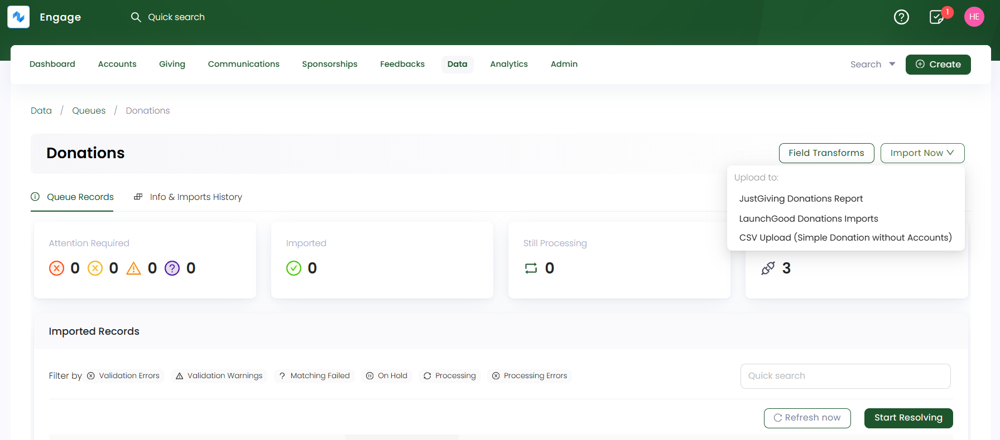
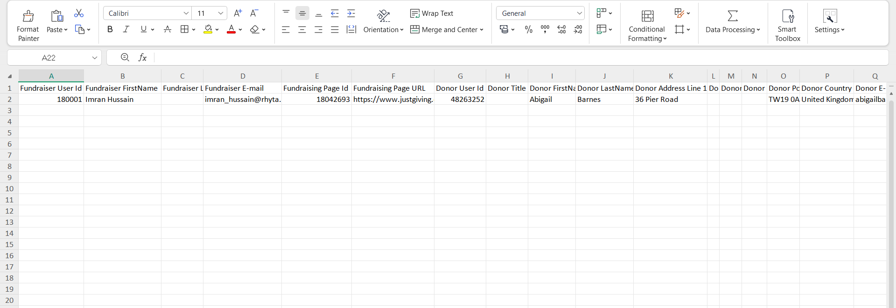
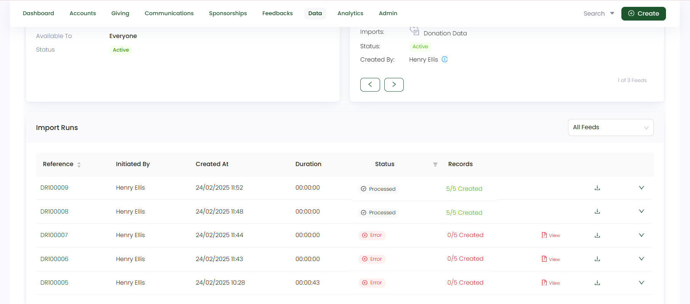

JustGiving is an online fundraising platform that allows individuals, charities, and organizations to raise money for various causes through crowdfunding and peer-to-peer fundraising. Here, fundraisers can create fundraiser campaigns and collect donations globally.

Engage allows you to import JustGiving donations through its data import feature. To start the process, you must first import the **campaign/fundraiser CSV sheet** obtained through the JustGiving platform into a **type: "Pledge" queue**.

### Import Campaign/Fundraiser Data into Engage via Pledge Queue

**1.** The first step is to create a **field transform rule** for multiple fundraising events in the campaign data. Each event is dedicated to a certain cause and this cause needs to be populated in the form of a pledge with the selected donation items and its fund dimensions in Engage. 

**1.1** To create a rule, click **Field Transforms** on a **pledge queue's** detailed screen. Click **Add Rule** for the feed you choose to import campaign data into. Then select the **Input Field** as the **event or appeal name**, the **Output fields** which majorly include: **Donation Item**, **Fund Dimensions (location, theme & stipulation)**, **Sponsorship or Feedback scheme's** and the **Type of allocation**.

:::tip
Prior to adding a rule, you must click the **transform icon** for each of the fields in **"Step 4: Mapping"**, while creating the feed.
:::

**2.** Now, click the **Import Now** option and choose the **JustGiving type CSV feed** to upload the campaign data into. 

**3.** On the **Upload CSV file to Feed** screen, upload all the campaign/fundraiser data that needs importing into Engage as a `CSV file`. You can also download the sample CSV file, which includes both **mandatory** and **optional** fields for reference. 

Let us have a look at each field and its description for clarity.

| Field | Description |
| ----- | ----------- |
| **Fundraiser ID** | Unique ID (reference number) dedicated to the fundraiser (the one creating the campaign) and a **mandatory** field. |
| **Fundraiser First & Last Name** | First and last name of the fundraiser and a **mandatory** field. |
| **Fundraiser Address Details** | Address details of the fundraiser including **Address line**, **Town/City**, **State**, **Post/Zip Code** and **Country** and a **mandatory** field. |
| **Fundraiser Email** | Email address of the fundraiser and a **mandatory** field. |
| **Fundraiser Page Created Date** | Date on which the fundraising page was created and a **mandatory** field. |
| **Fundraising Page ID & Title** | Unique ID (reference number) and title given to the fundraising page and a **mandatory** field. |
| **Fundraising Page Status & URL** | Status as active or inactive and URL of the fundraising page and a **mandatory** field. |
| **Event ID & Name** | Unique ID (reference number) dedicated to the fundraiser event and its name and a **mandatory** field. |
| **Appeal Name** | Name of the appeal for which the campaign is launched and a **mandatory** field. |
| **Number and Total Donations** | The number of online donations recieved and the total number of donation goal to reach and a **mandatory** field. |

**4.** Each imported data via a feed is shown as a record in the **Import Runs** section under **Info & Imports History**. Number of records are created and tested on the basis of the number of rows within the uploaded data file. Imported records with a **Processed** status can be downloaded or reprocessed, if needed.

:::tip
You can search for the created pledge via any search function in Engage.
:::

### Import Donations Recieved from the Campaign into Engage via Donations Queue

**1.** When the campaign data is successfully imported in Engage, the second step is to import all the donations received via the JustGiving platform campaign. On the **donation queue's detailed** screen, click the **Import Now** option and choose the **JustGiving type CSV feed** to upload the donation data into.

**2.** On the **Upload CSV file to Feed** screen, upload all the donation data that needs importing into Engage as a `CSV file`. You can also download the sample CSV file, which includes both **mandatory** and **optional** fields for reference. 

Let us have a look at each field and its description for clarity.

| Field | Description |
| ----- | ----------- |
| **Fundraiser ID** | Unique ID (reference number) dedicated to the fundraiser (the one creating the campaign) and a **mandatory** field. |
| **Fundraiser First & Last Name** | First and last name of the fundraiser and a **mandatory** field. |
| **Fundraiser Email** | Email address of the fundraiser and a **mandatory** field. |
| **Fundraising Page ID & URL** | Unique ID (reference number) and URL of the fundraising page and a **mandatory** field. |
| **Donor User ID** | Unique ID (reference number) dedicated to the donor who donated towards the campaign and a **mandatory** field. |
| **Donor First & Last Name** | First and last name of the donor and a **mandatory** field. |
| **Donor Address Details** | Address details of the donor including **Address line**, **Town/City**, **State**, **Post/Zip Code** and **Country** and a **optional** field. |
| **Donor Email** | Email address of the donor and a **mandatory** field. |
| **Donation Date** | Date of the donation and a **mandatory** field. |
| **Donation & Product Source** | Source of the donation and the platform from where the donation is coming and an **optional** field. |
| **Payment Frequency and Type** | The frequency and type of the donation payment and an **optional** field. |
| **Donation Currency & Amount** | Currency and amount of the donation and a **mandatory** field. |
| **Appeal Name** | Name of the appeal against which the donation is made and a **mandatory** field. |

**3.** Each imported data via a feed is shown as a record in the **Import Runs** section under **Info & Imports History**. Number of records are created and tested on the basis of the number of rows within the uploaded data file. Imported records with a **Processed** status can be downloaded or reprocessed, if needed.

:::tip
You can search for the created donations under a pledge by navigating to that pledge via any search function in Engage.
:::