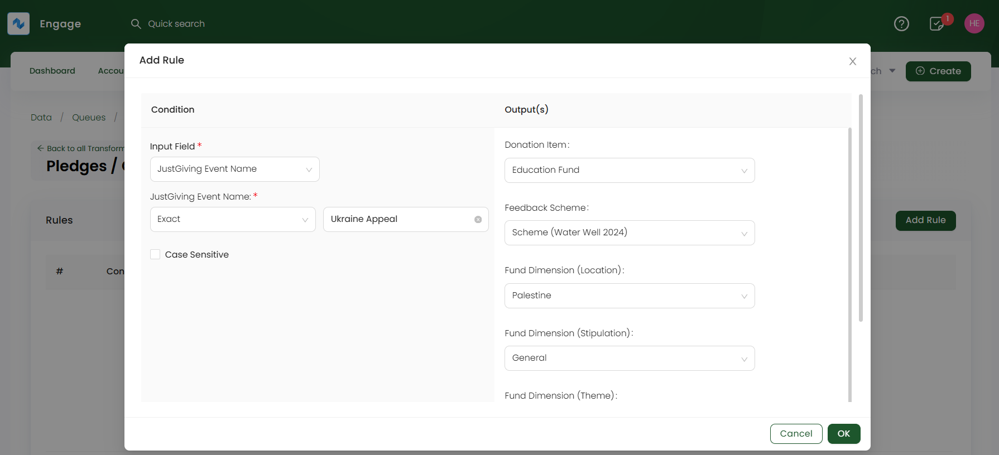

LaunchGood is a global crowdfunding platform that enables individuals, nonprofits, and organizations to raise funds for charitable, personal, and business initiatives while aligning with Islamic values, including interest-free transactions and zakat-compliant giving.

Engage allows you to import LaunchGood donations through its data import feature. To start the process, you must first import the **campaign/fundraiser CSV sheet** obtained through the LaunchGood platform into a **type: "Pledge" queue**.

### Upload Campaign/Fundraiser Data into Pledge Queue

**1.** The first step is to create a **field transform rule** for multiple fundraising events in the campaign data. Each event is dedicated to a certain cause and this cause needs to be populated in the form of a pledge with the selected donation items and its fund dimensions in Engage. 

**1.1** To create a rule, click **Field Transforms** on a **pledge queue's** detailed screen. Click **Add Rule** for the feed you choose to import campaign data into. Then select the **Input Field** as the **event or campaign name**, the **Output fields** which majorly include: **Donation Item**, **Fund Dimensions (location, theme & stipulation)**, **Sponsorship or Feedback scheme's** and the **Type of allocation**.

:::tip
Prior to adding a rule, you must click the **transform icon** for each of the fields in **"Step 4: Mapping"**, while creating the feed.
:::

**2.** Now, click the **Import Now** option and choose the **LaunchGood type CSV feed** to upload the campaign data into. 

**3.** On the **Upload CSV file to Feed** screen, upload all the campaign/fundraiser data that needs importing into Engage as a `CSV file`. You can also download the sample CSV file, which includes both **mandatory** and **optional** fields for reference. 

Let us have a look at each field and its description for clarity.

| Field | Description |
| ----- | ----------- |
| **Account ID** | Unique ID (reference number) of the account creating the fundraiser and a **mandatory** field. |
| **Account Name** | Name of the account creating the fundraiser and a **mandatory** field. |
| **Fundraiser Name** | Name of the fundraiser page and a **mandatory** field. |
| **Fundraising URL** | URL of the fundraising page and a **mandatory** field. |
| **Start, End & Launch Date** | Start date, end date and launch date of the fundraising page and all **mandatory** fields. |
| **Created By** | Email address of the fundraiser that creates a fundraiser page and a **mandatory** field. |
| **Fundraiser Category** | Category of the fundraiser page and an **optional** field. |
| **Fundraiser Status & Currency** | Status of the fundraiser page and the currency in which donations would be collected and a **mandatory** field. |
| **Amount Raised** | Amount raised via the fundraising page and an **optional** field. |
| **Goal Amount** | The set goal of the amount that should be raised and a **mandatory** field. |
| **Number of Donations** | Number of donations recieved via the fundraising page and a **mandatory** field. |
| **Community Name & URL** | Same as the fundraiser page name and URL and **optional** fields. |

**4.** Each imported data via a feed is shown as a record in the **Import Runs** section under **Info & Imports History**. Number of records are created and tested on the basis of the number of rows within the uploaded data file. Imported records with a **Processed** status can be downloaded or reprocessed, if needed.

:::tip
You can search for the created pledge via any search function in Engage.
:::

### Upload Donations Recieved from the Campaign into Donations Queue

**1.** When the campaign data is successfully imported in Engage, the second step is to import all the donations received via the LaunchGood platform campaign. On the **donation queue's detailed** screen, click the **Import Now** option and choose the **LaunchGood type CSV feed** to upload the donation data into.

**2.** On the **Upload CSV file to Feed** screen, upload all the donation data that needs importing into Engage as a `CSV file`. You can also download the sample CSV file, which includes both **mandatory** and **optional** fields for reference. 

Let us have a look at each field and its description for clarity.

| Field | Description |
| ----- | ----------- |
| **Donation ID** | Unique ID (reference number) dedicated to a donation and a **mandatory** field. |
| **Donor First & Last Name** | First and last of the donor and a **mandatory** field. |
| **Donor Email** | Email of the donor which depends on the consent of the donor and a **mandatory** field. |
| **Anonymous or Public** | Status of the donor and a **mandatory** field. |
| **Donation Currency & Amount** | Currency of the donation and its amount and both **mandatory** fields. |
| **Zakat** | If the donation is donated as zakat or not and an **optional** field. |
| **Created Date** | Date on which the donation was made and a **mandatory** field. |
| **Type** | Type of the donation and a **mandatory** field. |
| **Number of Donors** | Number of donors that made donations on the fundraiser page and a **mandatory** field. |
| **Gift Aid** | Tell about gift aid as yes and no and a **mandatory** field. |
| **Payment Type** | The type of payment while making a donation and a **mandatory** field. |
| **Campaign Name & URL** | Name and URL of the fundraising/campaign page and a **mandatory** field. |
| **Community Name & URL** | Same as the fundraiser page name and URL and **optional** fields. |

**3.** Each imported data via a feed is shown as a record in the **Import Runs** section under **Info & Imports History**. Number of records are created and tested on the basis of the number of rows within the uploaded data file. Imported records with a **Processed** status can be downloaded or reprocessed, if needed.

:::tip
You can search for the created donations under a pledge by navigating to that pledge via any search function in Engage.
:::