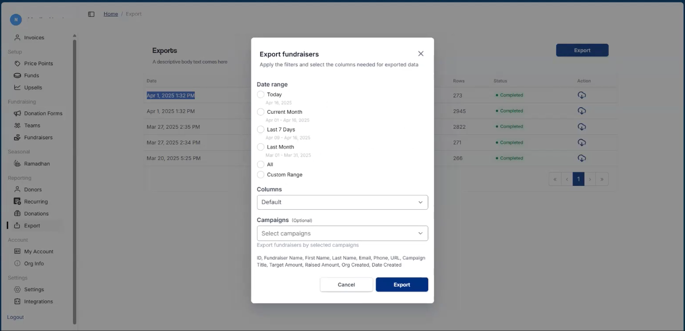
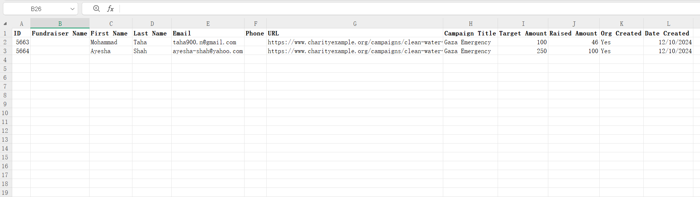
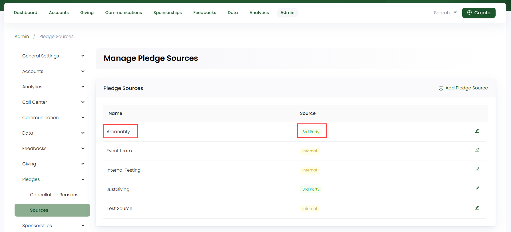
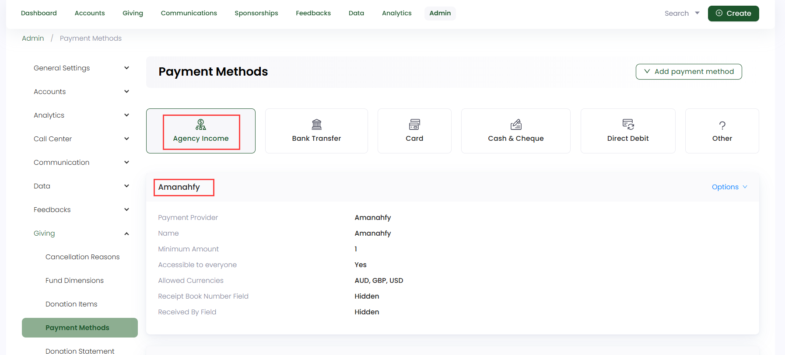
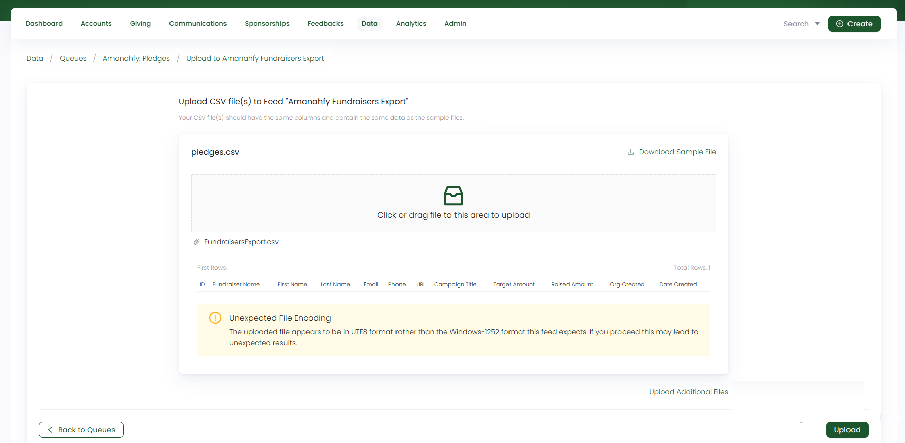
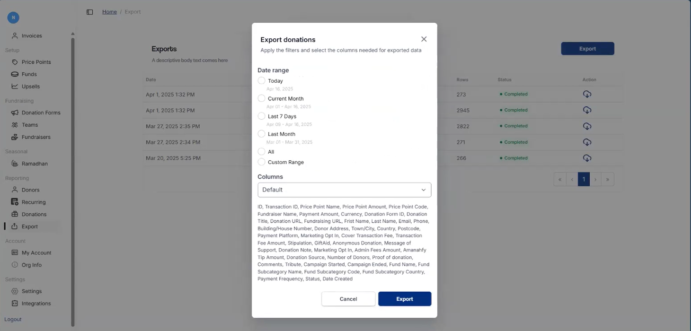
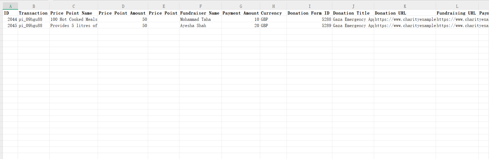
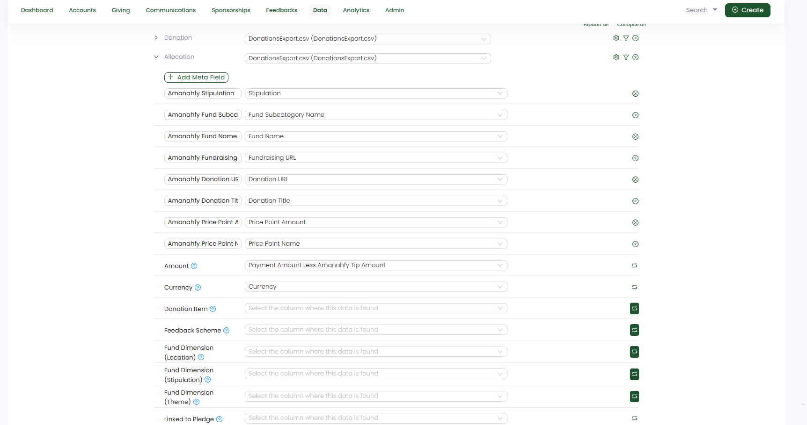
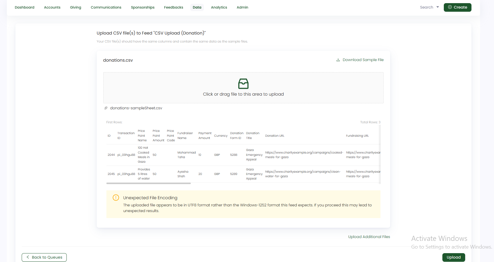

Amanahfy is a charity technology partner dedicated to empowering organisations and donors with cutting-edge solutions that amplify their giving. Some basic **key features** include:

- **Fundraising Tools:** Provides native fundraising, smart checkouts, analytics studio, and donor management.
- **Donor Engagement:** Offers donation updates, one-tap giving, and community giving features.
- **Islamic Giving:** Supports Zakat, Sadaqah, Sadaqah Jariyah, and Lillah contributions

Engage allows you to import **Amanahfy donations** through its data import feature. The general steps included are:

1. Export an **Amanahfy fundraisers sheet** from the Amanahfy portal. 
2. Create a **type: pledge CSV feed** in Engage Imports section and then import the data into Engage as pledges.
3. Export an **Amanahfy donations sheet** from the Amanahfy portal.
4. Create a **type: donations CSV feed** in Engage Imports section and then import the donations into Engage. 

## Import Amanahfy Fundraisers Data into Engage

:::tip
- Fundraisers are imported as **pledges** in Engage and originally have **no allocations** defined with them. Hence, when imported as a pledge, allocations do not appear.
- Parent/main fundraisers having **zero target amount** are set to **100 pounds as default target amount** when imported in Engage. 
- Campaign/fundraiser page name is stored as **External Reference 2** within the pledge in Engage. 
:::

**1.** The first step is to login into the **Amanahfy portal** and export the **fundraisers** data sheet. Choose **Export** in the side menu and then click the **Export** option. Select **Fundraisers**, apply the filters and click **Export**.

- Choose the **Date Range** as current date, month, last month, last 7 days, or custom range according to preference. By default, **All** must be selected.
- Choose the **Columns** as **Default**, not custom.

**2.** The exported fundraisers sheet includes different fields which are both mandatory and optional while importing in Engage. 

Let us have a look at each field and its description.

| Field | Description |
| ----- | ----------- |
| **ID** | Unique ID/number of the fundraiser/campaign and a **mandatory** field. |
| **Fundraiser Name** | Collective name of the fundraiser page creator and an **optional** field. |
| **First & Last Name** | First and last name as a separate of the fundraiser page creator and a **mandatory** field.  |
| **Email** | Email address of the fundraiser page creator and a **mandatory** field.  |
| **Phone** | Phone number of the fundraiser page creator and an **optional** field. |
| **URL** | URL of the fundraiser page created and a **mandatory** field. Some fundraisers have an "empty name section", meaning these fundraisers are the **parent** and **main** campaigns. |
| **Campaign Title** | Name/title of the fundraiser page/campaign and a **mandatory** field. |
| **Target Amount** | Financial goal amount the fundraiser has to achieve and a **mandatory** field. |
| **Raised Amount** | Total amount collected so far during a fundraiser and a **mandatory** field. |
| **Org Created** | Talks about if the fundraiser is created by the organization as "yes" or "no" and an **optional** field. |
| **Date Created** | Date and time on which the fundraiser was created and a **mandatory** field. |

**3.** The next step is to create a CSV feed to import the fundraisers data into Engage. But before import, some **prerequisites** need to be completed. **Make sure to login into Engage**.

#### 1. Add Amanahfy as Pledge Source

Navigate to **Admin** and select **Sources** under **Pledges**. Add **Amanahfy** as **3rd Party** source.

#### 2. Add Amanahfy as Payment Method

Navigate to **Admin** and select **Payment Methods** under **Giving**. Add **Amanahfy** as **Agency Income** payment method. To learn how to add, refer to the <K2Link route="docs/administrators/giving/adding-payment-methods/agency-income/" text="Agency Income Documentation" isInternal/>.

**4.** When the prerequisites are done, start creating the CSV feed. Choose a **type: Pledge queue** and create a new **type: CSV feed**. Select the **Amanahfy Fundraisers Export** template and each step is prepopulated as default without the need to change anything. Some important things to remember are under "Configure Options":

- Default **amount** is set to **100 pounds**.
- Default **currency** is set to **GBP**.
- **Allocations** are enabled as **no**.
- Fundraisers with **accounts** having no first & last name will be dealed as **anonymous pledges**.
 
**5.** When the feed is created, start importing the fundraisers data. Click **Import Now**, choose the **Amanahfy Fundraisers Export** feed, upload the fundraisers sheet and click **Upload**.

## Import Amanahfy Donations Data into Engage

**1.** The first step is to login into the **Amanahfy portal** and export the **donations** data sheet. Choose **Export** in the side menu and then click the **Export** option. Select **Donor and Donations**, apply the filters and click **Export**.

- Choose the **Date Range** as current date, month, last month, last 7 days, or custom range according to preference. By default, **All** must be selected.
- Choose the **Columns** as **Default**, not custom.

**2.** The exported donation sheet includes different fields which are both mandatory and optional while importing in Engage. 

Let us have a look at each field and its description.

| Field | Description |
| ----- | ----------- |
| **ID** | Unique ID/number of the donation and a **mandatory** field. |
| **Transaction ID** | Unique ID/number of the donation transaction and a **optional** field. |
| **Price Point Name** | Description of the donated item and a **mandatory** field. |
| **Price Point Amount** | Amount of the donated item and an **mandatory** field. |
| **Fundraiser Name** | Name of the fundraiser who made a donation and a **mandatory** field. |
| **Payment Amount** | Amount of the donation and a **mandatory** field. |
| **Currency** | Currency of the donation and a **mandatory** field. |
| **Donation Form ID** | Unique ID/number of the donation and an **optional** field. |
| **Donation Title** | Title of the donation form and a **mandatory** field. |
| **Donation URL** | URL of the page from where the donation is coming and a **mandatory** field. |
| **Fundraising URL** | URL of the fundraising page (where the donation was made) and a **mandatory** field. |
| **Marketing Opt In** | Opting for email and marketing communications as yes or no and a **mandatory** field. |
| **Stipulation** | Stipulation (type of fund dimension) of the donation item donated and a **mandatory** field. |
| **Gift Aid** | Tax status of the account creating a donation and a **mandatory** field. |
| **Anonymous Donation** | If the donation was made as anonymous or not and a **mandatory** field. |
| **Donation Source** | Source of the donation and an **optional** field. |
| **Campaign Started** | Date and time the campaign (fundraiser) was started and an **optional** field. |
| **Fund Name** | Name of the main fund towards which a donation was made and a **mandatory** field. |
| **Fund SubCategory Name** | Name of the subcategory of the main fund and a **mandatory** field. |
| **Date Created** | Time and date on which the donation was done and a **mandatory** field. |
| **First & Last Name** | First and last name as a separate of the fundraiser/donor and a **mandatory** field.  |
| **Email** | Email address of the fundraiser/donor and a **mandatory** field.  |
| **Phone** | Phone number of the fundraiser/donor and an **optional** field. |
| **Building/House Number & Donor Address** | House number and area name (donor address) of the fundraiser/donor and a **mandatory** field. |
| **Town/City** | Town and city of the fundraiser/donor and a **mandatory** field. |
| **Country & PostCode** | Country and post code of the fundraiser/donor and a **mandatory** field. |

**3.** The next step is to create a CSV feed to import the donations data into Engage. Choose a **type: Donation queue** and create a new **type: CSV feed**. Select the **Amanahfy Donations Export** template and each step is prepopulated as default. Only a small change needs to be done: choose **External Reference** only while "searching for a matching pledge" in **step:2 (Record Settings)**. 

**4.** Since no **allocations** are present in the donation sheet, transform rules need to be added in the feed. For this purpose, some **excel fields** of the sheet **(Stipulation, Fund Name, Fund SubCategory Name, Donation URL & Title)** related to allocations, are added as **meta fields** in the feed so that when a transform rule is applied, these fields are available as input. The feed by default, includes tickmarked **transform icon** for the fields: *Donation Item, Feedback Scheme, Fund Dimension (Location, Stipulation, Theme)*. Only <K2Link route="docs/engage/data/imports/field-transform-advanced-data-import/" text="transform rules need to be added" isInternal/> accordingly. 

**5.** When the feed is created and transform rules are set up, start importing the donations data. Click **Import Now**, choose the **Amanahfy Donations Export** feed, upload the donations sheet and click **Upload**.

