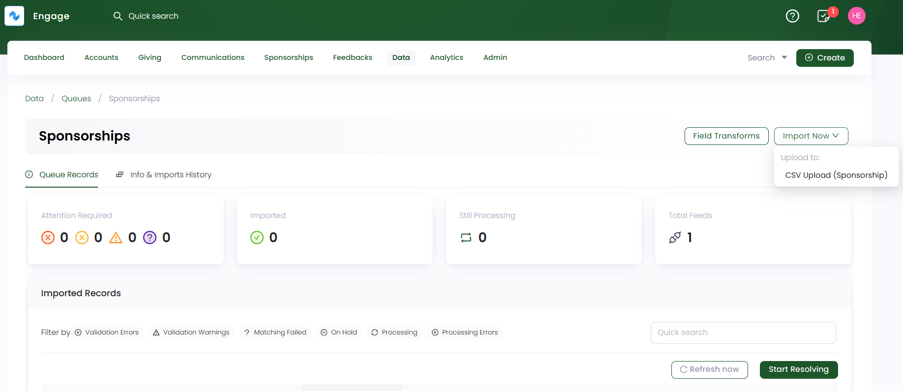
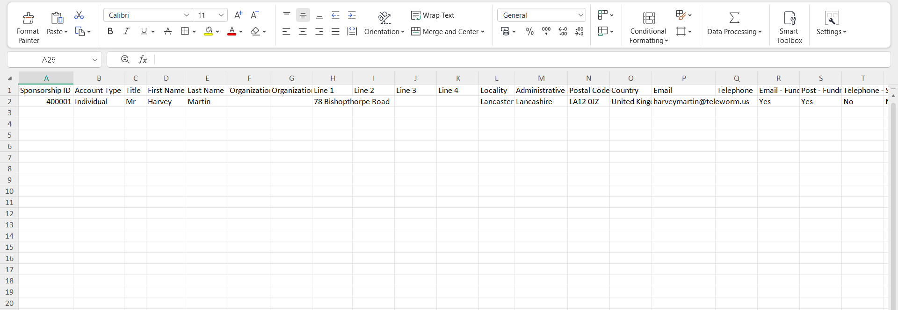
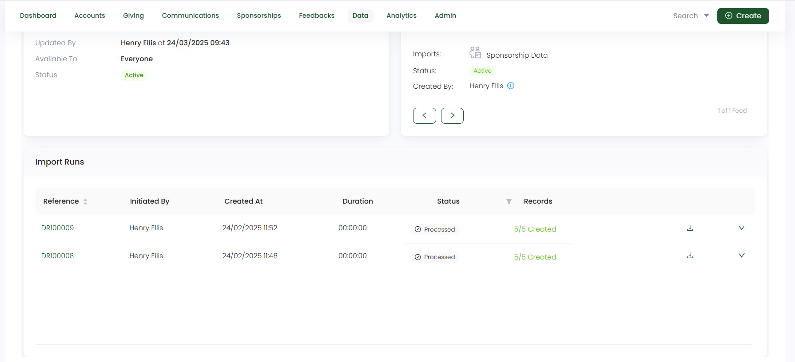

In this guide, let us look at how to import sponsorships data in Engage.

**1.** On a **sponsorships queue's** detailed screen, click the **Import Now** option and choose the feed to upload the sponsorship data into. Remember to choose a basic feed created for sponsorships upload. 

**2.** On the **Upload CSV file to Feed** screen, upload all the sponsorship data that needs importing into Engage as a `CSV file`. You can also download the sample CSV file, which includes both **mandatory** and **optional** fields for reference. 

:::tip
- These fields also depend on the **field mapping** setup in the CSV Sponsorship Feed. You can also check whether the options (selected options, filters) under the fields are correctly configured and your added details are in sync with the mapping.
- If you do not specify any field in the uploaded CSV file, Engage will use the field details from the **Field Mapping** section of the feed.
- All sponsorship schemes added in Engage, will show up in the **field mapping step 4** while creating the feed. Hence, make sure all fields are synced throughout.
:::

Let us have a look at each field and its description for clarity.

| Field | Description |
| ----- | ----------- |
| **Sponsorship ID** | Unique ID (reference number) dedicated to the sponsorship to be created and a **mandatory** field. |
| **Account Type** | Type of account creating the sponsorship, i.e. **individual** or **organization** and a **mandatory** field. |
| **Title, First Name & Last Name** | Title, first and last name of the individual and **optional** fields. |
| **Organization Type & Name** | Name and type of the organization and **optional** fields. |
| **Address as Line 1, 2**  | Address of the individual and a **mandatory** field. |
| **Locality & Administrative Area**  | A general place (locality) and a legally defined region (administrative area) and **optional** fields. |
| **Postal Code & Country**  | Unique identification of a region (postal code) and name of the country where the region is and **optional** fields.  |
| **Email & Telephone**  | Email address and telephone number of the individual and either of the two are required as **mandatory** fields. |
| **Contact Preferences**  | Ways to communicate with the donor via channels for different purposes *(email, post, sms)* and **optional** field. But if the donor specifies to add it, then it must be filled up. |
| **Tax Relief Information**  | Information regarding the **tax relief eligibility as yes or no** and if no, the **tax relief ineligible reason** and are **mandatory** fields. |
| **Commitment Type & Sponsorship Duration** | Type of commitment as **fixed-term** or **open-ended** and length of time a donor commits to sponsor an orphan i.e. 12, 24 or 36 months and **mandatory** fields. |
| **Beneficiary Reference** | Reference number (unique ID) dedicated to the beneficiary associated with the sponsorship and a **mandatory** field. |
| **Sponsorship Begin On Date & Currency** | Date on which the sponsorship would begin and the currency for its payments and **mandatory** fields. |
| **Fund Dimensions** | Dimensions related to the **beneficiary being sponsored** which are **location, theme and stipulation** and a **mandatory** field. |
| **Sponsorship Components** | **Monthly amount and quantity as numbers** of the sponsorship components (general or any other) and are **mandatory** fields. *Components appear according to the ones added while creating a sponsorship scheme in the Engage Admin Section*. |
| **Sponsorship Scheme** | Name of the type of sponsorship scheme and a **mandatory** field. |

**3.** Each imported data via a feed is shown as a record in the **Import Runs** section under **Info & Imports History**. Number of records are created and tested on the basis of the number of rows within the uploaded data file. Imported records with a **Processed** status can be downloaded or reprocessed, if needed.

:::tip
Each sponsorship imported can be searched and viewed via the different search functions available in Engage.
:::