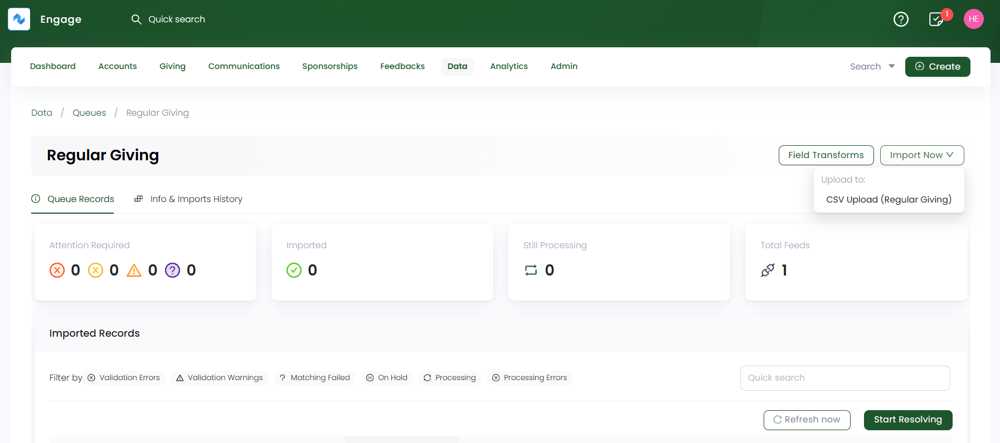
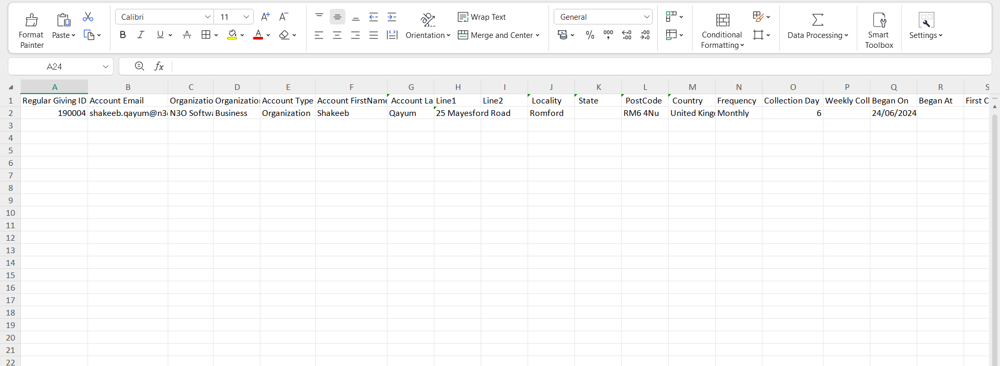
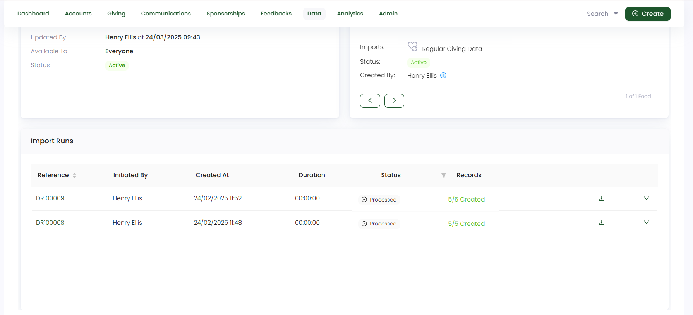

In this guide, let us look at how to import regular givings in Engage.

**1.** On a **regular giving queue's** detailed screen, click the **Import Now** option and choose the feed to upload the regular giving data into. Remember to choose a basic feed created for regular giving upload. 

**2.** On the **Upload CSV file to Feed** screen, upload all the regular givings that needs importing into Engage as a `CSV file`. You can also download the sample CSV file, which includes both **mandatory** and **optional** fields for reference. 

:::tip
- These fields also depend on the **field mapping** setup in the CSV Regular Giving Feed. You can also check whether the options (selected options, filters) under the fields are correctly configured and your added details are in sync with the mapping.
- If you do not specify any field in the uploaded CSV file, Engage will use the field details from the **Field Mapping** section of the feed.
- **Sponsorships, pledges and feedbacks can be imported along with a regular giving, if it was added as an allocation for the regular giving. These are regarded as additional data and must be selected while creating a type CSV regular giving feed (step 2: Record Settings). Hence, fields related to this additional data must be added in the CSV file for upload.** 
:::

Let us have a look at each field and its description for clarity.

| Field | Description |
| ----- | ----------- |
| **Account ID** | Unique ID (reference number) dedicated to the account that created a regular giving and a **mandatory** field. |
| **Account Type** | Type of account, i.e. **individual** or **organization** and a **mandatory** field. |
| **Account Email**  | Email address of the individual and a **mandatory** field. |
| **Address Details**  | Address details of the individual including *line address, locality, post code, country* and a **optional** field, if required. |
| **Tax Relief Information**  | Information regarding the **tax identification number**, **tax relief category** and **tax amount claimed** and are **mandatory fields, if required** and given by the donor. |
| **Regular Giving ID** | Unique ID (reference number) dedicated to a regular giving and a **mandatory** field. |
| **Frequency** | How many times a regular giving is being taken and an **optional** field. |
| **Installment Triggers Enabled** | A trigger applied if a donation receipt is needed each time a regular giving is taken. If added by donor, then a **mandatory** field. |
| **Collection Day** | Day of the month on which the regular giving payment would be taken and a **mandatory** field. |
| **Began On** | Date on which the regular giving began and a **mandatory** field. |
| **First Collection Date** | Very first date on which the regular giving was taken and an **optional** field. |
| **Currency & Amount** | Currency in which the regular giving is taken and its amount and both are **mandatory** fields. |
| **Type** | Type of allocation added to the regular giving and a **mandatory** field. |
| **Donation Item** | An item associated with a type fund allocation and a **mandatory** field. |
| **Fund Dimensions** | Dimensions related to the **allocation** chosen i.e. **location, theme and stipulation** and a **mandatory** field. |
| **Feedback scheme & Sponsorship scheme & Linked to Pledge** | These options are added if the regular giving is added with an allocation type as a feedback, sponsorship or linked to a pledge. |
| **Commitment Type & Sponsorship Duration** | Type of commitment as **fixed-term** or **open-ended** and length of time a donor commits to sponsor an orphan i.e. 12, 24 or 36 months and **mandatory** fields, **if the allocation chosen was a sponsorship for the regular giving**. |
| **Sponsorship & Beneficiary Reference** | Reference number (unique ID) dedicated to the beneficiary and sponsorship associated with the sponsorship and **mandatory** fields, **if the allocation chosen was a sponsorship for the regular giving**. |
| **Payment Method** | Type of payment method chosen by then donor for the regular giving i.e. **Direct Debit (Smart Debit, GoCardless)** or **Card (Bambora, Opayo, Stripe)** etc. and a **mandatory** field. |
| **Selected Payment Method Fields** | Each payment method selected will have some **mandatory** fields that need to be filled up. If **Smart Debit** or **GoCardless** is chosen, then **"Smart Debit Reference, GoCardless MandateId & SubscriptionId"**.  If any **card** is chosen, then its **Profile ID**.  |

**3.** Each imported data via a feed is shown as a record in the **Import Runs** section under **Info & Imports History**. Number of records are created and tested on the basis of the number of rows within the uploaded data file. Imported records with a **Processed** status can be downloaded or reprocessed, if needed.

:::tip
Each regular giving imported can be searched and viewed via the different search functions available in Engage.
:::
