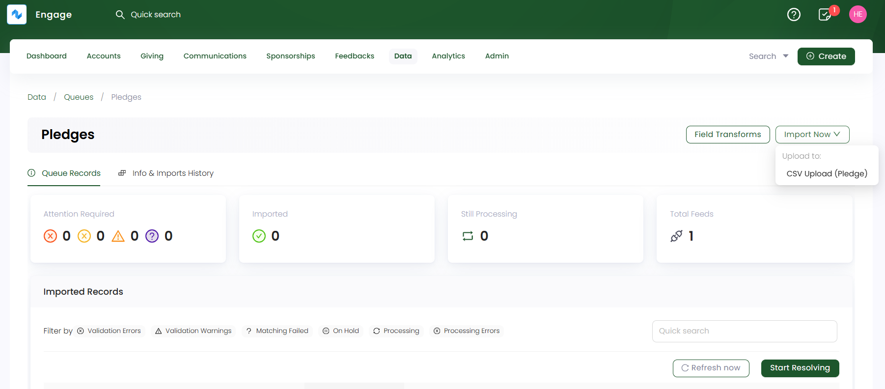
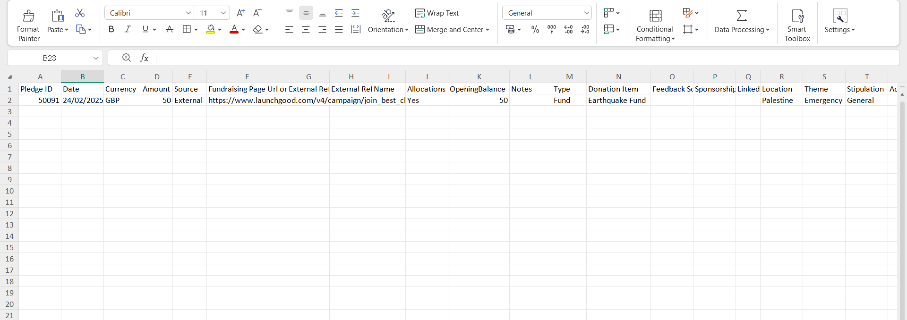
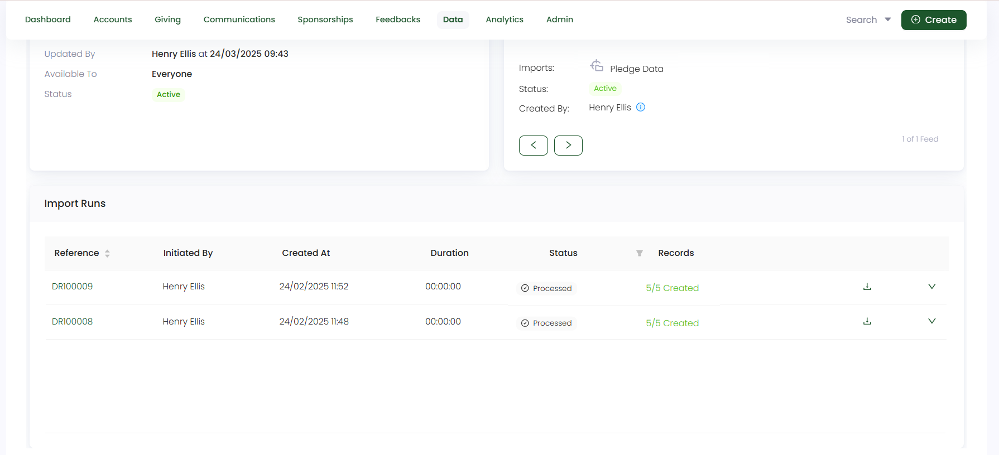

In this guide, let us look at how to import pledge data in Engage.

**1.** On a **pledge queue's** detailed screen, click the **Import Now** option and choose the feed to upload the pledge data into. Remember to choose a basic feed created for pledges upload. 

**2.** On the **Upload CSV file to Feed** screen, upload all the pledge data that needs importing into Engage as a `CSV file`. You can also download the sample CSV file, which includes both **mandatory** and **optional** fields for reference. 

Let us have a look at each field and its description for clarity.

:::tip
- These fields also depend on the **field mapping** setup in the CSV Pledge Feed. You can also check whether the options (selected options, filters) under the fields are correctly configured and your added details are in sync with the mapping.
- If you do not specify any field in the uploaded CSV file, Engage will use the field details from the **Field Mapping** section of the feed.
- All sponsorship schemes added in Engage, will show up in the **field mapping step 4** while creating the feed. Hence, make sure all fields are synced throughout.
:::

| Field | Description |
| ----- | ----------- |
| **Pledge ID** | Unique ID (reference number) dedicated to the pledge to be created and a **mandatory** field. |
| **Account ID** | Unique ID (reference number) dedicated to the account that creates a pledge and a **mandatory** field. |
| **Date** | Date of when the pledge was created and a **mandatory** field. |
| **Currency** | Currency in which the donation for the pledge will be done and an **optional** field. |
| **Amount** | Amount dedicated to the pledge and a **mandatory** field. |
| **Source** | Source of the pledge (internal or 3rd party) and a **mandatory** field. |
| **Fundraising Page URL or External Reference** | URL of the fundraising page or any other external reference as URL and a **mandatory** field. |
| **Allocations Enabled** | Input if allocations (fund, sponsorship, feedback) is allocated to the pledge as "yes" or "no" and a **mandatory** field. |
| **Type** | Type of allocation added to the pledge and an **optional** field. |
| **Donation Item & Feedback scheme & Sponsorship scheme** | These options are added according to the user as a donation item, feedback, or sponsorship. The option chosen will be **mandatory**, otherwise all **optional**. |
| **Fund Dimensions** | Dimensions related to the **allocation** chosen before i.e. **location, theme and stipulation** and a **mandatory** field. |

**3.** Each imported data via a feed is shown as a record in the **Import Runs** section under **Info & Imports History**. Number of records are created and tested on the basis of the number of rows within the uploaded data file. Imported records with a **Processed** status can be downloaded or reprocessed, if needed.

:::tip
Each pledge imported and created can be searched and viewed via the different search functions available in Engage.
:::