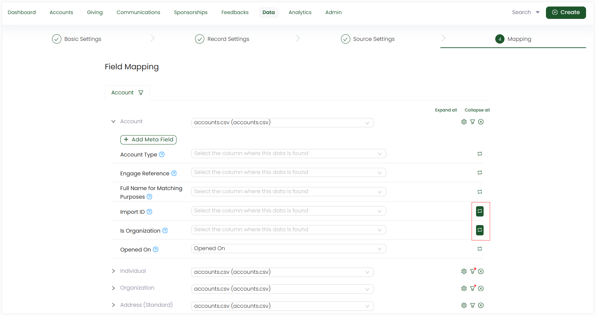
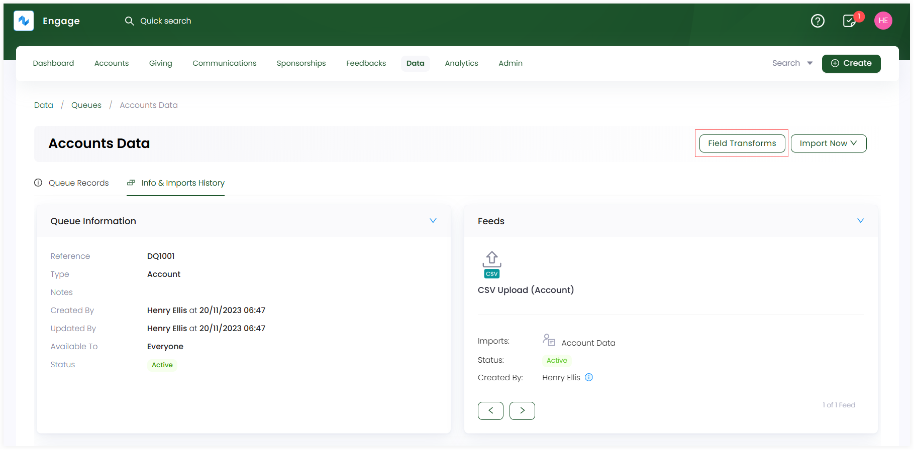
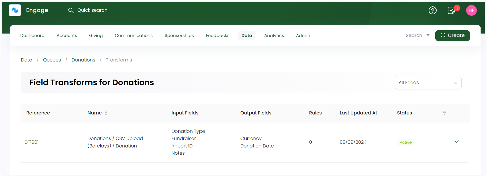
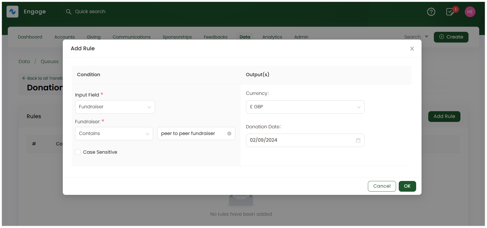
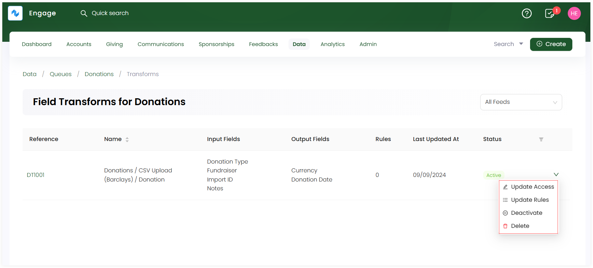

In a CRM, generally, field transform refers to the process of modifying the data stored in a CRM field during data imports, exports, or while processing data for use. It helps ensure that data is standardized, cleaned, and usable for reporting, and other functions, etc.

## Field Transform in Engage

Similarly, in Engage, our advanced data import feature named as **field transform** allows you to manipulate external data into something meaningful within the CRM. For example, your website may have a price handle such as **"food project"**, but in your system you do not have this donation item or the closest may be **"food fund"** or **"food parcels"**. The field transform function allows you to set a **rule** that whenever a **"food project"** donation comes in from your website, it will place it under the **food fund** or **food parcel** donation item within your system ensuring full data integrity.

Let's look at how to use the field transform function within Engage.

**1.** On the **Import Queues** screen, select any queue to create transform rules for. 

**2.** Transform rules are applied on fields while mapping them in **"Step 4: Mapping"** of creating a CSV or JSON feed. You can do this while creating a feed for the first time or editing it later. Select the field to apply a transform rule on, click the **transform** icon and leave it empty.

**3.** As soon as you save the feed, go back to the queue's detailed screen and click **Field Transforms**. 

**4.** The updated fields feed along with its queue name will be displayed in the form of a table. Have a look at the defined parameters below.

| Parameters | Description |
| ---------- | ----------- |
| **Reference** | Unique identification for the queue that has transform applied on it. |
| **Name** | Name of the queue along with the feed used. |
| **Input Fields** | Name of the fields which are used as input for a feed. |
| **Output Fields** | Name of the fields which will change and become the output after transform rule has been applied. |
| **Rules** | Number of rules applied. |
| **Last Updated At** | Date the queue was updated last time. |
| **Status** | Status of the field transform queue as active or inactive. |

**5.** To add a **rule**, click the **reference number** of the queue, and land onto the **Rules** screen.

**6.** Click **Add Rule**. On the **Add Rule** popup:

- Under **Condition**, select the **Input Field** and then specify the condition for which the transform rule would be applied. You can tickmark **Case Sensitive** for the input field, if required. 
- Under **Output**, select what the output fields will look like, when input fields come into the feed and click **OK**. 

**7.** The rule gets added and will be applied whenever a feed imports data.

## More Functions on Field Transform Queue

Besides adding rules, you can perform more functions on a field transform queue. Click the **down arrow** and you can:

- Update share access of the queue 
- Update rules created previously in case an input or output field changes 
- Deactivate or delete the queue

