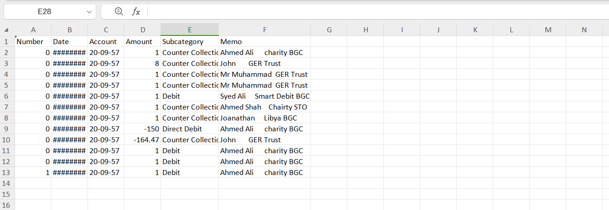

Converters are tools designed to manage different types of data, especially financial data. They eliminate the need for manual data entry, automatically mapping key details from statements into formatted reports. This guide will walk you through financial bank statement converters and their usage in Engage.

Follow the steps below to upload a sample file to a converter and then import it in Engage.

1. Customer support requests the client for the downloaded bank statement or sheet.

2. The client sheet includes data about the banks payments and other information. This data needs to be cleansed and sorted out with separate headings.

3. For this purpose, N3O developers create and set up a converter within Umbraco (Engage Forms). Each folder under "Converters" section has a separate converter for a separate bank file.

:::info
If you want to set up a converter, please contact `support@n3o.ltd`.
:::

4. Select the main folder, the converter type folder, and click **Create** to choose the converter for your preferred bank statement e.g. *Barclays Bank Statement Converter*.  

5. In the **Input** section upload the sheet with `.csv` extension via the **Drag and drop** option. Click **Save and publish**, and the converter converts the sheet into perfectly clear data along with additional fields like *account reference*, *allocation type*, *fund dimensions*, *donation item*, etc. 

:::tip
- A sample bank statement to be uploaded may look like this.

- These additional fields have been added by the N3O developers prior to the conversion, so that the client can manually fill it up themselves and then import in into Engage.
:::

6. The converted file appears under the **Output** section and can be downloaded as well. A sample downloaded output `.csv` file shows up like this.

7. As the last step, login into Engage, and navigate towards the **Imports** section under **Data**.

8. Select any queue and import the downloaded file into Engage via the **Import Now** option.

