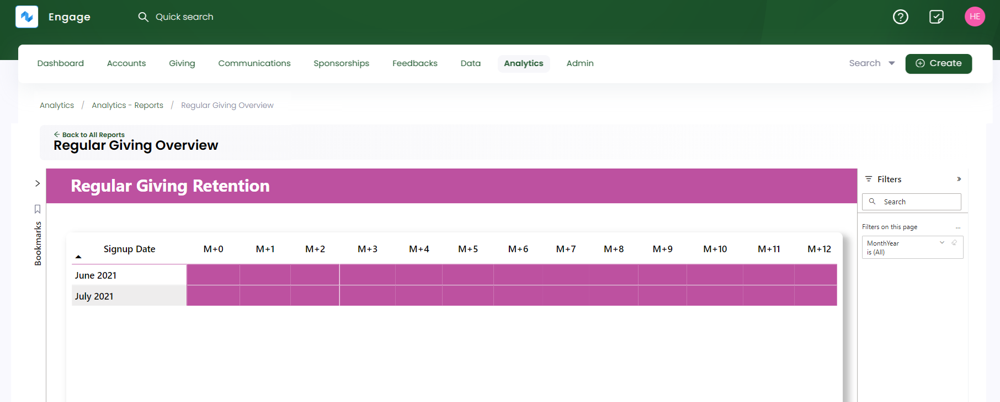

The regular giving overview report gives an outline of how much regular giving has been generated over a certain time frame. To land onto **Regular Giving Overview**, click **Analytics** in the top menu bar and then **Reports**. Under **Giving**, select **Regular Giving Overview**. 

The regular giving overview report has 3 tabs listed at the bottom. Each tab shows different information that can be viewed by selecting any one of them.

1. [Overview](#overview)
2. [Changes](#changes) 
3. [Retention](#retention)

Let's explain each of them in detail.

### Overview

The regular giving overview section shows how much income has been generated by regular giving over a period of time. 

:::tip
- All visuals compare the data with previous and current time periods that can be recognized by *Previous vs Current* heading. 
- Each visual when hovered over shows a summary of its values and three options including **filters**, **focus mode** and **more options**. **More options** further contains actions such as:
    - Export data
    - Get insights
    - Sorting values in ascending or descending order
    - Pinning particular visual to the dashboard
:::

Different visuals populated depicting different information are explained below.

1. **Total** number of regular givings done.
2. **Average** value of the amount of regular giving made.
3. **Total** value of regular giving made each month.
4. **Top** allocation types, payment methods and donation items used for regular giving.
5. **Frequency** of regular giving being done like monthly or annually. 
6. **Top campaigns**, **themes**, **locations** and **stipulations** used for regular giving.  

### Changes

The regular giving changes report shows how many regular giving's have changed, cancelled or updated in the form of visuals defined below.

1. First 2 rows of visuals show the number and value of **new, cancelled, adjusted** and **overall changes** regarding regular giving's done.
2. Line charts showing overall change value for **allocation types, stipulations, top themes** and **top locations**.
3. Data regarding reasons for **cancellation**.

### Retention

The regular giving retention report shows the figure of regular giving signing up and the number of givings still active over any month.

### Adding Filters, Bookmarks and Reporting Periods

You can create bookmarks, apply different filters and add multiple reporting periods on the regular giving overview report and its pages. For more information, see <K2Link route="docs/engage/data/analytics/reports/adding-bookmarks/" text="Adding Bookmarks" isInternal/>, <K2Link route="docs/engage/data/analytics/reports/using-filters/" text="Using Filters" isInternal/> and <K2Link route="docs/engage/data/analytics/reports/manage-reporting-periods/" text="Manage Reporting Periods" isInternal/>.  