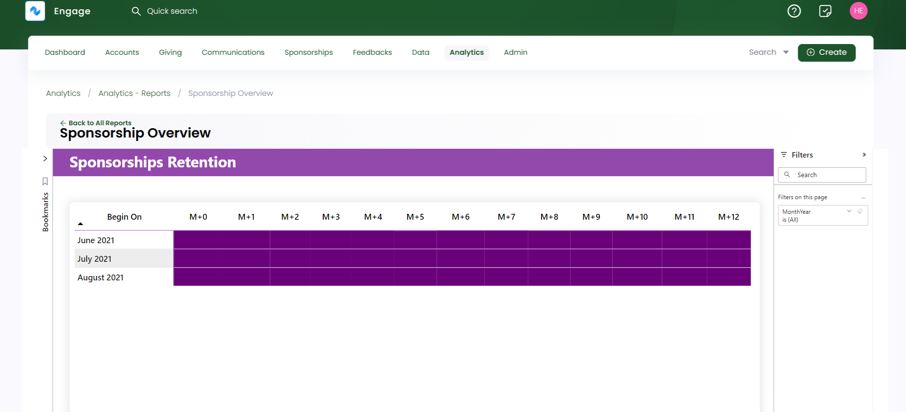

The sponsorship overview report provides an overview of all the sponsorships generated, edited or cancelled over a certain period of time. To land onto **Sponsorship Overview**, click **Analytics** in the top menu bar and then **Reports**. Under **Sponsorship**, select **Sponsorship Overview**. 

The sponsorship overview report has 3 tabs listed at the bottom. Each tab shows different information that can be viewed by selecting any one of them.

1. [Overview](#overview)
2. [Changes](#changes) 
3. [Retention](#retention)

Let's explain each of them in detail.

### Overview

The sponsorship overview section shows how many sponsorships have generated over a period of time. 

:::tip
- All visuals compare the data with previous and current time periods that can be recognized by *Previous vs Current* heading. 
- Each visual when hovered over shows a summary of its values and three options including **filters**, **focus mode** and **more options**. **More options** further contains actions such as:
    - Export data
    - Get insights
    - Sorting values in ascending or descending order
    - Pinning particular visual to the dashboard
:::

Different visuals populated depicting different information are explained below.

1. The value of **total sponsorships** created per month.
2. **Number** of sponsored beneficiaries.
3. **Average** age of the renewed sponsorships.
4. **Number** of cancelled sponsorships. 
5. **Most** used sponsorship terms and number of beneficiaries per sponsor.
6. **Top** locations, themes and attributions regarding generated sponsorships.
7. **Bar chart** depicting donated value against ages of sponsored beneficiaries. 

### Changes

The sponsorship changes report shows how many sponsorships have added, cancelled or renewed in the form of visuals defined below.

1. First 2 rows of visuals show the number and value of **new, cancelled, renewed** and **overall changes** regarding sponsorships.
2. Value of **adjusted** and **renewed** sponsorships.
3. Overall changes in value for **themes** and **locations** regarding sponsorships.
4. Any particular reasons for a **sponsorship cancellation**.

### Retention

The sponsorships retention report shows the figure of sponsorships begining on and the number which are still active over any month.

### Adding Filters, Bookmarks and Reporting Periods

You can create bookmarks, apply different filters and add multiple reporting periods on the sponsorship overview report and its pages. For more information, see <K2Link route="docs/engage/data/analytics/reports/adding-bookmarks/" text="Adding Bookmarks" isInternal/>, <K2Link route="docs/engage/data/analytics/reports/using-filters/" text="Using Filters" isInternal/> and <K2Link route="docs/engage/data/analytics/reports/manage-reporting-periods/" text="Manage Reporting Periods" isInternal/>.  