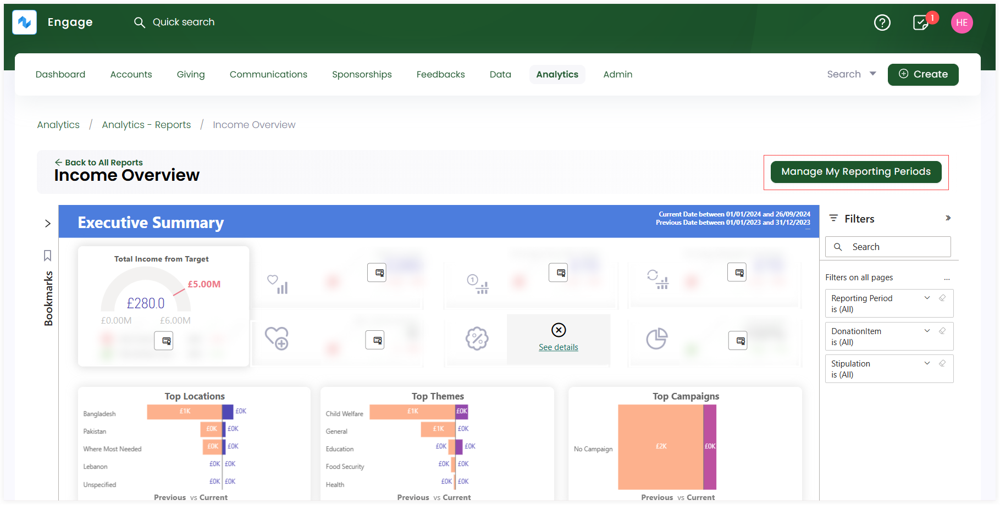

Reporting periods in a CRM are specific time frames used to collect and analyze data for reporting purposes. These periods help asses performance and track progress for multiple features displayed within a report.

In Engage, you can manage and add different reporting periods that are saved and displayed under the **Reporting Period filter** such as:

1. Yesterday
2. Last Week
3. Last Month
4. Over a Year

Each of these periods can be selected to display the required report information under the reports **Executive Summary** section. 

## Add a Reporting Period and Use it via Filters

**1.** Land onto any report page, and click the **Manage My Reporting Periods** button.

**2.** On the **Manage My Reporting Periods** popup, click **+ Add Reporting Period**. **Name** the reporting period, input the **start date** and **end date** and click **Save**.

**3.** Each reporting period is added and shown in the form of a table with following parameters.

| Lists Parameters | Description |
| ---------------- | ----------- |
| **Order** | Three lines that allow changing the order of reporting periods. |
| **Name** | Name of the reporting period. |
| **Start Date** | Start date of the reporting period. |
| **End Date** | End date of the reporting period. |

:::tip
You can also edit any existing reporting period via the **pen icon**. Select the icon, update any information and click **Save**.

:::

**4.** As soon as you add a reporting period, it gets saved within the **Reporting Period filter** under the **Filters** pane. You can select any period and display the report visuals accordingly.

