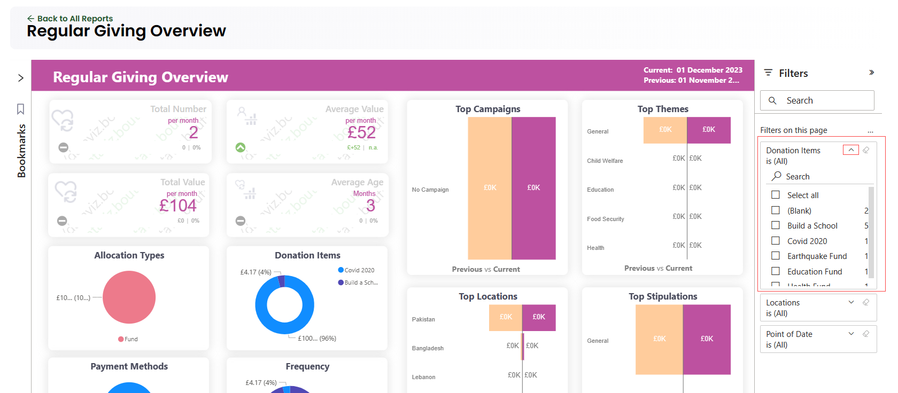

The collapsable **Filters** pane on the right-hand side of any report shows all the filters that can be applied to it. This is an area where you can view information about each filter, interact with them, and change them to see their impact on your visuals and report. Also, the filters pane displays and manages several types of report filters that can affect: 

- A whole single report
- Different report pages
- Multiple separate visuals 

## Display Filter Details

:::note
Anyone who has permissions to the report can interact with the **filters** section.
:::

Whenever a report is viewed in **Engage**, some default filters are displayed for each report under the **Filters** pane e.g. income overview report has filters: **Reporting Period**, **Donation Item** and **Stipulation**. Simply expand the pane for each report and view them.

To completely understand a filter in detail, expand the filter card with the **arrow** next to the filter name and view all the available values and their counts. Some filters have **(All)** beside them meaning all values under the filter have been selected to display. You can also select any one value and display accordingly.

## Search a Filter

Sometimes there might be more filters for a single report or a filter can have a long list of values within itself. To cater this purpose, use the search bar under the **Filters** heading or the search box within any filter card to search and find the value you want.

## View Filter Applied to a Visual

You can get a closer look at the filters affecting a specific visual by hovering over the visual to reveal the **filter icon**. Select that filter icon to see a pop-up window with all the filters and slicers affecting that visual. The filters in the pop-up window are the same as those displayed on the **Filters pane**, and you can view them as explained under the [Display Filter Details](#display-filter-details) heading. 

## Change Filter Selections

Another way to search for data insights within a report is to interact with filters itself. You can change filter selections by using the **drop-down arrow** next to the **filter name**. Depending on the filter and type of data that you are filtering, your options range from simple selections from a list, to identifying ranges of dates or numbers.

## Clear a Filter

You can also reset or clear a filter to start using them all over again. To reset or clear a filter, you can clear all its values by selecting the **eraser icon** next to the **filter name**. 

