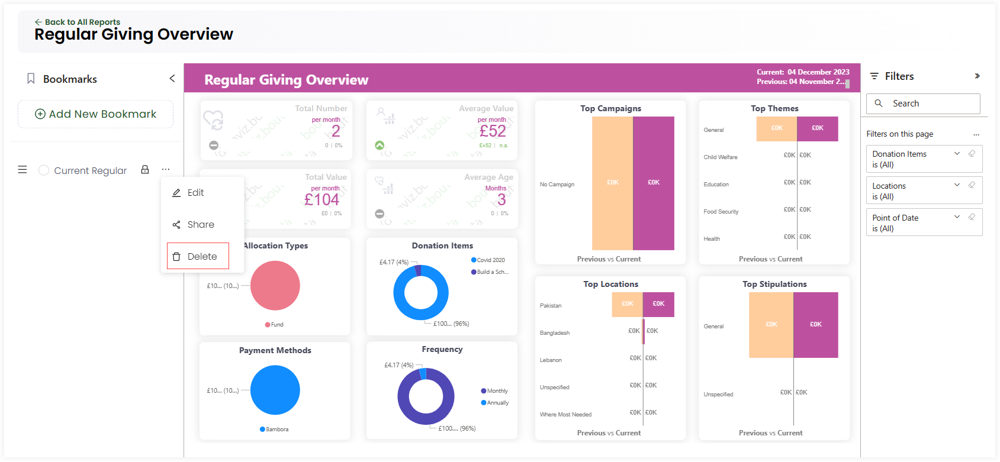

Engage provides a feature to create **bookmarked reports** of any tab within a particular report. Bookmarks allow you to keep track of what's important to you by capturing the state of a report including any filters or extra visuals added. You can easily view your bookmarked report at any time.

## Create a First Bookmark

To create a bookmark for the first time, open up the **Bookmarks** panel on the left-hand side of a report and click **Capture New Bookmark**. Name the bookmark and the current report view will be saved in the bookmarks section. A bookmark can be saved for any report and its pages, for example, **giving income overview** report and its pages **income overview**, **income by donation item** and **income by funds**.

:::tip
As soon as the first bookmark gets created, the **Capture New Bookmark** option changes to **Add New Bookmark**.
:::

A newly created bookmark saves the following elements:

1. The current report page
2. Any filters defined whether on visuals or the whole report
3. Any visuals added or deleted 
4. Information changes due to additions or updates in the CRM (Engage)

## Carry Out Other Functions on a Bookmark 

You can implement other functions with a single bookmark as defined below.

- You can **view** the bookmarked report by clicking the bookmark itself or delete it if not needed further. To delete, click the **three dots (...)** and select **Delete**.

- You can **edit** an existing bookmark's name by clicking the **three dots (...)**, selecting **Edit**, changing the name and then **Update**.

- A bookmark can be set as **private**, only for yourself, or **shared**, to make it viewable to others. Click the **three dots (...)** and then **Share**. Select the **Sharing Option** as:

1. **private** for only yourself
2. **available to all** for all users onboard
3. **selected users/roles** for selected users 

