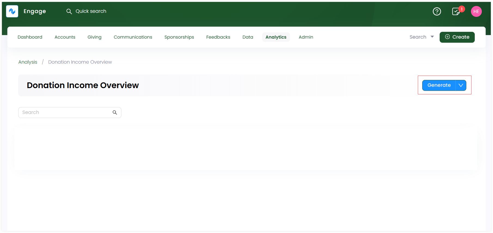
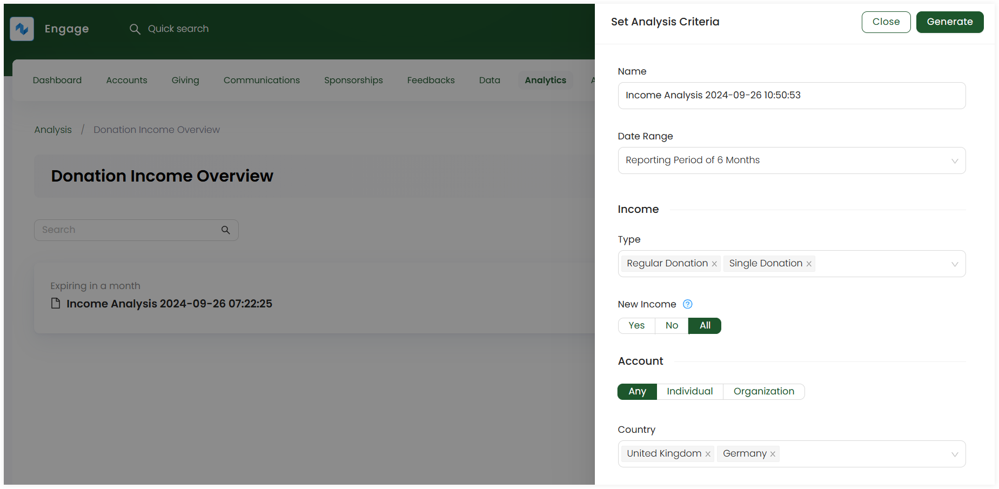
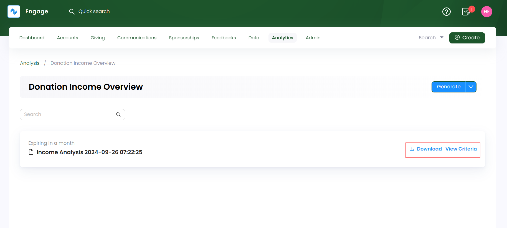
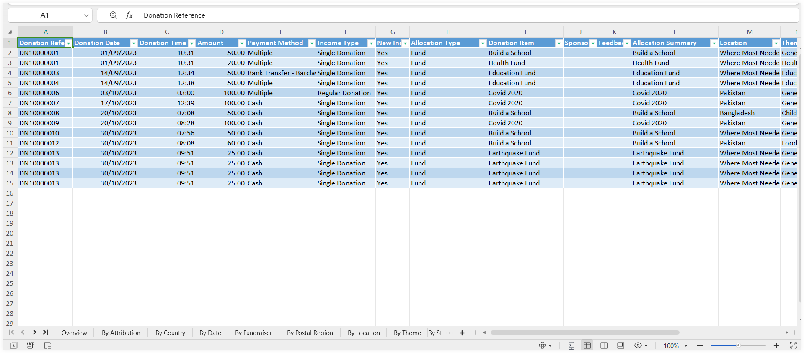
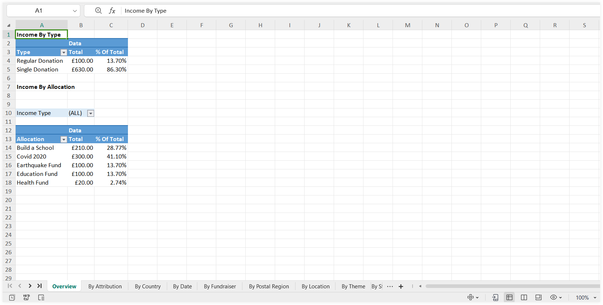
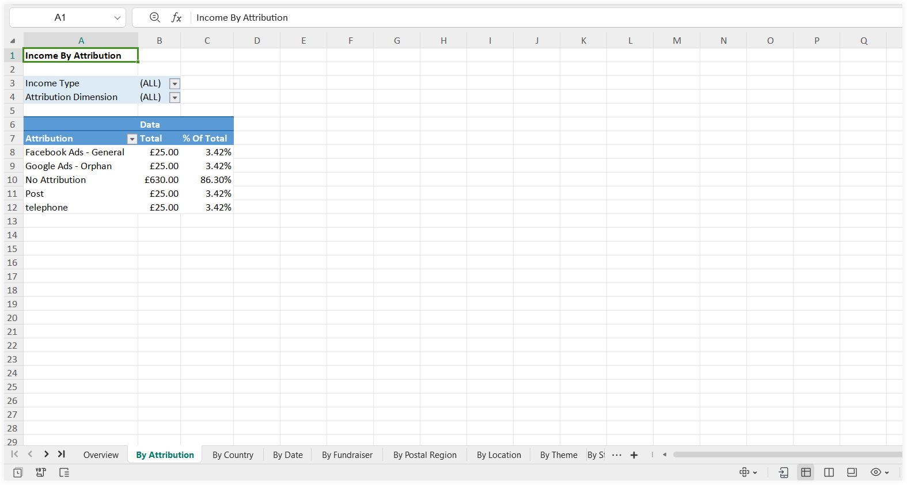
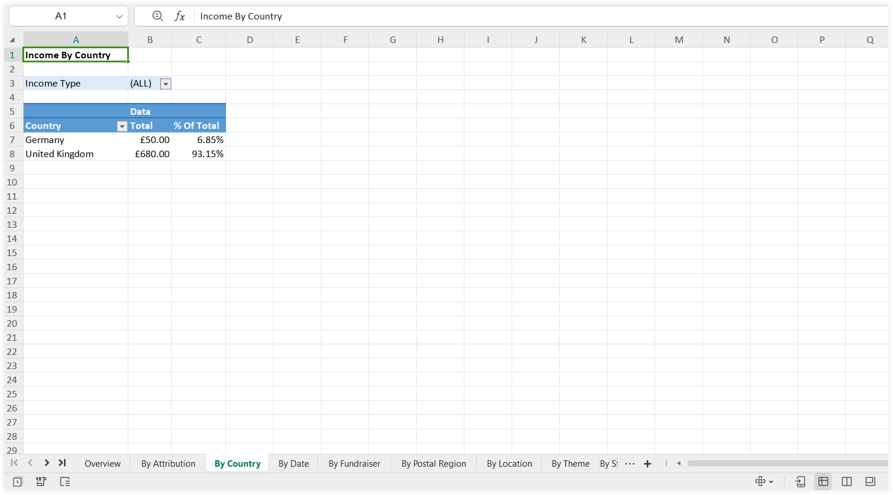
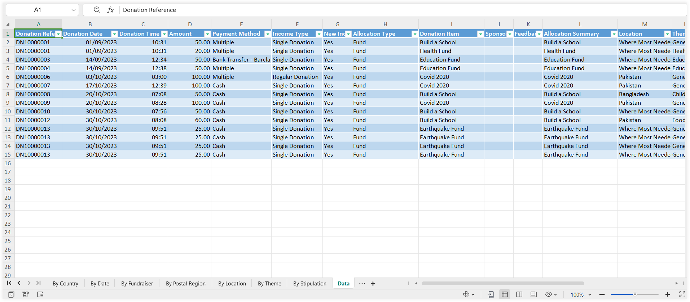

The donation income overview report provides an overview of the amount, source and characteristics of donation income raised from single, regular or scheduled donations. Click **Analytics** in the top menu bar and then **Analysis**. Under the **Giving** section, select **Donation Income Overview**.

## How to Generate a Donation Income Overview Report

Every first time user coming into Engage and making donations will need to generate a donation income overview report themselves. To generate a report:

**1.** Click **Generate** to navigate to the **Set Analysis Criteria** pop up.

**2.** On the **Set Analysis Criteria** pop up, specify the different parameters related to the report criteria and click **Generate**. 

| Parameters | Description |
| ---------- | ----------- |
| **Name** | Name of the donation income report. This section prepopulates itself with a standard naming convention used in Engage. |
| **Date Range** | The time period during which the donations were made. You can choose any date range from the drop-down that includes all reporting periods added. To learn how to add one, refer to Manage Reporting Periods documentation. |
| **Income** | <ul><li> **Income Type:** Select the type of donation to display in the generated report. </li><li> **New Income:** This  includes single donations as well the first donation for regular giving without subsequent ones. Select as **yes**, **no** or **all**. </li></ul> |
| **Account** | <ul><li> Select the type of account as **any**, **individual** or **organization**. </li><li> Select the **country** from the drop-down. </li></ul> |
| **Allocation** | <ul><li> **Type:** Select the type of allocation. </li><li> **Donation Item:** Select the donation item for which donations were raised. </li><li> **Fund Dimensions:** Select the type of fund dimensions under **location**, **theme** and **stipulation**. </li></ul> |
| **Attribution** | Select the type for previously specified **attribution dimensions**, for example, type of "Channel" or "Ad Campaign". |

**3.** The generated report appears on the **Donation Income Overview** screen. To examine the report, download it in `excel` format via **Download**.

**4.** Open up the downloaded report that displays all the processed donations in Engage under the specified criteria. The report is divided among multiple pivot tables for different dimension analysis (**By Attribution**, **By Country**, **By Date**, **By Fundraiser**, etc.) in their respective tabs. 

## Understand Pivot Tables in the Donation Income Overview Report

Multiple pivot tables depicting donations processed according to their data are displayed in a single donation income overview report. Each tab shows a table with the **total number** and **total percentage of donation income** opposite to the types selected while setting up the report criteria and can be viewed by clicking on the respective tab button. For example, *"By Attribtuion" tab includes a data table providing the "total number" and "percentage of donations" in pounds opposite to the attribution dimension types selected*.

Let us have a look at some of the important pivot tables in the report.

### Overview

The **overview** tab displays the **total number** and **total percentage of donation income** under separate tables named **Income by Type** and **Income by Allocation**. Donation income is shown for all types of income and allocations selected while setting the report criteria.   

### By Attribution

The **by attribution** tab displays the **total number** and **total percentage of donation income** in a table named **Income by Attribution**. Donation income is shown for all types of attribution dimensions selected while setting the report criteria.

### By Country

The **by country** tab displays the **total number** and **total percentage of donation income** in a table named **Income by Country**. Donation income is shown for all the countries selected while setting the report criteria.

### Data

The **data** tab displays each and every donation processed along with its detailed information including:

- Donation details like **donation reference**, **donation date** and **donation time**. 
- **Amount** allocated to the donation separately according to the **attribution dimensions** specified. *For example, a single donation that allocated "two" 50 pounds to online and post attribution dimensions, shows itself as two separate donations processed under the data tab*.
- **Payment methods** used.
- All the rest of the figures that were preselected while setting the report criteria like **allocation type**, **donation item**, **fund dimensions** or **account type**.

