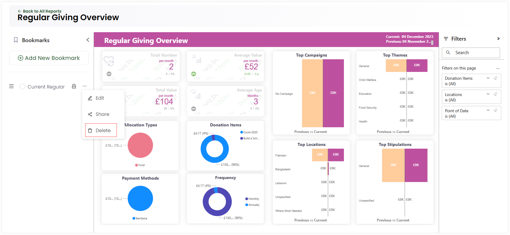

Engage provides a feature to create bookmarked reports of any tab within a particular report. Bookmarks allow you to keep track of what's important to you by capturing the state of a report including any filters or extra visuals added. You can easily view your bookmarked report at any time.

## Creating a First Bookmark

To create a bookmark for the first time, open up the *Bookmarks* panel on the left-hand side and click *Capture New Bookmark* for any report. Name the bookmark and the current report view will be saved in the bookmarks section. A bookmark can be saved for each report page e.g. *income overview* or *income by donation item*.

:::info
As soon as the first bookmark gets created, the *Capture New Bookmark* option changes to *Add New Bookmark*.
:::

A bookmark when created saves the following elements to look at:

1. The current report page
2. Any filters defined whether on visuals or the whole report
3. Any visuals added or deleted 
4. Information changes due to additions or updates in the CRM (Engage)

## Editing, Deleting or Sharing a Bookmark 

You can perform other functions, like sharing or editing a single bookmark, as defined below.

- You can view the bookmarked report by clicking the bookmark itself or delete it if not needed via *Delete*.

- You can edit an existing bookmark by clicking the **three dots (...)**, then *Edit* and *Update*.

- A bookmark can be set *private* or *shared* to make it viewable to others. Click **three dots (...)** and then *Share*. Select the *Sharing Option* as *private* for only yourself, *available to all* for all users onboard or *selected users/roles* for some selected people. 

