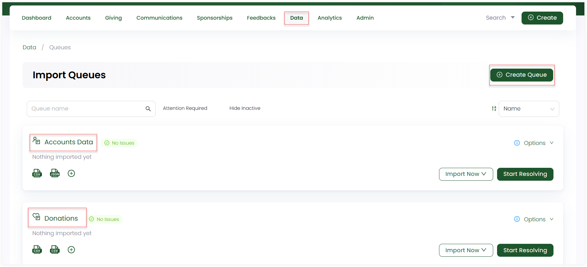
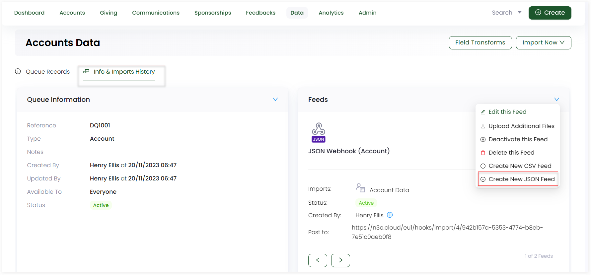

Mailchimp is an all-in-one marketing platform for businesses to manage emails, campaigns, newsletters and much more. Nonprofit organizations using CRM's, like Engage, can integrate with Mailchimp to provide a combination of customer data with email marketing capabilities, leading to effective data driven campaigns.

## Opting out from a Contact Preference within Engage via Webhooks

:::info
- Contacts in mailchimp are based on their email marketing status i.e. subscribed, unsubscribed, non-subscribed, cleaned, and pending.
- A subscribed contact, or subscriber, is someone who has opted in to receive an organizations email marketing.
:::

Subscribers in the audience section of a Mailchimp account can also be accounts or donors within Engage. Any subscriber wanting to unsubscribe from receiving any email regarding fundraising or other activities via mailchimp can at the same time opt out of the related contact preference (fundraising emails) within Engage using <K2Link route="docs/engage/data/imports/ways-to-import-data-within-queue/webhooks/" text="webhooks" isInternal/>. 

1. In Engage, click on **Data**, **Imports** and choose an existing **Queue** or create a new one.

2. Open the **Info & Imports History** tab and under the **Feeds** section, hover over the **down arrow** and click **Create New JSON Feed** to create and set up a new JSON feed. 

:::note
You can also ask your system administrator to set up feeds (webhooks) for you.
:::

3. Provide the **URL** of the created webhook by copying and pasting the unique last part of the URL consisting of numbers and letters under the webhook settings of an audience in Mailchimp.

4. As soon as a subscriber unsubscribes from any email in Mailchimp, Engage receives a webhook via the URL, finds the account (subscriber) by its **Engage ID** and sets the contact preference of emails for the fundraising section of that account to be **off**.

