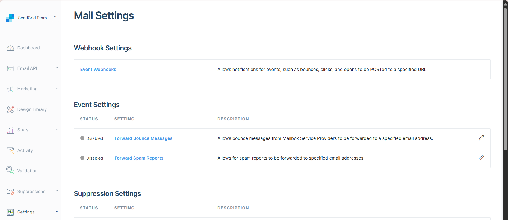
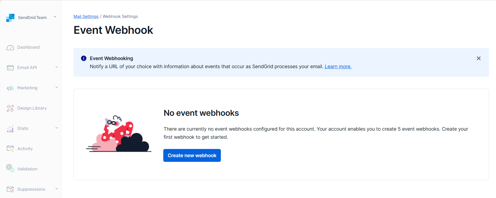
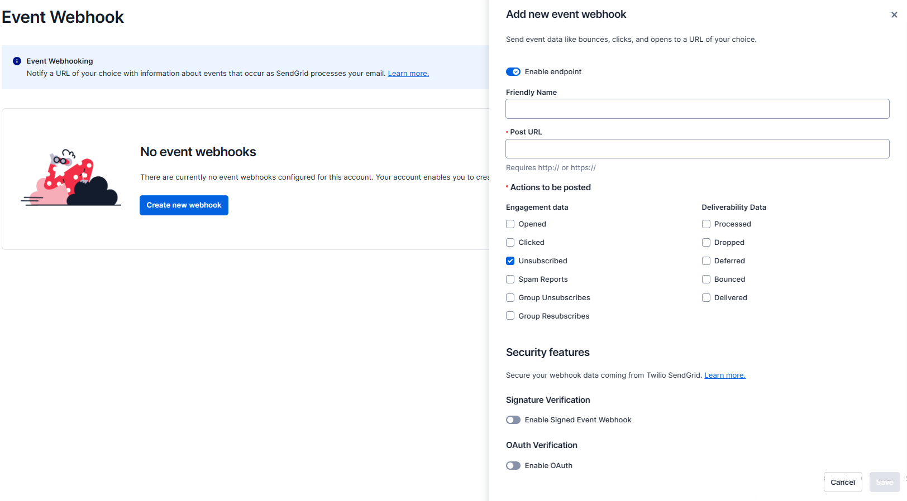

Twilio SendGrid is a cloud-based email delivery platform that allows businesses to reliably send transactional and marketing emails. But, sending an email is only a first step. You need to make sure that the email is sent to the right audience. Hence, **Event Webhooks** are used.

**SendGrid Event Webhooks** provide real-time notifications about events related to your email delivery. They allow you to track the success and engagement of your email campaigns or troubleshoot any delivery issues, etc. Therefore, organizations using a CRM, like **Engage**, integrate with SendGrid via webhooks to avail these features.

## What are Event Webhooks and Types?

Terms *'webhooks'* and *'event webhooks'* are two different phenomena's. Webhooks refer to an overall API concept for an app to provide other applications with real-time information, whereas, event webhooks point to the *SendGrid operation* that makes *POST* requests to your URL. The URL you use to configure your SendGrid Event Webhook is referred to as the "Post URL," "endpoint," or "destination."

In SendGrid, event types refer to the type of events provided by the event webhooks in two major categories: *deliverability events* and *engagement events*. 

- Deliverability events such as "delivered," "bounced," and "processed".
- Engagement events such as "unsubscribe," and "click".

## Create a Webhook in Engage

Subscribers in SendGrid can also be accounts or donors within Engage. Any subscriber wanting to unsubscribe from receiving any email regarding fundraising or any other activity via SendGrid can at the same time opt out of the related contact preference within Engage using <K2Link route="docs/engage/data/imports/webhooks/" text="webhooks" isInternal/>. 

**1.** In Engage, click on *Data*, *Imports* and choose the **Preferences Queue**.

**2.** Click the **three dots(...)** on the top right-hand side and go to **Queue info and history** to create and set up a new webhook (feed). 

:::note
You can also ask your system administrator to set up feeds (webhooks) for you.
:::

## Add an Event Webhook in SendGrid

Once you have a webhook URL ready to accept SendGrid's POST requests, you can add an event webhook in SendGrid. To add a new event webhook to your account, follow the steps below.

**1.** Login into your SendGrid account. In the SendGrid application UI, navigate to **Settings** and then **Mail Settings**.

**2.** Under Webhook Settings, click **Event Webhooks**.

**3.** The Event Webhook settings page will load. Click **Create new webhook**. A dialog will open where you can configure the event webhook. 

**4.** Populate the following fields according to the required information.

- **Enable endpoint:** Toggle the webhook to be active.
- **Friendly Name:** Add an optional name to help you differentiate among your webhooks.
- **Post URL:** Add the URL where the SendGrid should send data. This URL is the webhook URL that you created in Engage.
- **Actions to be posted:** Select the event types you would like to receive data about in each webhook request payload.
- **Security features:** See <K2Link route="https://docs.sendgrid.com/for-developers/tracking-events/getting-started-event-webhook-security-features" text="Getting Started with the Event Webhook Security Features"/> for details about configuring the settings under this heading.
- **Signature Verification:** Toggle the *Signed Event Webhook* button as yes or no.
- **OAuth Verification:** Toggle the *Enable OAuth* button as yes or no. 

**5.** Click **Save** to save the Event Webhook configuration.

## Testing the Event Webhook

Now that you have created your first event webhook, it is time to test it. As soon as a subscriber **unsubscribes** from any email in SendGrid, Engage receives a webhook via the URL, finds the account (subscriber) by its **Engage ID** and sets the contact preference of emails for the fundraising section of that account to be **off**.

:::tip
**Unsubcription** is the event type that you have choosen in the **actions to be posted** section while configuring the event webhook.
:::