Managing cash and cheque deposits for a charity organization is an important step. Money in the form of cash or cheque might be coming from donor donations, any fundraising events or from donors directly coming into the charities office and depositing it. 

**Tally**, as an FMS, makes sure that the cash and cheque deposit mechanism works smoothly. To view the cash and cheque functionality, click on Engage and then navigate to Tally. In the main menu, select **Paying In** to populate the **Paying In & Deposits** screen.

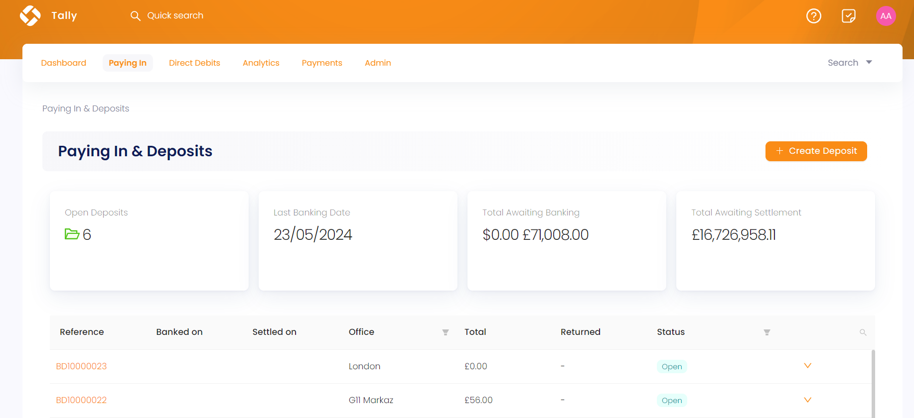

## Overview of the Deposits Screen

Tally maintains several **batches**, also called **deposits**, that collect donations coming in from Engage. A batch is created by the finance administrator of Tally but can be manually created by a donor as well. On the **Paying In & Deposits** screen, click on **+ Create Deposit** to populate the **Create Deposit** popup. Choose the **currency** the deposit will contain, an **office** location, add any extra notes, and click **OK**. The deposit will open to receive payments within it.

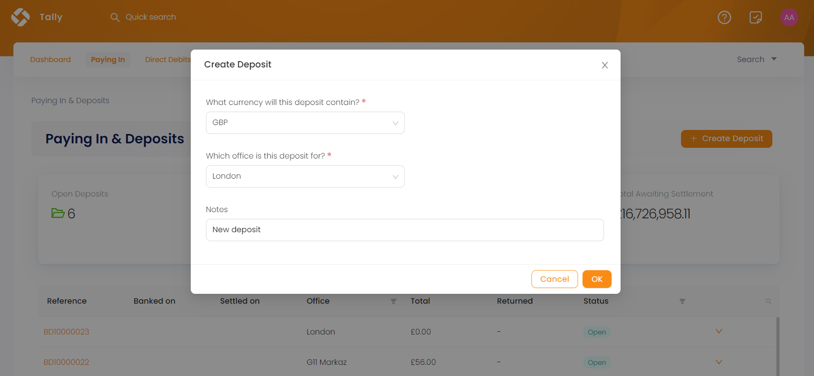

The **Paying In & Deposits** screen shows a summary of the entire page via the following information:

1. Number of **open deposits** ready to collect payments
2. **Last banking date** of the recent deposit banked by the finance administrator
3. **Total money** awaiting to be banked 
4. **Total money** awaiting to be settled after being banked

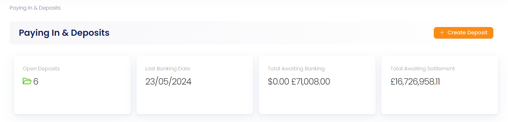

All batches are shown on the **Paying In & Deposits** screen in the form of a table. Each batch has:

1. **Batch reference**
2. Cash or cheque **banked on** (the day on which an amount of money was deposited in the bank) and **settled on** date (the day all the money will be cleared by the bank)
3. **Office** location of batch
4. **Total** money collected by the batch
5. Payments **returned** in the form of refunds
6. **Status** of the batch as **open**, **banked** or **awaiting banking**
7. **Down arrow** to **download a report** of all payments received by the batch or **delete** it  

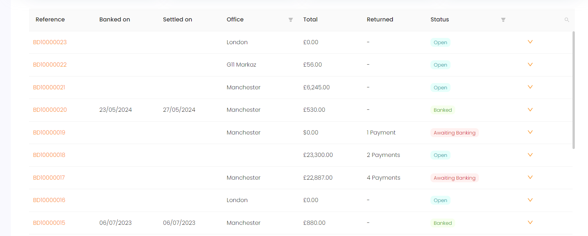

## Process to Deposit Payments via Tally

Whenever a <K2Link route="/docs/engage/donations/creating-donations/" text="donation is processed" isInternal/> in Engage, whether single or regular giving, a payment method is chosen at the end. That payment method can be cash, cheque, card or any other. All these donated payments are added in batches and deposited into banks through Tally.

A payment is always added to a batch with **open** status, meaning the batch is ready to collect as many payments as possible. When a certain amount is collected in a batch and ready to be deposited, follow the steps below.

**1.** Click the **batch reference** to view the deposit.

**2.** The deposit will initially show some details; **status**, **cash amount**, **cheque amount**, **total** and **returned amount**. 

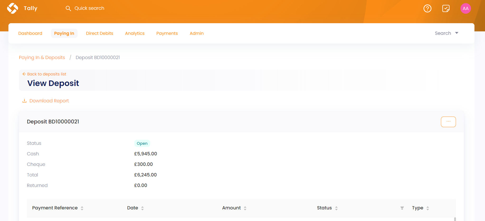

**3.** The deposit will also show a list of all the payments it collected in the form of a table with a **payment reference**, **payment processing date**, **amount**, **status** and **type** (whether cash or cheque).

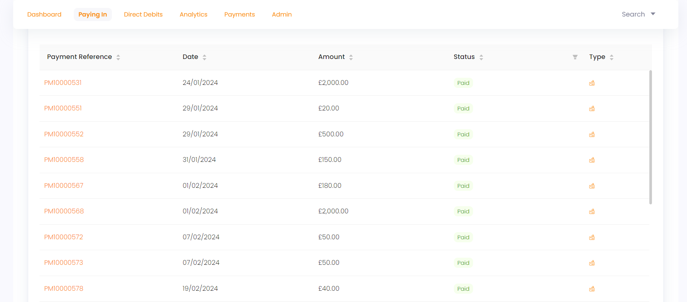

**4.** Click the **three dots ...** and select **Close to New Payments** to close the deposit for any new payments coming from Engage and changing the status from **open** to **awaiting banking**.

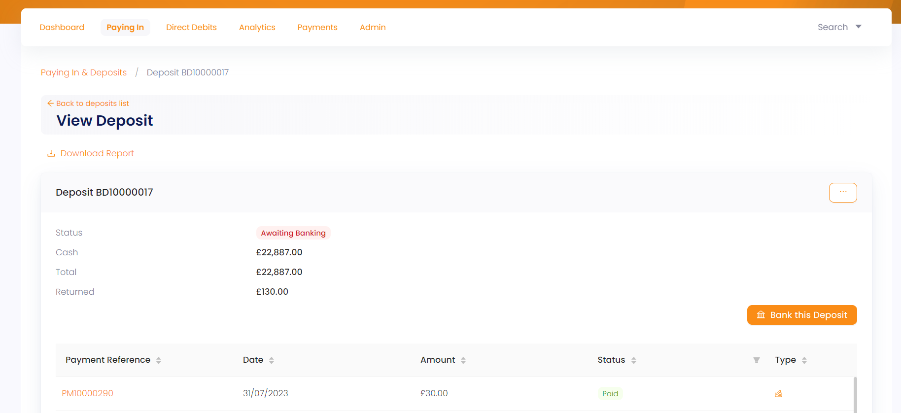

**5.** Now, click on **Bank this Deposit** and provide the banking details. Input the **name of person** who banked the deposit, **date** the deposit was banked on and **date** on when the cash or cheque will clear by the bank.

:::tip
Cash and cheque **date to clear** appear according to payments conducted whether in cash or cheque.
:::

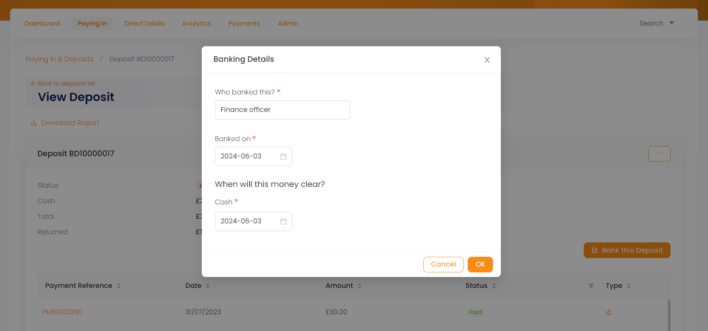

**6.** The status of the deposit changes from **awaiting banking** to **banked** with the banking details added into the initial ones.

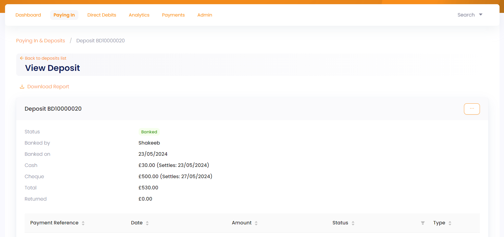

**7.** You can also download a report of the deposit in `CSV` or `Excel` format via the **Download Report** button.

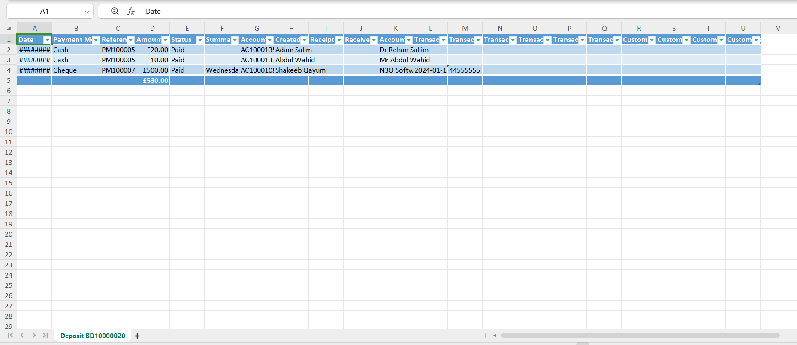

## Returned Payments (Refunds) in Batches

Refunds requested in Engage are approved via Tally by the finance administrator. As soon as a refund is approved in Tally, the payment status is changed to **refunded** under the deposits section and refunded payments are added as a **number** under the **Returned** section in the batch list table.

To read more about refunds, go to the <K2Link route="/docs/engage/donations/refunds/" text="Refunds documentation" isInternal/>. 

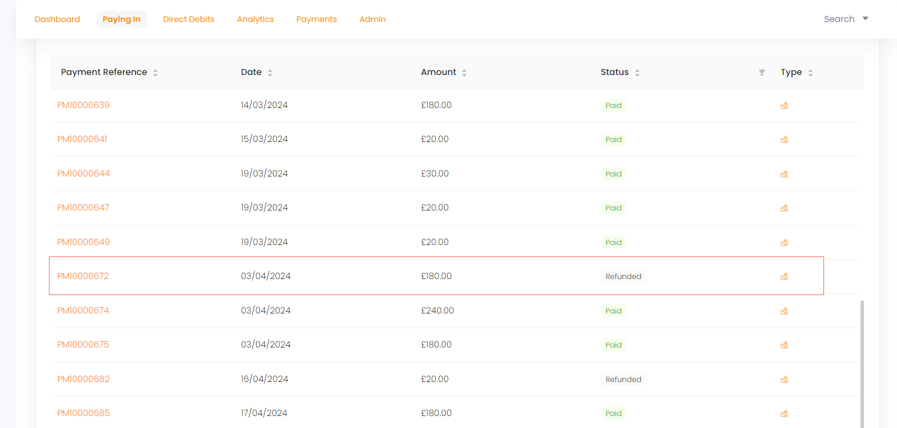

