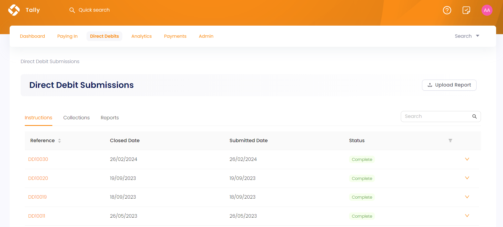
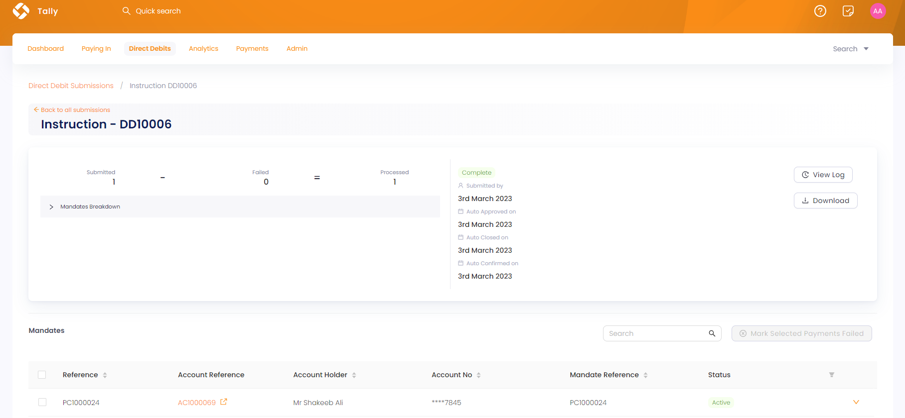
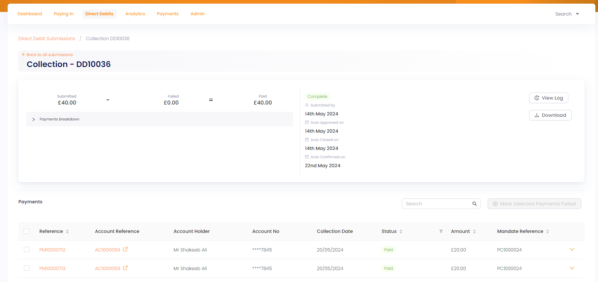

Direct Debit submissions refer to the process by which organizations or businesses submit instructions to collect payments directly from their customers' bank accounts. **Tally**, as an FMS, keeps a record of all the direct debit submissions and collections, ensuring financial security and maintainence. 

To view the direct debit functionality, click on Engage and then navigate to Tally. In the main menu, select **Direct Debits** to populate the **Direct Debit Submissions** screen.

  

## Overview of the Direct Debit Submission Screen

Tally maintains several **instruction batches**, **collection batches** and **reports**, that collect and pay regular givings coming in from Engage. The **Direct Debit Submissions** screen shows a list of all these batches in the form of a table under separate tabs. 

### Instruction Batch

An instruction batch keeps a record of all the regular givings created and set up using direct debit payment method. Under the **Instructions** tab, each instruction batch includes:

1. **Instruction batch reference**.
2. **Closed date** indicating the date the batch was closed to any new regular giving payments.
3. **Submitted date** indicating the first date the batch was created and open to new regular giving payments.
4. **Status** of the batch as **complete**, **submitted** or **awaiting approval**, etc.
5. **Down arrow** to view the collection detail or download an `Excel` or `CSV` file for the instruction.

### Collection Batch

A collection batch keeps a record of all the direct debit payment collections for each regular giving created before. Under the **Collections** tab, each collection batch includes: 

1. **Collection batch reference**.
2. **Collection date** indicating the date the batch is supposed to collect payments.
3. **Closed date** indicating the date the batch was closed to any new regular giving payments.
4. **Submitted date** indicating the first date the batch was created and open to new regular giving payments.
5. **Status** of the batch as **complete**, **submitted** or **awaiting approval**, etc.
6. **Down arrow** to view the collection detail, confirm it or download an `Excel` or `CSV` file for the collection.

### Reports

Reports are important to the Direct Debit process, ensuring smooth and efficient handling of payment instructions between organisations and banks. These reports are specific to the direct debit scheme in the UK and are preloaded by the N3O team, but can be manually uploaded as well. Click **Upload Report**, select the type of report and upload it. 

Under the **Reports** tab, you can view a list of all uploaded reports:

1. Report **reference**.
2. **Types** of reports; **DDICA, AUDDIS, ARUDD, ADDACS, REFT**.
3. **Uploaded on** date.
4. Downloadable file and **status** of file as **new, processed, processing** or **error**. 

## Process for Direct Debit Submissions via Tally

Whenever a <K2Link route="/docs/engage/donations/searching-regular-giving/" text="regular giving is processed," isInternal/> following a direct debit payment method, a status **Setting Up** appears on the regular giving's detailed screen in Engage. All these regular givings are added in instruction batches with status **open** and collected as payments via collection batches through Tally.

**1.** Click an **instruction batch reference** to view the detailed batch screen. Each instruction batch shows:

- A **mandate breakdown matrix** telling about the number of **submitted**, **failed** and **processed** mandates.
- A timeline of events and dates indicating when the instruction was **submitted**, **approved**, **closed**, and **confirmed**. You can also view this via **View Log**.
- A **mandate list** specifying the **account reference**, **name**, **number**, **mandate reference** and **status**.

**2.** As soon as the instruction batch is confirmed and approved, the status of each mandate becomes **active**.

**3.** Now ready to collect payments, a collection batch is created 5 days prior to the **collection date**. Click any **collection reference** and view its details.

- A **payments breakdown matrix** telling about the number of **submitted**, **failed** and **paid** payments.
- A timeline of events and dates indicating when the instruction was **submitted**, **approved**, and **closed**. You can also view this via **View Log**.
- A **payments list** specifying the **account reference**, **name**, **number**, **mandate reference**, **amount**, **collection date** and **status**.

**4.** When a collection date for a regular giving is reached, the direct debit system automatically collects the payments and changes the status for a payment from **Processing** to **Paid**. If, for any reason, the direct debit instruction is gone to **error**, then the payment will show status as **declined** or **failed**. 