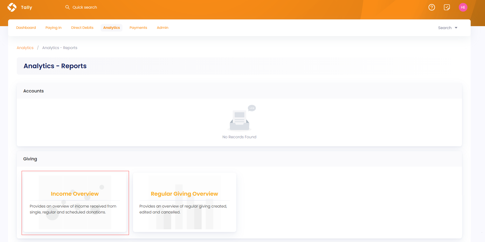
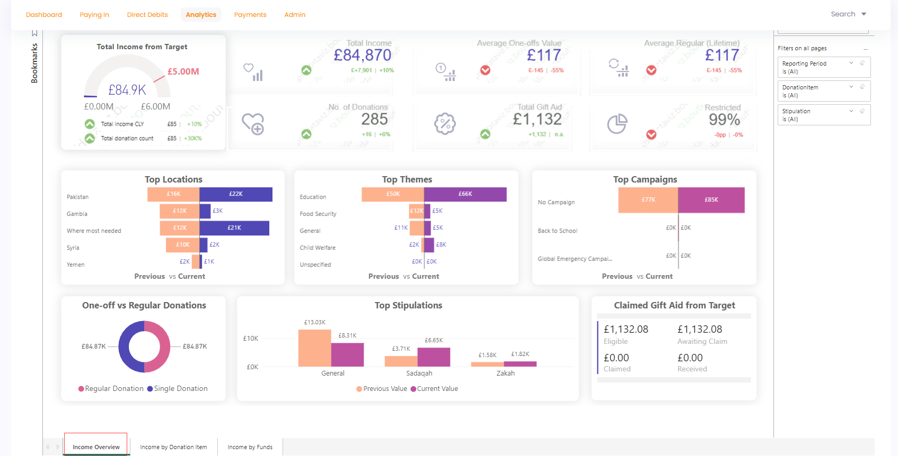
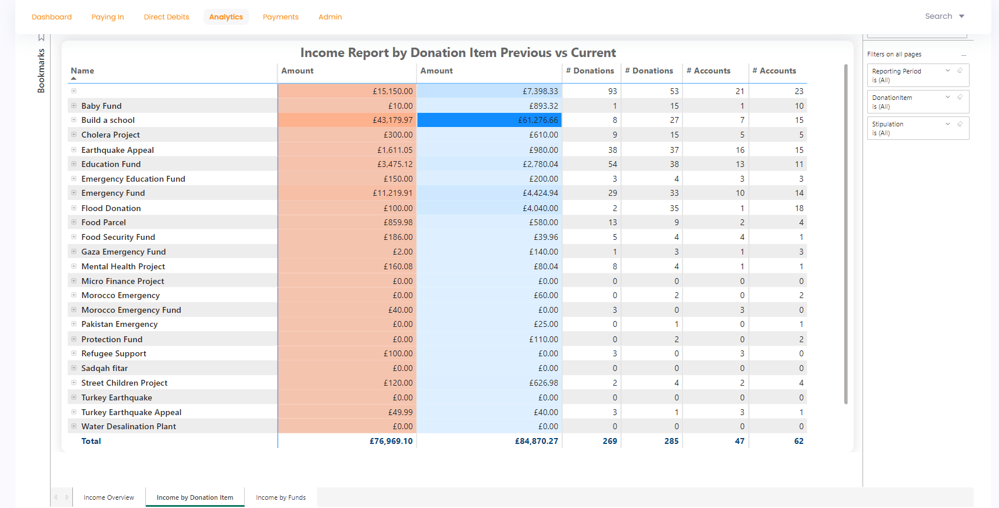
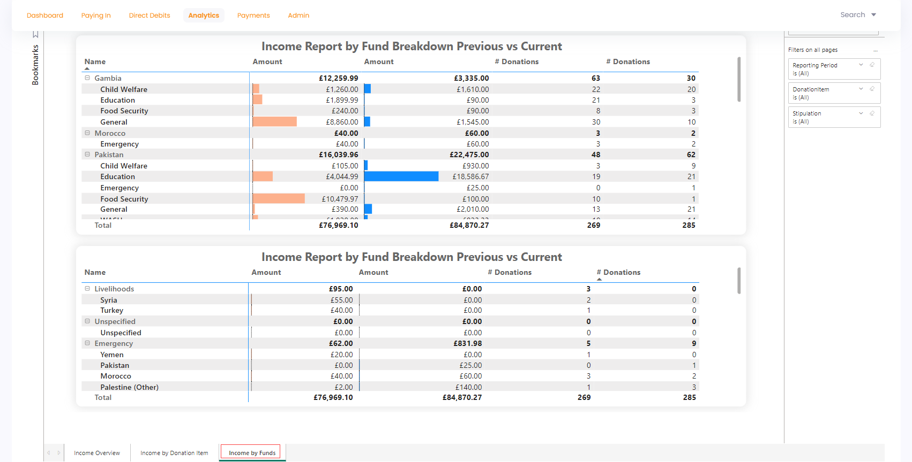

In Tally, the giving income overview report provides an overview of income/funds recieved from single, regular or scheduled donations over a period of time. To navigate to the Income Overview page, click **Analytics** in the top menu bar and then **Reports**. Under the **Giving** section, select **Income Overview**.

This report has 3 tabs listed at the bottom. Each tab shows different information which can be viewed by selecting any one of them.

1. Income Overview
2. Income by Donation
3. Income by Funds

Let's explain each of them in detail.

## Income Overview

The income overview section displays an **Executive Summary** of how much income has been generated over a certain period of time. 

:::info
- Most visuals compare the data with previous and current time periods that can be recognized by **Previous vs Current** heading. 
- Each visual when hovered over shows a summary of its values and three options including **filters**, **focus mode** and **more options** further containing **export data**, **get insights**, **sorting via values** and **pinning particular visual to the dashboard**.
:::

Multiple visuals are exhibited as a report that show different information.

1. **Total Income From Target** shows total income raised, number of donations made, average one-off donations amount value, average regular donations (lifetime) amount and total gift aid donation.
2. **Top Locations** where the donations were raised like *Pakistan*.
3. **Top Themes** for which the donations were raised like *child welfare*. 
4. **Top Campaigns** which initiated donations.
5. Amount of donations raised among one-off and regular donations in the form of a pie chart.
6. Bar chart showing **Top Stipulations** that raised donations. 

## Income by Donation Items 

Income by donation items section shows the *Donations Breakdown* report on each existing donation item over a period of time in the form of a table. The report shows:

1. **Name** of each donation item.
2. Difference between **donated amount** over the previous and current time period.
3. **Number of donations** made over the previous and current time period.
4. **Number of accounts** that made a particular donation for a donation item over the previous and current time period.
5. **Total** amount of donations made, donated amount and accounts that donated.

## Income by Funds

Income by funds section shows the *Donations Breakdown* report of funds based on location and its related donation items over a period of time in the form of a table. The report shows:

1. **Donated amount** for each donation item and its related location. 
2. **Number of donations** made over the previous and current time period.
3. Total amount of donations made and the donated amount.

## Bookmarks and Filters

You can create bookmarks to review the report later and apply different filters on the income overview report and its pages to view any specific information you want. For more information, see <K2Link route="docs/engage/data/analytics/reports/adding-bookmarks/" text="Adding Bookmarks" isInternal/> and <K2Link route="docs/engage/data/analytics/reports/using-filters/" text="Using Filters" isInternal/> in the **Engage Analytics Reports** section.  