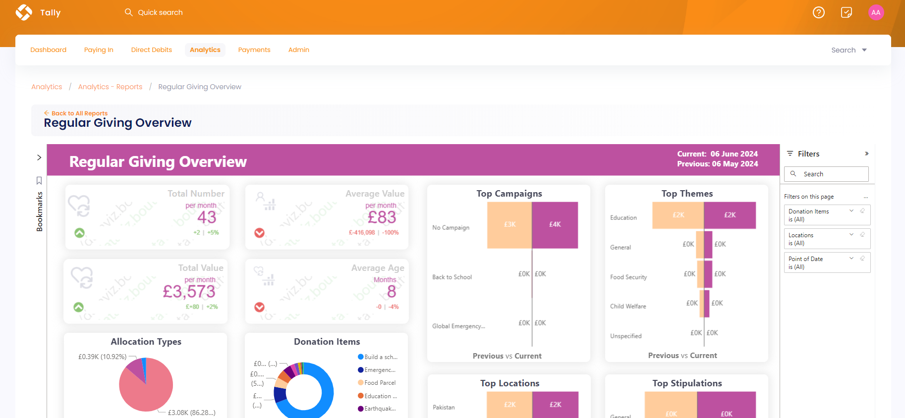
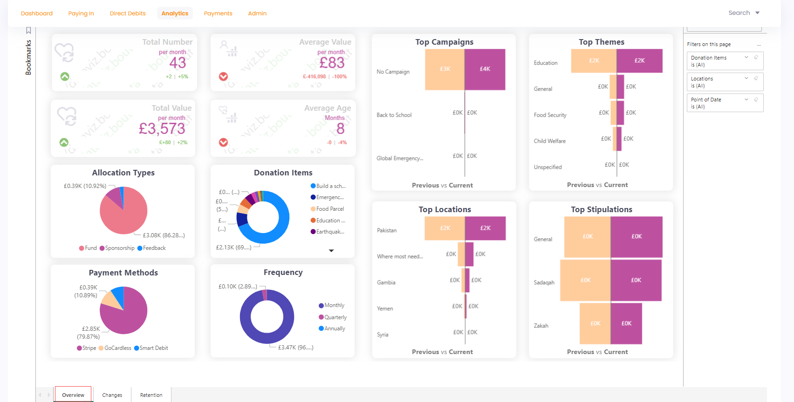
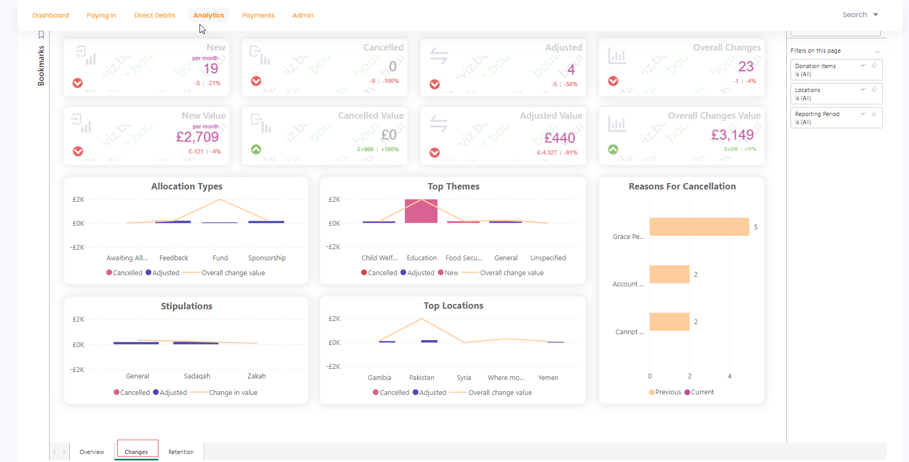
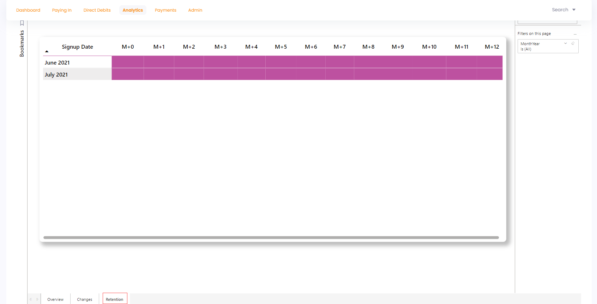

The regular giving overview report gives an outline of how much regular giving has been generated over a certain time frame. To navigate to the Regular Giving Overview report, click **Analytics** in the top menu bar and then **Reports**. Under the **Giving** section, select **Regular Giving Overview**.

The **Regular Giving Overview Executive Summary** looks like this at first glance:

The regular giving overview report has 3 tabs listed at the bottom. Each tab shows different information which can be viewed by selecting any one of them.

1. Overview
2. Changes 
3. Retention

Let's explain each of them in detail.

## Overview

The **regular giving overview** section shows how much income has been generated by regular giving over a period of time. 

:::info
- Most visuals compare the data with previous and current time periods that can be recognized by **Previous vs Current** heading. 
- Each visual when hovered over shows a summary of its values and three options including **filters**, **focus mode** and **more options** further containing **export data**, **get insights**, **sorting via values** and **pinning particular visual to the dashboard**.
:::

Different visuals depicting different information are explained below.

1. **Total** number of regular givings done.
2. **Average value** of the amount of regular giving made.
3. **Total** value of regular giving made each month.
4. **Top** allocation types, payment methods and donation items used for regular giving.
5. **Frequency** of regular giving being done like *monthly* or *annually*. 
6. **Top campaigns**, **themes**, **locations** and **stipulations** used for regular giving.  

## Changes

The **regular giving changes** report shows how many regular giving's have changed, cancelled or updated in the form of visuals defined below.

1. First 2 rows of visuals show the number and value of **new, cancelled, adjusted and overall changes** regarding regular giving's done.
2. Line charts showing overall change value for **allocation types, stipulations, top themes** and **top locations**.
3. **Data** regarding reasons for cancellation.

## Retention

The **regular giving retention** report shows the figure of regular giving signing up and the number which are still active over any month.

## Bookmarks and Filters

You can create bookmarks to review the report for later and use different filters on the regular giving overview report and its pages to view any specific information you want. For more information, see Adding Bookmarks and Using Filters in the **Engage reports** section.