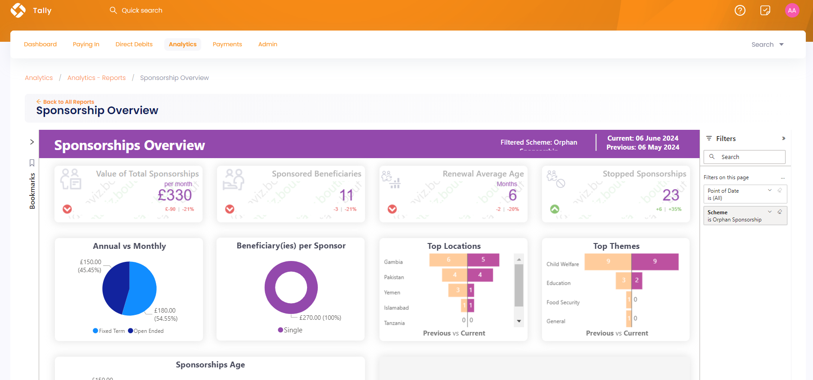
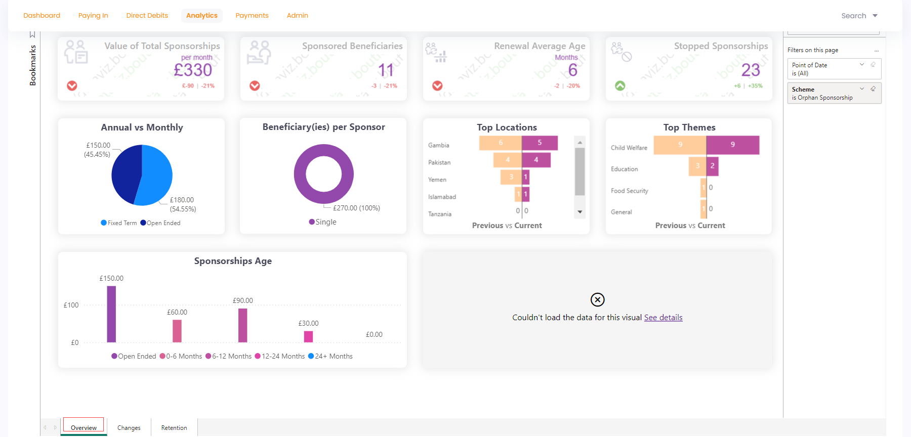
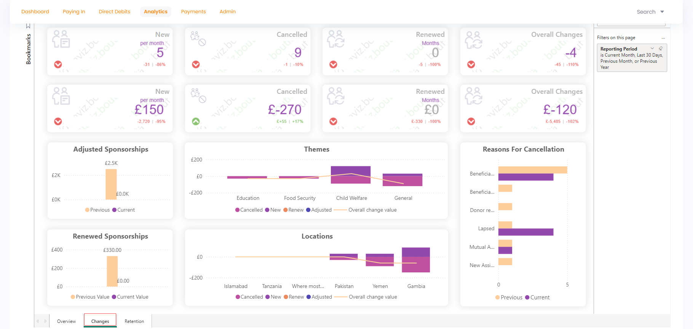
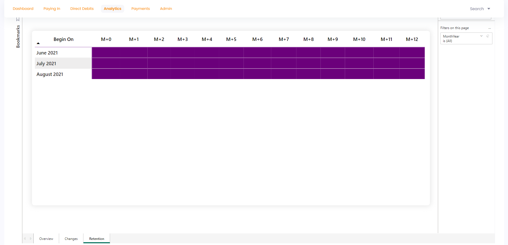

The sponsorships overview report provides an overview of all the sponsorships generated, edited or cancelled over a certain period of time. To navigate to the Sponsorship Overview report, click **Analytics** in the top menu bar and then **Reports**. Under the **Sponsorship** section, select **Sponsorship Overview**.

The **Sponsorship Overview Executive Summary** looks like this at first glance:

The sponsorship overview report has 3 tabs listed at the bottom. Each tab shows different information which can be viewed by selecting any one of them.

1. Overview
2. Changes 
3. Retention

Let's explain each of them in detail.

## Overview

The **sponsorship overview** section shows how many sponsorships have generated over a period of time. 

:::info
- Most visuals compare the data with previous and current time periods that can be recognized by **Previous vs Current** heading. 
- Each visual when hovered over shows a summary of its values and three options including **filters**, **focus mode** and **more options** further containing **export data**, **get insights**, **sorting via values** and **pinning particular visual to the dashboard**.
:::

Different visuals depicting different information are explained below.

1. The value of **total sponsorships** created per month.
2. Number of sponsored **beneficiaries**.
3. **Average age** of the renewed sponsorships.
4. Number of **cancelled** sponsorships. 
5. **Most** used sponsorship terms and number of beneficiaries per sponsor.
6. **Top** locations, themes and attributions regarding generated sponsorships.
7. **Bar chart** depicting donated value against ages of sponsored beneficiaries. 

## Changes

The **sponsorship changes** report shows how many sponsorships have added, cancelled or renewed in the form of visuals defined below.

1. First 2 rows of visuals show the number and value of **new**, **cancelled**, **renewed** and **overall changes** regarding sponsorships.
2. Value of **adjusted** and **renewed** sponsorships.
3. Overall changes in value for **themes** and **locations** regarding sponsorships.
4. Any particular reasons for a sponsorship cancellation.

## Retention

The **sponsorships retention** report shows the figure of sponsorships begining on and the number which are still active over any month.

## Bookmarks and Filters

You can create bookmarks to review the report for later and use different filters on the sponsorship overview report and its pages to view any specific information you want. For more information, see  <K2Link route="docs/engage/data/introduction-to-analytics/reports/adding-bookmarks/" text="Adding Bookmarks" isInternal/> and <K2Link route="docs/engage/data/introduction-to-analytics/reports/using-filters/" text="Using Filters" isInternal/> in the **Engage reports** section. 