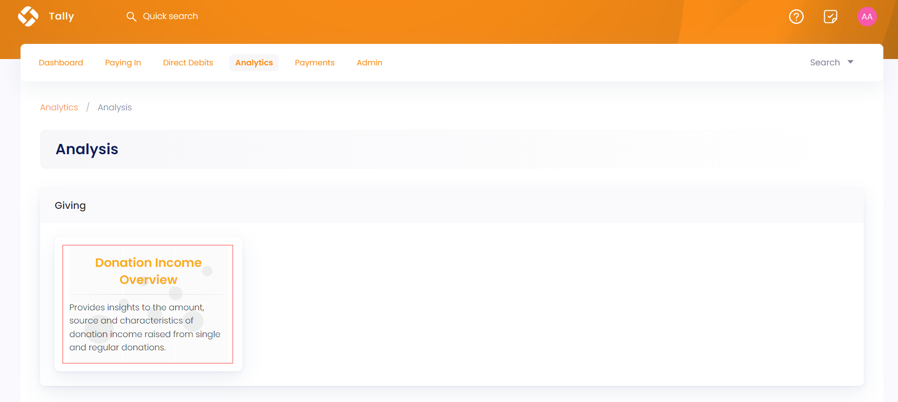
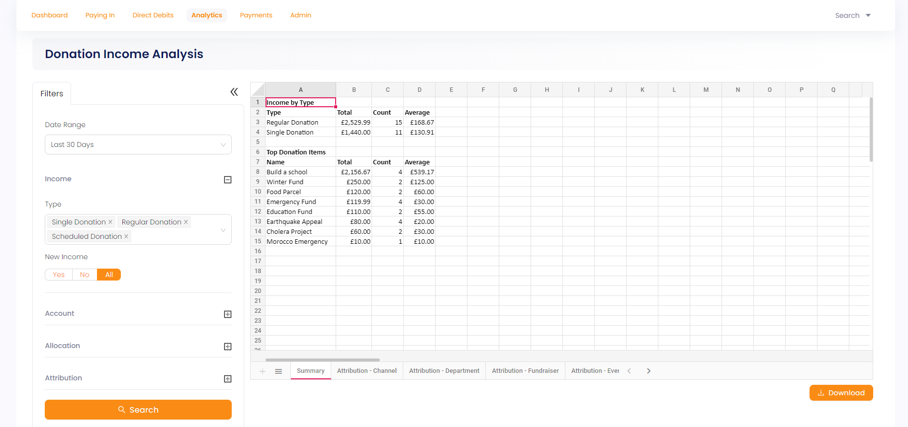
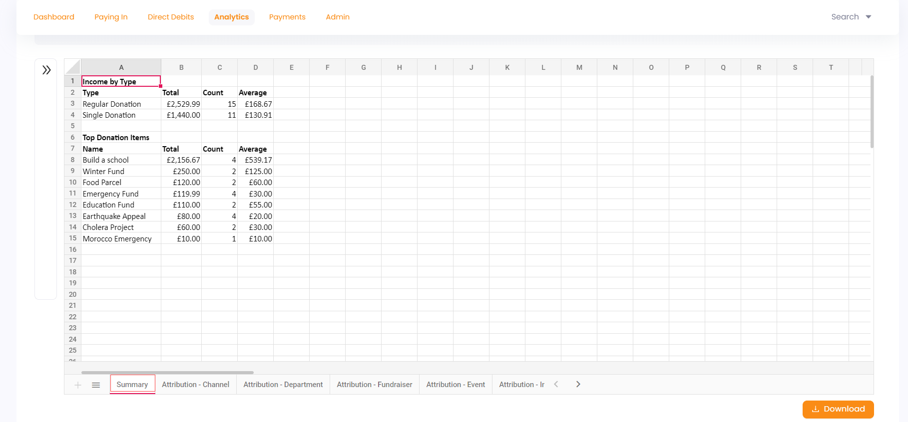
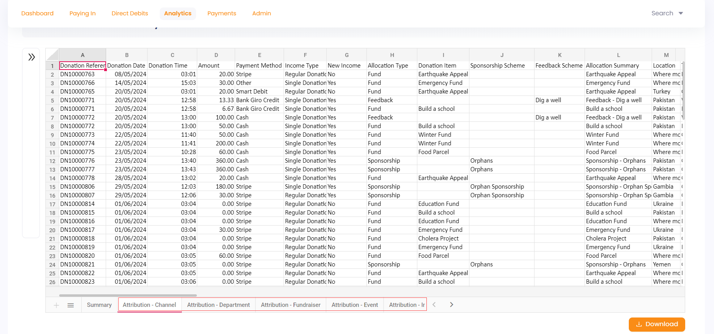
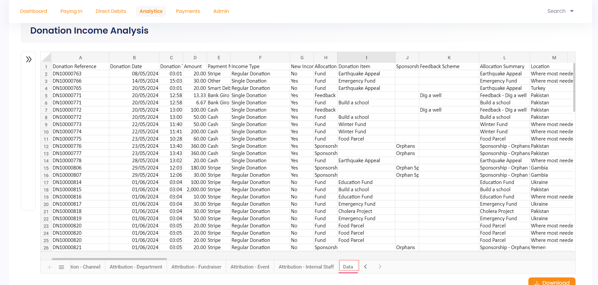

The donation income overview report provides an overview of the amount, source and characteristics of donation income raised from single, regular or scheduled donations. To land onto **Donation Income Analysis**, click **Analytics** in the top menu bar and then **Analysis**. Under the **Giving** section, select **Donation Income Overview**.

The **Donation Income Analysis** screen is made up of a collapsable **Filters** panel on the left, that allows you to set the search criteria and show the results in the form of a report on the right. 

## Search via Filters Panel

In the **Filters** panel, you can modify your search by specifying input in multiple parameters defined below. Click the **"+"** icon next to each parameter and search accordingly.

| Parameters | Description |
| ---------- | ----------- |
| **Date Range** | The time period during which the donations were made. You can choose any date range from the drop-down e.g. *last 7 days* or *this year*. |
| **Income** | Type of donations from where the donation income is coming from. You can choose the donation type and input any new donation income coming in as *yes, no* or *all*. |
| **Account** | Type of account and its related country that made the donation. |
| **Allocation** | Type of allocation and its related *donation item, location, theme* and *stipulation*. Choose any from the drop-down's related to each. | 
| **Attribution** | Type of attribution channels and their related Ad campaigns. |

Click the **Search** button and results are loaded in the form of an Excel sheet with different tabs: **Summary**, **Attribution Channels** including all channels saved and **Data**. You can also download the whole donation income report with the **Download** option at the bottom.

### Summary 

The summary tab displays the donation income separately by **type** and **top donation items**. It shows **total** and **average value** of income and the number of times a donation was made for your particular search. 

### Attribution Channel and its Dimensions

The attribution channel and its dimensions tabs (fundraiser, department, event) contains donations according to their **donation reference**, **date**, **time**, **amount**, **donation item** and **payment method** etc. Other parameters can be viewed in the report itself.  

### Data

The data tab includes data about all donations made according to their **date**, **time**, **amount**, **payment method**, **allocation type**, **donation items**, **attribution values**, etc.

