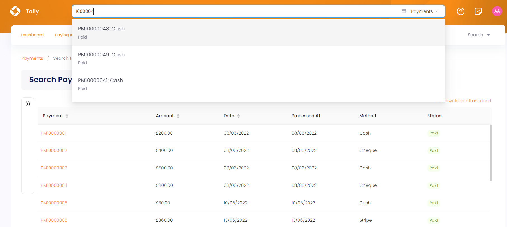
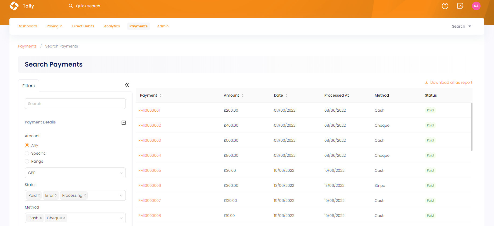

To search for a specific payment made in Engage, Tally provides two different ways. 

1. A **quick search box** available in the header at all times allowing you to quickly search for a payment by **reference** or **amount**.

2. A dedicated **advanced search screen** for advanced searches, such as recently processed payment or refund.

## Using Global Search

**1.** On the <K2Link route="tally/dashboard" text="Tally dashboard" isEngage />, click the quick search box in the header. If the search scope is not already set to **Payments**, change this from the dropdown on the right.

**2.** Input the search query and select the desired search result. For example, type the **reference** of a payment.

## Using Advanced Search

The advanced search function is a detailed search option which gives you the leverage to search for any specific type of payment. You can search for payments with any status, payment method or amount. The advanced search screen is made up of a **Filters** panel on the left which you can collapse, and a **results** panel on the right.

**1.** On the Tally dashboard, click the **Search** button and choose **Payment**. Alternatively, you can also click **Payments** in the top menu and navigate to **Search Payments** screen.

**2.** In the **Filters** panel, you can modify the search by specifying different input parameters. Click the **"+"** icon next to each parameter defined below and search accordingly.

- Input the **payment reference** in the search bar, and you'll obtain the exact result.
- Input **payment details**; **payment amount**, **status** (error, cancelled, declined or complete) and **method**. 
- Specify the **payment dates** as the exact payment date or the date at which the payment was processed.
- Select whether the payment has any **refund** or not.

:::note
For the payment dates option, you can specify only the **From Date** or the **To Date** and do not need to specify both.
:::

**3.** Click the **Search** button and the results are loaded *"one page"* at a time on the right. Use a **Load More** button at the bottom of the result list to get further results.

:::tip
If you wish to remove the search input for all parameters and start all over again, use the **Reset All** option. 
:::

**4.** You can download a report for the search results as well. Click **Download all as report** in `CSV` or `Excel` format.