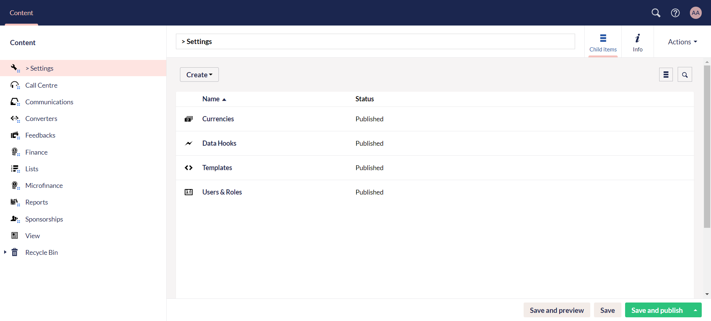

Umbraco consists of different sections, each with a separate function. A section is where you perform specific tasks related to a particular area of Umbraco. For example **Content**, **Settings** and **Users**. You can navigate between the different sections by clicking the corresponding icon in the section menu which is positioned at the top of the backoffice. 

*Throughout this guide, you will work under the **Content** section in the horizontal menu.* 

## Content

The Content section includes everything about content. This content is displayed as nodes under the Content tree. In order to create content, you must define it using <K2Link route="https://docs.umbraco.com/umbraco-cms/tutorials/creating-a-basic-website/document-types" text="Document Types"/>. These document types have already been *predefined by N3O* for usage and the first one to talk about is **Settings**.

:::tip
When creating a document type, you will find different options to choose from. Visit the <K2Link route="https://docs.umbraco.com/umbraco-cms/fundamentals/data/defining-content/default-document-types" text="Default Document Type Umbraco Docs"/> to understand each option.
:::

## Items Under Settings

The Settings document type under Content includes four different items, predefined by N3O:

1. Currencies
2. Data Hooks
3. Templates
4. Users & Roles

### Currencies

This item includes all the type of currencies that will be used in Umbraco while making donations, payments or financial transactions e.g. *GBP* or *PKR*. To create a new currency, click **Currencies** and then **Create Currency**. Input the *name* and *symbol* of the currency.  

### Data Hooks 

A data hook allows you to validate, manipulate and format data as it is being uploaded. They provide a way to integrate systems or automate processes by reacting to changes in data. You can create data hook helpers and data hook actions separately. Click **Create**, and choose any. 

Data hook action includes:

1. **Name** of the action hook
2. Adding any **helper hooks** created previously
3. Adding one or more **content types** to execute the action hook against
4. **Event** the action should take place against
5. **Predefined script** for the action hook 

 
Data hook helper includes:

1. **Name** of the helper hook
2. **Script** to be defined which can be done by the N3O developers

### Templates

:::info
In most of the cases, you can give a **generic HTML template** or a **sample template** to N3O, and they can set up the template section for you. Contact `support@n3o.ltd`.
:::

Templates define the structure and layout for a specific page, webpage or any document. N3O predefines templates as an item under Settings to add report templates. As reports are a major part of Engage's functionality e.g. sponsorship, feedbacks and donor reports, there must be definite criteria to add them in Umbraco.

You can also create a new template. Click **Create Template** and input the **name**, **HTML body** of the template, **content type** and any **assets**.

### Users & Roles

This item defines all the **collaborators** and **Engage specific** users and their roles. Collaborators are users invited for a specific role and to access certain folders. Engage specific roles are predefined and customized roles based on the different sections within Engage like *Call Center Manager*, or *Donor Care Manager*. You can create both collaborator and Engage specific users and roles separately. Click Create, and choose **Collaborator Settings** or **Engage Role Collection**.

Collaborator settings have both users and roles in separate folders. Create a user and input **full name**, **email**, **roles** and **content**. Create a role and input the **role name**, **content** and toggle the defined options. 

Engage role collections includes all the role folders for each section related to Engage separately. These roles have already been predefined by N3O.

