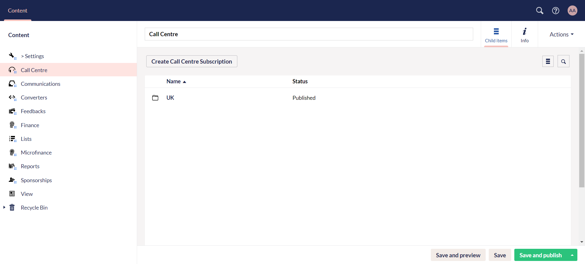
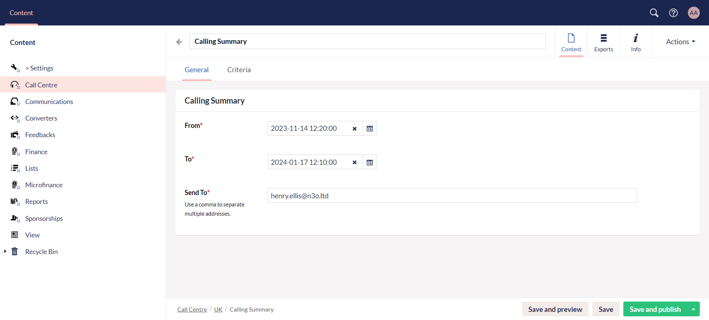
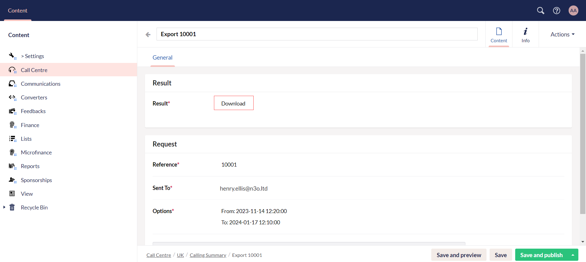
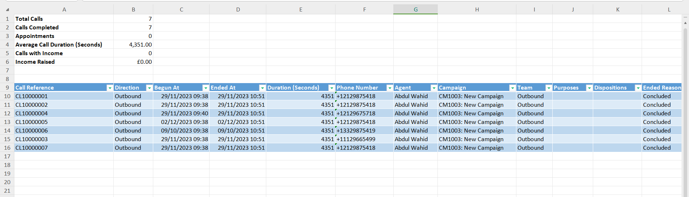

The next document type to understand under **Content** in the section menu is **Call Center**. The call center functionality offers a seamless donor care solution, empowering charities to efficiently manage all aspects of your call campaigns. 

Similar to this extensive feature in Engage, you can also find it in **Engage Forms**. Engage forms allow you to:

1. Easily create **separate folders** for agents working in different time zones like UK, or Pakistan.
2. Create calling summaries **from and to** a certain time period.
3. Get free from the hassle to wait for **downloading** of huge calling lists.
4. Obtain the **calling list Excel sheet** as soon as downloading is completed in **seconds**.
5. Get notified via **email** about the completion of the export of a calling summary. 

## Create a Calling Summary              

The calling summary in Engage forms is basically a record of multiple statistics related to agents calling different donors via call center in Engage. These statistics include:

- Call begin and end at date + time
- Call reference
- Call duration
- Call status
- Income raised during the call, etc.

To create a calling summary:

**1.** Click Engage on the main dashboard and navigate to **Engage Forms**. 

**2.** Click **Create Call Centre Subscription** and create a folder for the time zone the agents are working in.

**3.** Open the folder and click **Create Calling Summary** to export a list of all the calls made.

**4.** In the **General** tab, **name** the calling summary, specify the date and time in the **From** and **To** section and input the **email** to update the donor as soon as the export is complete. Click **Save and Publish**. The **Criteria** tab includes the `json code` for all the fields included in a calling summary.

:::tip
To only save your work for further changes, click **Save** and to save your work and view an unpublished version of the website, click **Save and Preview**. An Umbraco preview of the website will appear.
:::

**5.** As soon as the calling summary for the specified time period is obtained from Engage, you will see an export in the **Exports** tab. Click it and download the Excel sheet from the **Download** option.

**6.** The **Excel sheet** includes a summary at the top mentioning **total calls**, **calls completed**, etc. and a table of all the calls conducted by agents along with their descriptions like **Call reference**, **direction**, **begun** and **end at**, etc. 

