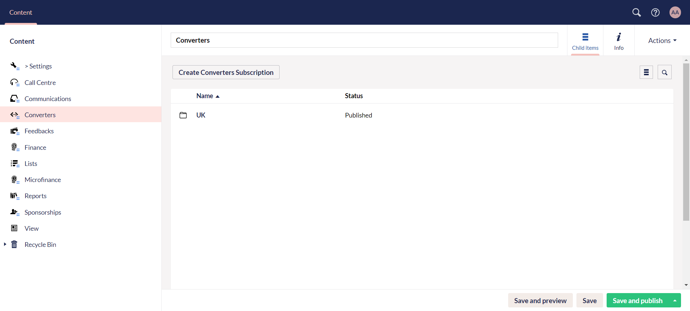
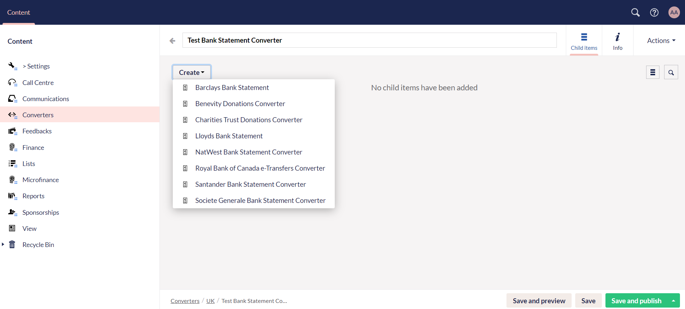
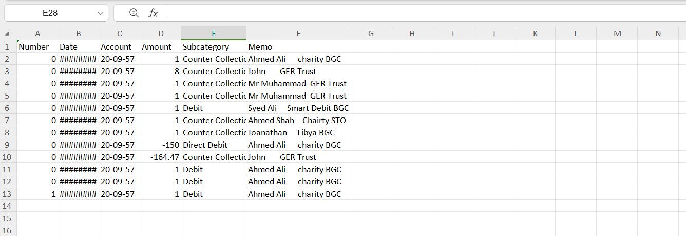
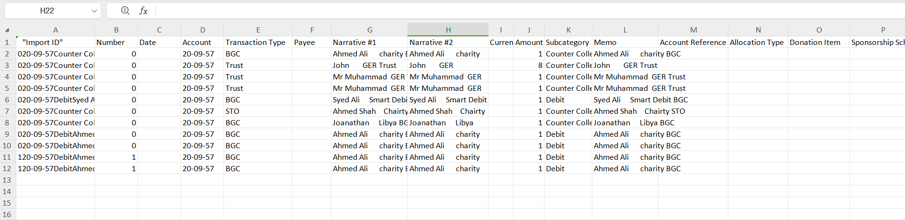

Another document type under **Content** in the section menu is **Converters**. Converters are tools designed to manage different types of data, especially financial data, eliminating the need for manual data entry, and automatically mapping key details from statements into formatted reports.

To start with converters:

1. The charity provides a bank statement sheet that includes data about bank payments and other information. 
2. The data is not properly sorted, therefore, it must be classified the right way.

## Creating a Converter in Engage Forms

:::tip
You can also ask N3O to set up a converter for you. Simply contact `support@n3o.ltd`. 
:::

To properly sort out the data provided by any charity, converters need to be setup using **Engage Forms**. To set up a converter: 

**1.** Start by creating a main converter subscription folder via **Create Converters Subscription** button.

**2.** Create a **converter type folder** and name it.

**3.** Under the converter type folder, click **Create** to choose the converter for your preferred bank statement e.g. *Barclays Bank Statement Converter*.

**4.** In the **Input** section upload the sheet with `.csv` extension via the **Drag and drop** option. Click **Save and publish**, and the converter converts the sheet into perfectly clear data along with additional fields like *account reference*, *allocation type*, *fund dimensions*, *donation item*, etc.

:::tip
- A sample bank statement to be uploaded may look like this.

- Some additional fields have been added by the N3O developers prior to the conversion, so that the client can manually fill it up themselves and then import the bank statement sheet into Engage.
:::

**5.** The converted file appears under the **Output** section and can be downloaded as well. A sample downloaded output `.csv` file shows up like this.

