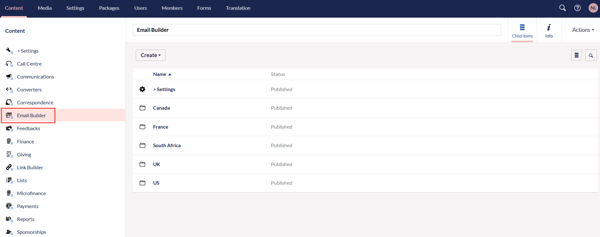
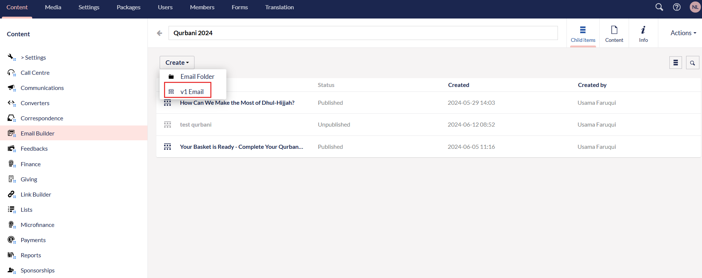
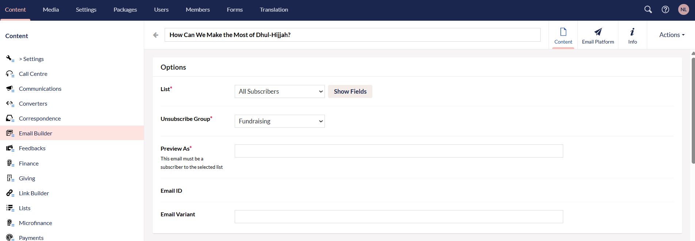
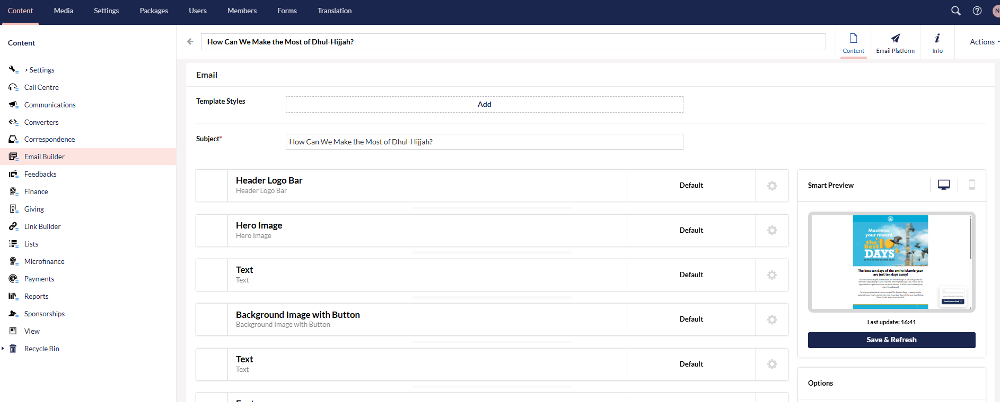
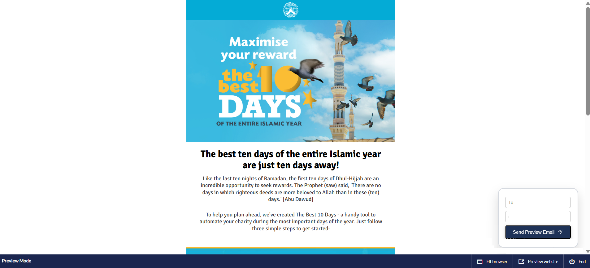
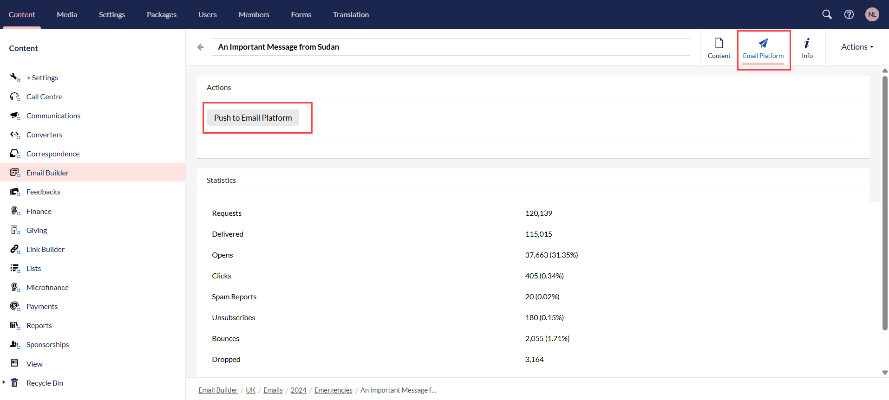
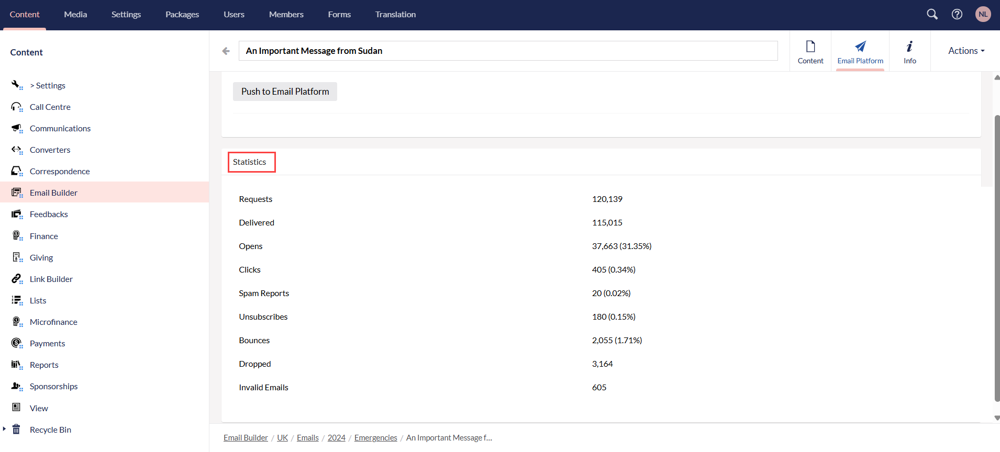

Email template builder is a tool designed to help users create, design, and manage email layouts and content without needing extensive HTML or coding knowledge. 

Some general key features include:

1. **Drag and Drop Interface:** Easily add elements like text blocks, images, buttons, and social media links. Also, customize layout and styling with no coding required.

2. **Responsive Design:** Templates automatically adjust for different screen sizes (mobile, tablet, desktop).

3. **Personalization Options:** Use merge tags or dynamic content (like names, donation amounts, or locations) for personalized emails.

4. **Template Saving and Reuse:** Save these email templates to reuse or edit in future campaigns for newsletters, event invites, etc.

## Designing and Sending Emails with Engage's Email Builder

Similar to a general email template builder, Engage CRM also provides an email builder feature that allows you to **design and send drafted emails** in **bulk** to a list of **different subscribers** via an **email sending platform**, mainly **SendGrid**. An email draft can be designed with the help of **reusable blocks** in Umbraco, speeding up the email creation process and increasing donor outreach.

To create an email template:

**1.** Login into Engage and navigate to **Umbraco (Engage Forms)**. Select **Email Builder** and create an **email builder subscription** folder based on **location**.

**2.** Then select the **email builder composition** folder e.g. "Emails", folder based on **year** e.g. "2024" and lastly, folder defining the **categories** of types of emails. 

**3.** Click **Create** and select **v1 Email** to start designing the email template. All designed emails come up with a **name**, **status**, **created date** and **created by**.

**4.** Starting the email template design, under **Options** section:

- Select the **list of subscribers** to send an email to. *These lists are the ones created on SenGrid.*
- Choose the **unsubscribe group** (groups which are unsubscribed and not receiving emails) as "Fundraising".
- Input a **sample email** (must be one of the subscribers in the selected list) only for the purpose of previewing the email before sending.

Under **Email** section:

- Input the **subject** of the email.
- Add **multiple predesigned blocks** according to your preferred template design. Click **Add Content** and choose the block you want to add. Each block includes text, images, links and buttons and is reusable, meaning can be used multiple times.

**5.** After blocks are added, click **Save and publish** to save the draft. To preview how the email would look like before sending, choose **Save and preview** and the designed email opens in a new tab.

**6.** When your email design is ready, select **Email Platform** from the top right corner and click **Push to Email Platform**. This pushes the email to **SendGrid**, saves it as a draft and you can send the email to the required recipients. 

:::tip
You can also view statistics related to all the email templates:

1. **Requested:** Number of emails the system has attempted to send.
2. **Delivered:** Number of emails that successfully reached recipients' inboxes
3. **Opens:** Number of times recipients opened the email.
4. **Clicks:** Number of times recipients clicked a link inside the email.
5. **Spam Reports:** Number of recipients who marked the email as spam or junk.
6. **Unsubscribes:** Number of users who opted out from receiving further emails.
7. **Bounces:** Emails that could not be delivered.
8. **Dropped:** Emails that the system decided not to send at all, usually due to a known issue.
9. **Invalid Emails:** Email addresses that are incorrectly formatted or do not exist.

:::

 