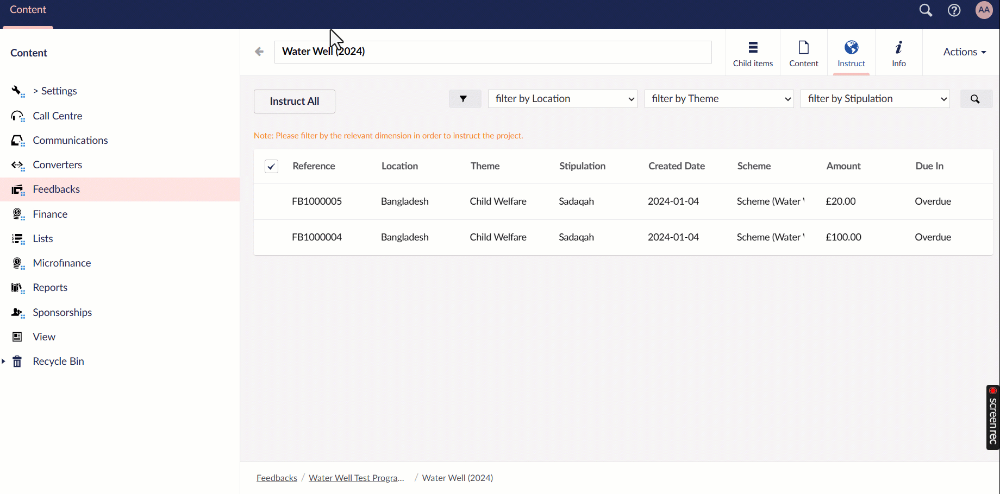
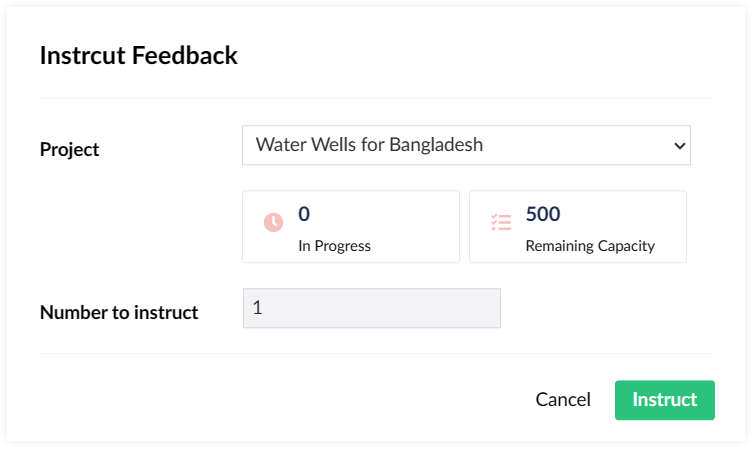

The next part to look into under **Content** in the section menu is **Feedbacks**. Feedbacks in Engage are mini charitable projects, in which the donor receives updates after its completion. Such projects can range from constructing a water well or a classroom to building a clinic for the beneficiaries and more.

Creating feedbacks is just half of the process. The other half is to let the person responsible for the project know that the feedback has been created and ready for progress, known as **feedback instruction**. 

## Performing Feedback Instruction via Engage Forms

Feedback instruction is started as soon a feedback is created and donated towards within Engage. These feedbacks automatically appear under the **Instruct** tab in **Engage Forms**. 

To instruct a particular feedback:

**1.** <K2Link route="docs/engage/feedbacks/creating-feedbacks/" text="Create" isInternal/> and <K2Link route="docs/engage/feedbacks/donating-to-feedback/" text="donate towards" isInternal/> a feedback in Engage, but before that ask your *N3O system administrator* to create feedback schemes for you.

**2.** Navigate to **Engage Forms** and click **Feedbacks** under Content. 

**3.** Create any new programme or choose an existing one via **Create programme**.

**4.** Open up the programme and create a new feedback scheme for the programme via **Create**. You can name it according to the scheme created by N3O to avoid any confusion.

**5.** Next, create different folders under the scheme, that can be according to the **scheme's location**, **theme** or **stipulation**.

**6.** Under any folder, create a feedback project via **Create** that will include details about all the feedbacks that have been instructed. Click the **Content** tab and add all the information regarding the project. Each input parameter is described in the table below.

| Input Parameter | Description |
| --------------- | ----------- |
| **Code** | A unique identifier for the particular feedback project. |
| **Summary** | A small paragraph on what the feedback project is about. |
| **Start On** | Start on date for the project. |
| **End On** | End on date for the project. |
| **Capacity** | <ul><li>Number of feedbacks that can be instructed under a certain project.</li><li> **Note:** If any feedback added exceeds the capacity, then that feedback will not be added in the project. You will need to increase the feedback capacity or create another project. </li></ul> |  
| **Fund Dimensions** | Fund dimensions to be added according to the feedback scheme.  |
| **Notifications** | Once the feedback is instructed, an email is sent to the related person or partner to start working on the project. |

**7.** Navigate back to the **feedback scheme** screen, next to programme, and open up the **Instruct** tab.

**8.** Mulitple feedbacks created in Engage appear with parameters; **Reference**, **Location**, **Theme**, **Stipulation**, etc.

**9.** To instruct any feedback, filter and choose the fund dimensions via the **filter icon**, select the feedback to instruct and click **Instruct x**. 

:::tip
- **x** represents the number of feedbacks selected for instruction.
- You can also choose **Instruct All** to instruct all the feedbacks at the same time, known as **bulk feedback instruction**.
:::

**10.** On the **Instruct Feedback** screen, select the project to instruct feedback into and click **Instruct**.

:::info
- **Remaining Capacity:** Number of feedbacks to be instructed for a particular project.
- **In progress:** Number of feedbacks that have been instructed for a particular project.
:::

**11.** The feedback instructed would automatically appear in the relevant project under the **Child items** tab. You can click the feedback and view the feedback details under **Feedback** and feedback status from creation to completion under **Log**.

