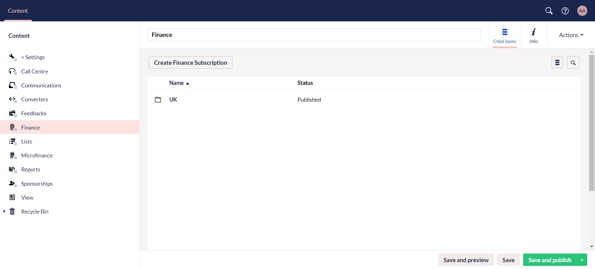
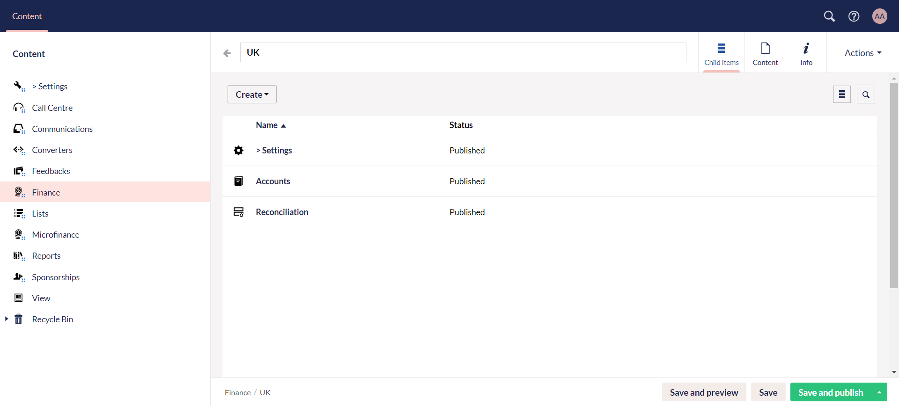
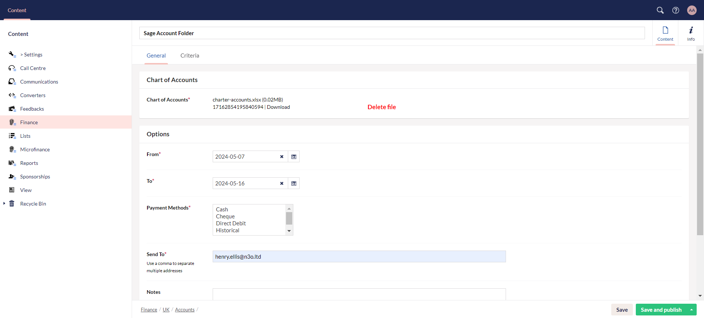
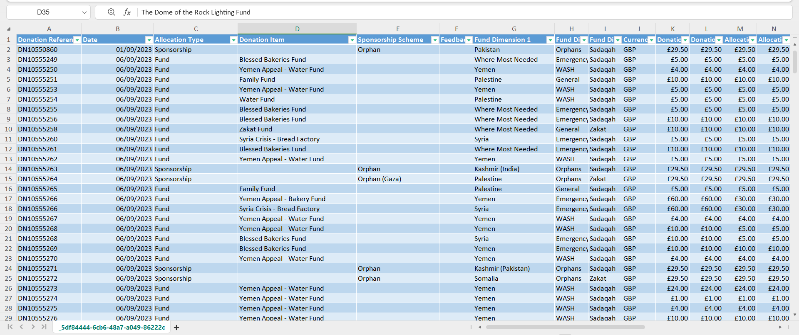
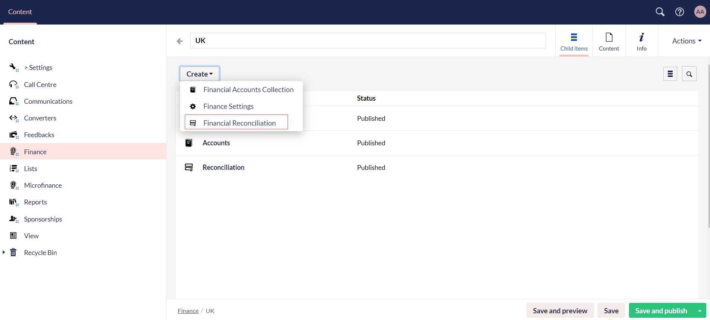

Another important part under **Content** in the section menu is **Finance**. Generally, finance involves integrating financial data and processes with a CRM's activities to provide a holistic view of customer interactions and financial transactions. 

## Create Sage Accounts in Engage Forms

In **Engage Forms**, finance talks about incorporating a payment software solution e.g. Sage with donations conducted in Engage via donors. <K2Link route="https://www.sage.com/en-us/integrated-payment-solutions/" text="Sage payment software"/> manages your financial data very efficiently. It categorizes the donations and its payments done in Engage based on certain references.

Engage forms automates the financial process by transforming the provided *donations summary file* and mapping it onto a file accepted by any charities integrated Sage payment software. You only need to provide the *donations summary file*, *date range*, *payment methods* and an *email address*.

To peform this process:

**1.** Navigate to **Engage Forms** and click **Finance** under Content.

**2.** Create a finance folder via **Create Finance Subscription** button and name it.

**3.** Click the **Create** button and create a finance accounts collection folder and name it.

:::tip
**Finance settings** under the *Create* button includes all those payment methods to be added which automatically appear when creating a Sage account e.g. *Cash*, *Card* and *Direct debit*, etc. 
:::

**4.** Within the finance accounts folder, click **Create Sage Accounts** and create a Sage account. Under the *General* tab, input:

- **Name** of the account.
- Upload a **donations summary list Excel file** in the **Chart of Accounts** section.
- **Date range** under **From** and **To**.
- **Payment methods** used.
- **Email address** of any designated person in the charity to send a notification about the file export.
- Click **Save and publish**.

:::info
The **Criteria** tab is predefined by N3O developers in the form of *JSON* code.
:::

**5.** The donation summary Excel file includes donations in the form of a list with multiple fields including **donation reference**, **allocation type**, **fund dimensions**, and **payment methods**, etc. 

**6.** Engage forms transforms and maps the donation summary file by generating **account reference**, **nominal reference** and **department code** based on **fund dimensions** and **payment methods**, onto a new Excel Sage file. This Sage file includes the generated fields along with others including **tax code** and **tax amount**. 

**7.** As soon as the mapping is completed, the Excel file is shown under the **Exports** tab. Click the export item and download the Sage file from the **Result** section.

## Financial Reconciliation

Finance reconciliation is the process of comparing and verifying two sets of financial records to ensure they are consistent and accurate. This practice is essential for maintaining the integrity of financial data and identifying discrepancies. 

This helps you: 

1. Save time with an automated process
2. Control cash with a secure view of all of your transactions in one place
3. Improve accuracy

Engage forms also provides this functionality, but for now, you can create a **financial reconciliation folder** under any finance folder using the **Create** button. 

