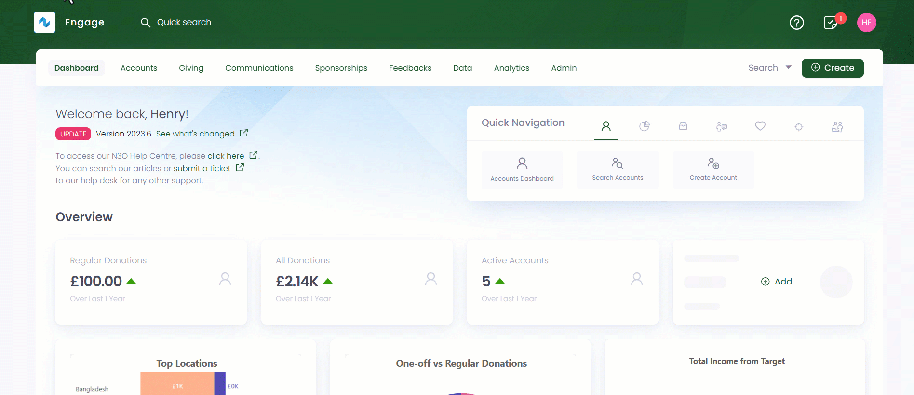
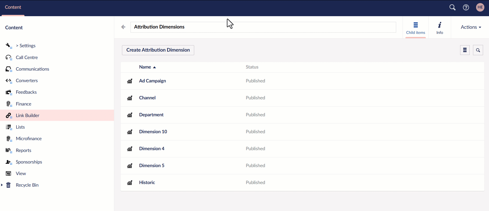
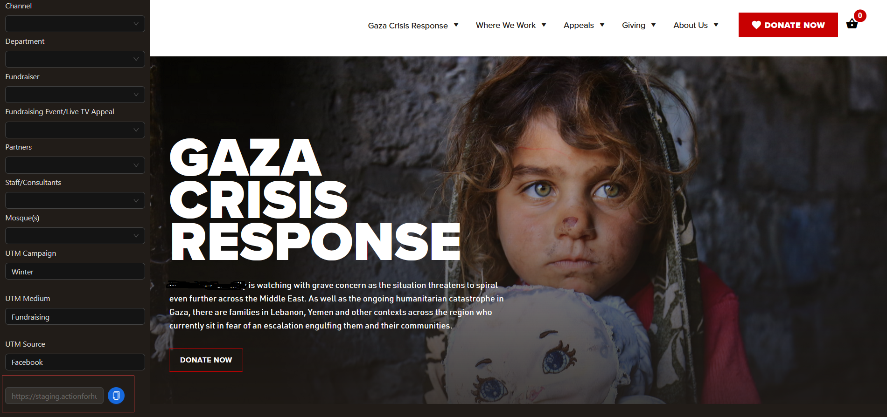

In this guide, let us look at how to use and apply link builder to any charity's website. 

## Prerequisites for Using Link Builder

Link builder creates custom URLs to track the performance of donations coming into Engage. Before using its functionality, you should know how to add **attribution dimensions** and **UTM parameters** in **Engage Forms**. 

**1.** The attribution structure is set up on **Engage Forms (Umbraco)** where field users can add attribution dimension options without access to the Engage CRM. These options are lined with Engage, so any option added here will also appear under attribution dimensions in Engage and any dimension option added in Engage will appear here. 

**2.** Navigate to the **Link Builder** section in Engage Forms, click on **Engage** and select **Forms**. Under Content, click **Link Builder**, choose **subscription type**, **settings** and then **Attribution Dimensions**. A list of attribution dimensions added will be seen.



**3.** Here, under each attribution dimension, multiple new dimension options can be added. Furthermore, on each dimension option you can specify values for properties, i.e. **Source**, **Medium** and **Campaign** that correspond to **UTM parameters**: `utm_source`, `utm_medium` and `utm_campaign` used in **Google Analytics**. The purpose of this is, that if you have selected a dimension option with any of these values, the utm parameters will also be populated in the generated link so that your Google Analytics tracking still works as it has previously. In case you have selected options where both have the same property value populated, the first one will take precedence, but this value can also be modified manually on the link builder screen, so you have the flexibility to specify any option for UTM parameters.



## Steps to Use Link Builder

**1.** After adding attribution dimensions in Engage forms, the next step is to add the **link builder script**. To start, insert the below generic script in the body tag of your html. You can also wrap this script in a conditional statement where it is only included if a user is logged into Umbraco back office, so it is not loaded on every page visit, but it is up to you how you want to do it.

```java
<script>
  (function(w, d, s, c, u) {
    let f = d.body.getElementsByTagName(s)[0],
        j = d.createElement(s);
    j.async = true; 
    j.src = u;
    j.type = "text/javascript";
    f.parentNode.insertBefore(j, f); 

    j.onload = function() {
      if (w.n3o_attribution && typeof w.n3o_attribution.init === 'function') {
        w.n3o_attribution.init(c);
      }
    }
  })(window, document, 'script', null, 'https://unpkg.com/@n3oltd/link-builder/umd/n3o-attribution.js');
</script>
```

**2.** When you have inserted the above script in your website, you can access link builder by appending **"#linkbuilder"** in the end of any page of your website, for example: *"https://charity-organisation-page-name-link#linkbuilder"*. This is a passcode-protected page and the default passcode is set up during the initial phase and can be changed upon request. 

**3.** The link builder UI is very simple and easy to understand. Attribution dimensions added in Umbraco are shown on the left along with UTM parameters for flexibility of the user. The website page to generate the link for is displayed on the right and you can change the page, if required. The actual generated link is shown below the UTM parameters and copied for further use.



:::tip
- We can define some default dimensions for you as well. For example, your website page was visited but it did not have any dimensions linked, you may want to specify this as **“Website Visit”** in your attribution, which is possible, but you will have to let us know which option you want to specify as default for a specific dimension.

- If you already use URLs that have UTM parameters included, you can also link those to dimensions in Engage. For example, if your page URLs specify `utm_medium`, you can link this to your **“Website Dimension”** in Engage, but in this case, you will also have to let us know the one you want to use and which option you want to link to a certain dimension.
:::

**4.** Choose the attribution dimensions (same as those added in Umbraco or Engage) and the UTM parameters to generate a unique link and use it for further use.

**5.** As a last step, your web team needs to add this information in a webhook that you are already sending from your website to Engage. This information is stored in a cookie in a donor’s browser. The cookie you need to read is **“n3o_attribution”** and whenever a donation is completed and a webhook is to be sent to Engage, add this cookie value in the webhook with the property name **“attribution”**.

```json
"attribution": {
    "d1": [
      {
        "option": "gaza_appeal",
        "percentage": 100.0
      }
    ],
    "d2": [
      {
        "option": "cpc",
        "percentage": 100.0
      }
    ],
    "d3": [
      {
        "option": "google",
        "percentage": 100.0
      }
    ]
  }
```

